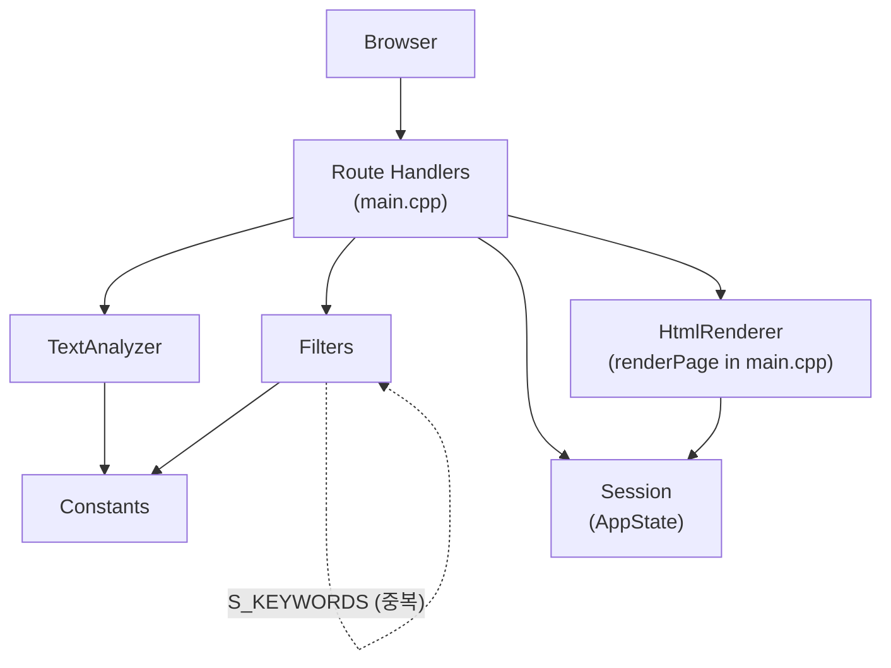
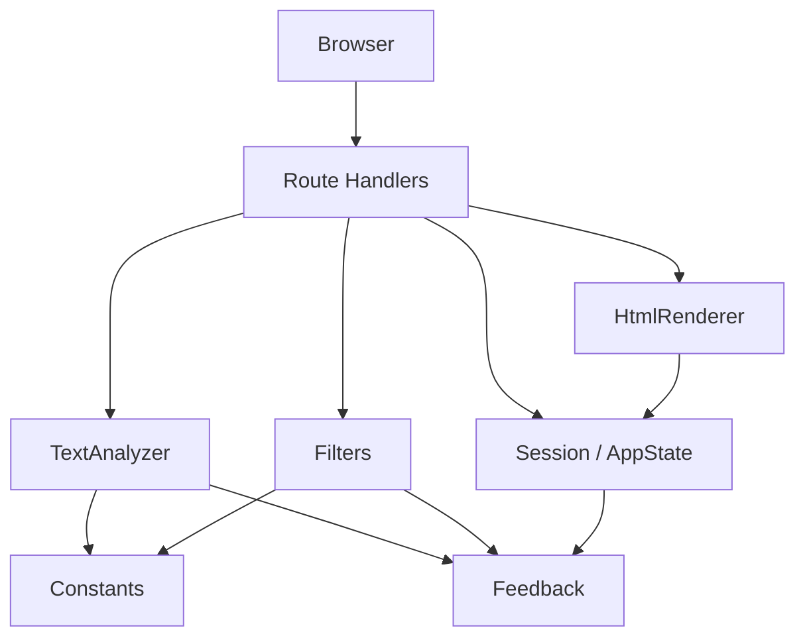

# Feedback Analyzer (C++)


**자연어 고객 피드백을 수집·분류·시각화하는 C++17 웹 앱으로, 운영/CS 담당자는 웹 UI로 피드백을 분석하고 중급 C++ 개발자는 TDD·Clean Code로 레거시 코드를 점진 개선하며 유지보수 가능한 구조를 학습한다.** (근거: `docs/PRD.md` §1.1)

---

## 목차

- [개요 (Overview)](#개요-overview)
- [빠른 시작 (Quick Start)](#빠른-시작-quick-start)
- [HTTP API 개요](#http-api-개요)
- [감정 분류 및 키워드 카테고리](#감정-분류-및-키워드-카테고리)
- [입력·출력 계약](#입력출력-계약)
  - [CSV 입력 (POST `/upload`)](#csv-입력-post-upload)
  - [HTTP Form 입력 (POST `/analyze`, POST `/filter`)](#http-form-입력-post-analyze-post-filter)
  - [CSV 출력 (GET `/download`)](#csv-출력-get-download)
- [아키텍처](#아키텍처)
- [프로젝트 구조](#프로젝트-구조)
- [테스트 실행](#테스트-실행)
- [RED 단계 To-Do 리스트](#red-단계-to-do-리스트)
- [설정 및 데이터](#설정-및-데이터)
- [출력 포맷](#출력-포맷)
- [알려진 이슈 (Known Issues)](#알려진-이슈-known-issues)
- [생성형 AI 활용 Activities](#생성형-ai-활용-activities)
- [기여 가이드](#기여-가이드)
- [라이선스](#라이선스)

---

## 개요 (Overview)

### 이 프로젝트가 해결하는 문제

Feedback Analyzer는 **리팩토링 챌린지**용 레거시 C++ 웹 애플리케이션이다. 현재 코드베이스에는 아래 문제가 존재하며, 본 프로젝트는 이를 식별·개선하는 학습 경험을 제공한다. (근거: `docs/PRD.md` §1.2, `docs/analysis.md` §1~§3)

| 문제 | 설명 |
|------|------|
| **God Function** | `main.cpp`에 HTTP 라우팅·HTML 렌더링·CSV 파싱·오케스트레이션이 혼재 (372줄) |
| **전역 상태** | `Session::currentFeedbacks`, `fil_data`, `TextAnalyzer::globalSent/globalKw` |
| **P0 기능 버그** | H-1 중립 필터 불일치, H-2 CSV `text` 컬럼 미사용, H-3 키워드 필터 `main` 누락 |
| **테스트 부재** | Google Test·CMake 테스트 타깃 0건 |

### 주요 학습 목표

| 목표 | 내용 | 근거 |
|------|------|------|
| **SRP (단일 책임 원칙)** | Controller / Service / View / State 계층 분리 | `docs/PRD.md` §4.2 |
| **관심사 분리** | HTML·라우트·비즈니스 로직·파일 I/O 분리 | `project_purpose.md` §1.3 |
| **TDD** | Given-When-Then 단위 테스트 → Green 상태에서 리팩토링 | `.cursorrules` §5 |
| **점진적 리팩토링** | Extract Function/Class, 최소 diff, Phase별 단계 진행 | `docs/PRD.md` §1.3 G-4, `docs/analysis.md` 부록 C |

**측정 가능 목표:** HTTP 5엔드포인트 계약 유지, P0 버그 회귀 0건, Service 계층 커버리지 ≥ 90%, `main.cpp` ≤ 200줄 (Phase 2 이후). (`docs/PRD.md` §1.3)

### 현재 코드의 문제점과 개선 방향

| Phase | 목표 | 핵심 산출물 |
|-------|------|-------------|
| **Phase 1** | 테스트 기반 + H-1/H-2/H-3 수정 | Google Test 타깃, TextAnalyzerTest, FiltersTest, CsvParserTest |
| **Phase 2** | 관심사 분리 | HtmlRenderer, RouteHandlers, CsvParser; `main.cpp` ≤ 200줄 |
| **Phase 3** | 상태·네이밍 정리 | AppState, Constants 단일 소스, `sent/kw/fil` Rename |
| **Phase 4** | Logger UI·download·gitignore | level별 alert, 다운로드 대상 명확화 |
| **Phase 5** (선택) | Trend·File DB | `test_feedback_trend.csv` 시각화, 감정 키워드 File DB |

상세 분석: [`docs/analysis.md`](docs/analysis.md) (v2.0 QA·코드 스멜 통합) · 테스트 계획: [`docs/test_plan.md`](docs/test_plan.md) · 요구사항: [`docs/PRD.md`](docs/PRD.md)

---

## 빠른 시작 (Quick Start)

### 사전 조건

| 항목 | 버전 |
|------|------|
| C++ | C++17 이상 |
| CMake | 3.14 이상 |
| 컴파일러 | MinGW GCC / MSVC / Clang |
| 기타 | 웹 브라우저 |

### 저장소 클론

```powershell
git clone https://github.com/jvvoung/FeedbackAnalyzer_12.git
cd FeedbackAnalyzer_12
```

### 빌드 (Windows MinGW 예시)

```powershell
rmdir /q /s build
cmake -S . -B build -G "MinGW Makefiles" -DCMAKE_CXX_COMPILER=C:/mingw64/bin/g++.exe
cmake --build build
```

### 실행

```powershell
build\feedback_analyzer.exe
```

### 접속

브라우저에서 **http://localhost:8080** 접속 (서버 바인딩: `0.0.0.0:8080`, `docs/PRD.md` §3.3 C-05)

### 예시 사용 흐름

1. textarea에 `배송이 너무 늦어요. 화가 납니다.` 입력 → **입력하기** (POST `/analyze`)
2. **분석 결과** stat에서 감정(부정) · 키워드(배송) 건수 확인
3. 감정=`부정`, 키워드=`배송` 선택 → **필터 적용** (POST `/filter`)
4. **결과 다운로드** 클릭 (GET `/download`) → `filtered_feedback.csv` 수신

---

## HTTP API 개요

근거: `docs/PRD.md` §3.2 F-01~F-05, `docs/analysis.md` 부록 B.4

| Method | Path | 역할 | Content-Type |
|--------|------|------|--------------|
| GET | `/` | UTF-8 한국어 대시보드 HTML 반환 | `text/html; charset=UTF-8` |
| POST | `/analyze` | 텍스트 피드백 추가 + 감정·키워드 집계 | `text/html; charset=UTF-8` |
| POST | `/upload` | CSV 파일 업로드 (`text` 컬럼 파싱) | `text/html; charset=UTF-8` |
| POST | `/filter` | 감정·키워드 필터 적용 + 집계 | `text/html; charset=UTF-8` |
| GET | `/download` | 마지막 필터 결과 CSV 다운로드 | `text/csv; charset=UTF-8` |

---

## 감정 분류 및 키워드 카테고리

근거: `docs/PRD.md` §3.3, §5.1, §3.2 F-06

### 감정 (Sentiment)

| 유형 | 라벨 (UTF-8) | 판정 규칙 (목표) | Constants 출처 |
|------|--------------|------------------|----------------|
| 긍정 | `긍정` | `Constants::SENTIMENT_KEYWORDS["긍정"]` 키워드 포함 | `Constants::SENTIMENT_KEYWORDS` |
| 부정 | `부정` | 긍정 미매칭 + `Constants::SENTIMENT_KEYWORDS["부정"]` 키워드 포함 | `Constants::SENTIMENT_KEYWORDS` |
| 중립 | `중립` | 긍정·부정 모두 미매칭 | `Constants::SENTIMENT_KEYWORDS` (기본값) |

> **판정 순서:** 긍정 → 부정 → 중립. TextAnalyzer·Filters가 **동일 규칙**을 사용해야 한다 (`docs/PRD.md` §3.2 F-06).

### 키워드 카테고리 (Category Keyword)

| 카테고리 | 라벨 (UTF-8) | 판정 규칙 (목표) | Constants 출처 |
|----------|--------------|------------------|----------------|
| 배송 | `배송` | `CATEGORY_KEYWORDS["배송"]["main"]` 키워드 포함 | `Constants::CATEGORY_KEYWORDS` |
| 품질 | `품질` | `CATEGORY_KEYWORDS["품질"]["main"]` 키워드 포함 | `Constants::CATEGORY_KEYWORDS` |
| 가격 | `가격` | `CATEGORY_KEYWORDS["가격"]["main"]` 키워드 포함 | `Constants::CATEGORY_KEYWORDS` |
| 서비스 | `서비스` | `CATEGORY_KEYWORDS["서비스"]["main"]` 키워드 포함 | `Constants::CATEGORY_KEYWORDS` |
| 사용성 | `사용성` | `CATEGORY_KEYWORDS["사용성"]["main"]` 키워드 포함 | `Constants::CATEGORY_KEYWORDS` |

- **`main` 키워드:** 집계·필터 공통 매칭 기준 (예: `배송` → `배송`, `택배`, `배달`)
- **`sub` 키워드:** Constants 내부 세부 분류용 (`time`, `type`, `status` 등) — 집계·필터 매칭에는 사용하지 않음
- **품질 카테고리 ≠ 감정:** `품질`/`서비스` 키워드와 감정 3분류를 혼동하지 않음 (`.cursorrules` §3)

### 필터 sentinel

| 값 | 의미 |
|----|------|
| `전체` | 해당 축(감정 또는 키워드) 필터 **미적용** |

---

## 입력·출력 계약

### CSV 입력 (POST `/upload`)

**Request:** `multipart/form-data`, 필드명 `file` (`.csv`)

#### 정상 예시

```csv
text
배송이 너무 늦어요. 화가 납니다.
품질은 좋은데 가격이 비싸요.
```

→ `text` 컬럼 값 2건이 Session에 적재. success alert: `2개의 피드백이 입력되었습니다.`

#### 비정상 케이스

| 케이스 | 입력 | UI alert |
|--------|------|----------|
| `text` 컬럼 없음 | `id,comment\n1,hello` | error: `파일 업로드 중 오류가 발생했습니다.` (PRD §3.2 F-03: error 우선) |
| 빈 파일 | (0 byte) | error: `파일 업로드 중 오류가 발생했습니다.` |
| 헤더만, 데이터 없음 | `text\n` | success: `0개의 피드백이 입력되었습니다.` (누적 0건) |

> **현재 알려진 이슈:** H-2 — 구현이 `fields[0]`만 사용하여 `text` 컬럼을 무시함. Phase 1에서 수정 예정. ([알려진 이슈](#알려진-이슈-known-issues))

---

### HTTP Form 입력 (POST `/analyze`, POST `/filter`)

**Content-Type:** `application/x-www-form-urlencoded`

#### POST `/analyze` — 정상 예시

| # | Form fields | 기대 결과 |
|---|-------------|-----------|
| 1 | `text=배송이 너무 늦어요. 화가 납니다.` | 감정 stat: 부정 +1, 키워드 stat: 배송 +1 |
| 2 | `text=품질 좋아요. 만족합니다.` | 감정 stat: 긍정 +1, 키워드 stat: 품질 +1 |
| 3 | `text=첫 줄\n두 번째 줄` (멀티라인) | Feedback 1건 추가, 개행 포함 저장 (AC-7 검증 대상) |

#### POST `/filter` — 정상 예시

| # | Form fields | 기대 결과 |
|---|-------------|-----------|
| 1 | `sentiment=중립&keyword=전체` | 중립 분류 피드백 subset + 집계 stat |
| 2 | `sentiment=전체&keyword=배송` | 배송 카테고리 피드백 subset + 집계 stat |
| 3 | `sentiment=부정&keyword=배송` | 부정 **및** 배송 교집합 + 다운로드 버튼 표시 |

#### 비정상 케이스

| 케이스 | 요청 | UI alert |
|--------|------|----------|
| 빈 text 제출 | POST `/analyze`, `text=` 또는 공백만 | 피드백 미추가; 기존 건수 유지 |
| 피드백 없이 `/filter` | Session 비어 있을 때 POST `/filter` | warning: `분석할 피드백이 없습니다.` |
| 필터 결과 0건 | 조건에 맞는 피드백 없음 | warning: `필터링 결과가 없습니다.` |

공통 error: `처리 중 오류가 발생했습니다.` (예외 발생 시)

---

### CSV 출력 (GET `/download`)

**다운로드 대상 (PRD 확정):** 마지막 POST `/filter` 성공(≥1건 반환) 직후의 필터 결과 집합. (`docs/PRD.md` §3.2 F-05)

#### 형식 예시

```
[EF BB BF]text
배송이 너무 늦어요. 화가 납니다.
```

| 항목 | 값 |
|------|-----|
| BOM | `\xEF\xBB\xBF` (UTF-8 BOM) |
| 헤더 | `text` |
| Content-Disposition | `attachment; filename="filtered_feedback.csv"` |
| 인코딩 | UTF-8 |

`/filter` 미실행 시: BOM + `text\n` 헤더만, 데이터 행 0건 (Phase 4에서 warning UI 추가 예정).

---

## 아키텍처

### 계층 다이어그램

**As-Is (현재):**



**To-Be (Phase 2~3 목표):**



**의존성 방향 (목표):** `main` → handlers → services → domain(Feedback) → Constants (`docs/PRD.md` §4.2)

| As-Is | To-Be |
|-------|-------|
| `main.cpp`에 HTML·파싱·라우팅 혼재 | HtmlRenderer, RouteHandlers, CsvParser 분리 |
| `fil_data`, `globalSent/Kw` 전역 분산 | AppState 단일 캡슐화 |
| `Filters::S_KEYWORDS` 이중 관리 | `Constants::SENTIMENT_KEYWORDS` 단일 소스 |

### 새 키워드 카테고리 추가 방법

1. `src/cpp/Constants.cpp` — `Constants::init()`에 `CATEGORY_KEYWORDS[u8"새카테고리"]["main"]` 및 `sub` 키워드 등록
2. `src/cpp/UIComponents.cpp` — `UIComponents::CATS` 벡터에 `u8"새카테고리"` 추가
3. 단위 테스트 — 집계·필터에 새 카테고리 `main` 키워드 반영 확인
4. **변경 금지:** `httplib.h`, HTTP 5엔드포인트 path/method, 감정 3분류 라벨

> **원칙:** 카테고리 추가 시 `Constants::CATEGORY_KEYWORDS` + `UIComponents::CATS` **2곳만** 변경 (Shotgun Surgery 방지, `docs/PRD.md` §4.4)

### 외부 라이브러리

| 파일 | 정책 |
|------|------|
| `src/cpp/httplib.h` | cpp-httplib 헤더 전용 외부 라이브러리 — **수정 금지** (`.cursorrules` §1, `docs/PRD.md` §3.3 C-07) |

---

## 프로젝트 구조

근거: `docs/analysis.md` 부록 B.3 (`tests/`는 Phase 1 목표)

```
FeedbackAnalyzer_12/
├── CMakeLists.txt
├── README.md
├── project_purpose.md
├── .cursorrules
├── docs/
│   ├── PRD.md              # 제품 요구사항 명세
│   ├── analysis.md         # QA·코드 스멜 통합 분석 (v2.0)
│   └── test_plan.md        # TDD 테스트 계획·AC 매핑
├── tests/                  # (Phase 1 목표) Google Test
│   ├── TextAnalyzerTest.cpp
│   ├── FiltersTest.cpp
│   └── CsvParserTest.cpp
└── src/cpp/
    ├── main.cpp            # HTTP 라우팅 + HTML + CSV 파싱
    ├── httplib.h           # 외부 HTTP 라이브러리 (수정 금지)
    ├── Feedback.h          # 피드백 도메인 모델
    ├── TextAnalyzer.h/cpp  # 감정·키워드 분석
    ├── Filters.h/cpp       # 필터링
    ├── Constants.h/cpp     # 감정·카테고리 키워드 상수
    ├── Session.h/cpp       # 인메모리 세션 상태
    ├── UIComponents.h/cpp  # UI 카테고리 목록
    ├── Logger.h/cpp        # 콘솔 로깅
    └── FileHandler.h       # (Lava Flow) 정리 대상
```

---

## 테스트 실행

### 현재 상태

| 항목 | 상태 |
|------|------|
| Google Test | **미구성** (`docs/analysis.md` §2.1.4, 부록 B.6) |
| CMake `enable_testing()` | **미구성** |
| 단위 테스트 파일 | **0건** |

→ **Phase 1 목표:** GTest + CMake 테스트 타깃 추가 후 P0 버그 수정 (`docs/analysis.md` 부록 C Phase 1, `docs/test_plan.md` §8)

### 목표 실행 방법 (Phase 1 이후)

```powershell
cmake -S . -B build
cmake --build build
ctest --test-dir build --output-on-failure
```

### 커버리지 목표

| 대상 | 목표 | 스타일 |
|------|------|--------|
| TextAnalyzer | ≥ 90% | Given-When-Then, TEST/TEST_F |
| Filters | ≥ 90% | 동일 |
| CsvParser | ≥ 90% | 동일 |
| Feedback | ≥ 90% | 동일 |

도구: gcov/lcov 또는 동등 (`docs/PRD.md` §4.3, `.cursorrules` §5)

**경계값 테스트 필수:** 빈 입력, 단일 피드백, `중립`만 해당, `전체` 필터, `text` 컬럼 없는 CSV, main 키워드만 포함 피드백 (`docs/PRD.md` §4.3)

---

## RED 단계 To-Do 리스트

> 이 체크리스트는 docs/test_plan.md 기반으로 생성되었습니다.
> 각 항목은 RED(실패 테스트 작성) 완료 시 체크합니다.
> Phase 1: T-03, T-05, T-06 failing test → H-1/H-2/H-3 수정 → Green.

### Track A — HTTP / Boundary 테스트 (수동·스모크)
- [ ] TC-A-01: POST `/analyze` — `text=배송이 너무 늦어요. 화가 납니다.` → 감정 stat 부정 +1, 키워드 stat 배송 +1 (Happy Path, T-02)
- [ ] TC-A-02: POST `/analyze` — `text=` 또는 공백만 → 피드백 미추가, 기존 건수 유지 (T-08)
- [ ] TC-A-03: Session 비어 있을 때 POST `/filter` → warning `분석할 피드백이 없습니다.` (T-09)
- [ ] TC-A-04: 필터 조건 불일치 → warning `필터링 결과가 없습니다.` (T-10)
- [ ] TC-A-05: GET `/download` 필터 미실행 → BOM + `text\n` 헤더만, 데이터 0건 (EX-04, M-6)
- [ ] TC-A-06: POST `/upload` — CSV `text` 컬럼 없음 (`id,comment`) → error `파일 업로드 중 오류가 발생했습니다.` (T-05, EX-06)
- [ ] TC-A-07: textarea 개행 입력 → analyze → filter → download 시 `\n` 유지 (T-11, AC-7)
- [ ] TC-A-08: 부록 A HTTP-S-01~05 엔드포인트 회귀 체크리스트 (AC-5)

### Track B — Domain / Service 단위 테스트 (Google Test)
- [ ] TC-B-01: T-01 — 빈 Feedback 목록 → analyzeSentiment → 긍정=0, 중립=0, 부정=0
- [ ] TC-B-02: T-03 / AC-1 / H-1 — `text="그냥 그래요. 특별한 감정 없음."` → filter sentiment=중립 → TextAnalyzer 중립 집합과 100% 일치
- [ ] TC-B-03: T-04 — sentiment=전체, keyword=전체 → 입력 전체 반환
- [ ] TC-B-04: T-05 / AC-2 / H-2 — CSV `id,comment\n1,hello` → `text` 컬럼 파싱, fields[0] 사용 금지
- [ ] TC-B-05: T-06 / AC-3 / H-3 — `text="택배가 빨라요."` → filter keyword=배송 → 1건 포함 (main 키워드)
- [ ] TC-B-06: T-07 — `text="품질이 별로예요."` → analyzeSentiment=중립 (카테고리≠감정 분리)
- [ ] TC-B-07: EX-09 — 긍정·부정 키워드 동시 포함 → 긍정 우선 (판정 순서 F-06)
- [ ] TC-B-08: Filters·TextAnalyzer — `Constants::SENTIMENT_KEYWORDS` 단일 소스 사용 (EX-01, M-7)

### 커버리지 목표
- [ ] TextAnalyzer / Filters / CsvParser / Feedback: 각 ≥ 90% (PRD §4.3, AC-4)
- [ ] Domain (Service) stretch: ≥ 95% (# gcov / lcov, `docs/test_plan.md` §6.2)
- [ ] Boundary (T-01~T-11, EX-01~EX-10): ≥ 85%+
- [ ] HTTP 핸들러 (main.cpp): 90% 목표 아님 — 부록 A 체크리스트로 검증

### 결함 목록 연결
- [x] docs/defect_list.md 생성 — H-1(중립 필터), H-2(CSV text), H-3(main 키워드), H-4(테스트 부재) 기록
- [x] 각 결함에 test_plan ID(T-03/T-05/T-06) 및 failing test명 연결
- [ ] H-1/H-2/H-3 수정 후 `ctest --test-dir build --output-on-failure` Green 확인
- [ ] Phase 1 Green 직후 lcov baseline 수립 (`docs/test_plan.md` §7.4)

---

## 설정 및 데이터

### 현재 설정 방식

| 항목 | 방식 | 근거 |
|------|------|------|
| 키워드·감정 상수 | `Constants::init()` 하드코딩 | `docs/PRD.md` §5.1 |
| application.yml | **없음** | `docs/analysis.md` 부록 B.2 |
| 서버 포트 | `8080` 소스 하드코딩 | `docs/PRD.md` §3.3 C-05 |

### 세션·상태

| 상태 | 저장소 | 용도 |
|------|--------|------|
| 전체 피드백 | `Session::currentFeedbacks` | POST `/analyze`, `/upload` 누적 |
| 마지막 필터 결과 | `fil_data` (→ Phase 3 `AppState::lastFilteredFeedbacks`) | GET `/download` 소스 |

### (선택 Phase 5) File DB

| 항목 | 계약 |
|------|------|
| 저장 대상 | `Constants::SENTIMENT_KEYWORDS` (긍정/중립/부정) |
| 저장 위치 | `data/sentiment_keywords.json` (또는 `.csv`) |
| 기동 시 | 파일 존재 → 로드; 없음 → `Constants::init()` 기본값 + 파일 생성 |
| CRUD | 웹 UI 또는 CLI로 키워드 추가·삭제; 변경 후 `/filter`·집계에 즉시 반영 |

근거: `docs/PRD.md` §5.4, `project_purpose.md` §6.1-7

---

## 출력 포맷

### HTML 대시보드 (기본)

근거: `docs/PRD.md` §6.1

| 섹션 | UI 요소 |
|------|---------|
| 피드백 입력 | `<textarea name="text">` → POST `/analyze` |
| CSV 업로드 | `<input type="file" name="file">` → POST `/upload` |
| 필터 | `<select name="sentiment">`, `<select name="keyword">` → POST `/filter` |
| 분석 결과 | 감정 stat + 키워드 stat (`.stat-number`, `.stat-label`) |
| 다운로드 | `<a href="/download">` |

**Alert 예시:**

| Level | CSS class | 예시 메시지 |
|-------|-----------|-------------|
| success | `.alert-success` | `2026-05-21 14:30:00 : 3개의 피드백이 입력되었습니다.` |
| warning | `.alert-warning` | `필터링 결과가 없습니다.` |
| error | `.alert-danger` | `처리 중 오류가 발생했습니다.` |

**Content-Type:** `text/html; charset=UTF-8`

### CSV 다운로드

```csv
text
배송이 너무 늦어요. 화가 납니다.
품질은 좋습니다.
```

- 파일 선두: UTF-8 BOM (`\xEF\xBB\xBF`)
- 파일명: `filtered_feedback.csv`
- Content-Type: `text/csv; charset=UTF-8`

### (선택) Trend 시각화 — Phase 5

| 항목 | 내용 |
|------|------|
| 입력 | `test_feedback_trend.csv` (프로젝트 루트 또는 `data/`) |
| 차트 | 시계열 선 그래프 (X: 날짜/순번, Y: 감정·카테고리 건수) |
| 출력 | HTML 대시보드 "Trend" 섹션 |

근거: `docs/PRD.md` §6.3

---

## 알려진 이슈 (Known Issues)

근거: `docs/analysis.md` §2.1 — **Phase 1에서 수정 예정**. 재현 시나리오: [`docs/analysis.md` §2.1](docs/analysis.md#21-p0--반드시-잡아야-할-기능-결함), [`docs/test_plan.md` §2](docs/test_plan.md#2-대표-샘플-예제--ac-1--h-1-중립-필터-일치)

| ID | 문제 요약 | 영향 | 심각도 |
|----|-----------|------|--------|
| **H-1** | "중립" 필터: TextAnalyzer는 긍정/부정 미매칭 시 중립, Filters는 중립 키워드 필요 — **결과 불일치** (예: `괜찮아요`) | 기능 오류 | **High** |
| **H-2** | CSV 업로드: README `text` 컬럼 명세와 달리 `fields[0]`만 사용 | 기능 오류 | **High** |
| **H-3** | 키워드 필터: `main` 키워드 skip, 집계는 `main`만 사용 — **동작 불일치** (예: `품질이 좋습니다`) | 기능 오류 | **High** |
| **H-4** | 테스트 인프라 전무 (Google Test 미구성) | 회귀 방지 불가 | **High** |

기타 Medium·Low 이슈(God Function, 전역 상태, Logger UI 미연동 등): [`docs/analysis.md`](docs/analysis.md) §3 참조.

---

## 생성형 AI 활용 Activities

`project_purpose.md` §6.1 8단계 + `docs/PRD.md` §9 Phase 매핑

### 학습 단계 상세

| 단계 | 소요 | Phase | 목표 | Cursor/AI 활용 팁 | 산출물 |
|------|------|-------|------|-------------------|--------|
| **L-0** | 1h | — | 프로젝트·PRD·analysis 숙지 | "5엔드포인트 계약과 P0 버그 3건을 요약해줘" | `docs/PRD.md` 숙지 |
| **L-1** | 2h | **Phase 1** | GTest + P0 버그 수정 | "TextAnalyzer 중립 필터 failing test를 Given-When-Then으로 작성해줘" | `tests/*`, `ctest` Green |
| **L-2** | 1.5h | Phase 1·4 | 중립 필터·Logger UI·textarea | "logWarning 호출 시 HTML alert-warning에 반영되도록 최소 diff로 수정" | AC-1, AC-6, AC-7 |
| **L-3** | 1h | **Phase 3** | Rename·Constants 단일화·AppState | "globalSent/Kw를 AppState로 이동하는 단계별 계획만 제시" | `sent/kw/fil` 제거 |
| **L-4** | 1.5h | **Phase 2** | Extract Function/Class | "`renderPage`를 HtmlRenderer로 Extract Class — 테스트 Green 유지" | `main.cpp` ≤ 200줄 |
| **L-5** | 1h | Phase 3·4 | FileHandler·download 정리 | "FileHandler 제거 vs /download 역할 부여 — trade-off만 비교" | M-5, M-6 해소 |
| **L-6** | 3h | **Phase 5** | Trend·File DB (선택) | "test_feedback_trend.csv 스키마와 차트 축 정의만 PRD §6.3 기준으로" | Trend UI 또는 File DB |
| **L-7** | 2h | — | 팀 리뷰·발표 | "AC-5 체크리스트 기준으로 peer review 코멘트 템플릿 작성" | 리뷰 노트, 커버리지 리포트 |

### 총 학습 시간

| 구분 | 시간 |
|------|------|
| L-0 ~ L-7 합계 | **14시간** |
| Phase 1 (L-1) | 2h |
| Phase 2 (L-4) | 1.5h |
| Phase 3 (L-3, L-5) | 2h |
| Phase 4 (L-2, L-5) | 2.5h |
| Phase 5 (L-6, 선택) | 3h |

### Phase별 핵심 Activity 예시

| Phase | Activity |
|-------|----------|
| **Phase 1** | GTest 타깃 추가 → H-1/H-2/H-3 failing test 작성 → Green까지 수정 |
| **Phase 2** | AI에게 "Extract Function: parseCsvLine, renderPage 분리" 요청, HTML 변경은 Phase 2 범위만 |
| **Phase 3** | `containsAny` 통합, `Filters::initFilterKeywords()` 제거, AppState 도입 |
| **Phase 4** | Logger level별 UI, `/download` 대상 warning, `.gitignore` C++ 정리 |
| **Phase 5** | Trend 시각화 또는 `data/sentiment_keywords.json` File DB (명시 요청 시) |

---

## 기여 가이드

### 브랜치·PR

1. feature 브랜치 생성 (예: `feature/phase1-gtest-neutral-filter`)
2. 변경 후 빌드·테스트 통과 확인
3. PR 생성 — 커밋 메시지·PR 설명은 **한국어** (`.cursorrules`)

### 리팩토링 규칙

| 규칙 | 내용 |
|------|------|
| 테스트 우선 | **테스트 Green 상태에서만** 리팩토링 진행 (`.cursorrules` §5, §6) |
| 최소 diff | God Class/Function 한 번에 분해 금지; Extract Function/Class 점진 적용 |
| 범위 준수 | 요청 범위 밖 파일·기능 수정 금지 |
| httplib | `src/cpp/httplib.h` diff 0 |

### PRD 개정이 필요한 변경

다음 변경 시 **`docs/PRD.md` 개정 없이 merge 금지** (`docs/PRD.md` §7.2):

- HTTP 5엔드포인트 path/method (`/`, `/analyze`, `/upload`, `/filter`, `/download`)
- 감정 3분류 라벨 (`긍정`, `중립`, `부정`)
- CSV 출력 BOM·`text\n` 헤더 형식

### 참고 문서

| 문서 | 용도 |
|------|------|
| [`docs/PRD.md`](docs/PRD.md) | 기능·계약·인수 기준 |
| [`docs/analysis.md`](docs/analysis.md) | QA·코드 스멜 통합 분석·Phase 로드맵 (v2.0) |
| [`docs/test_plan.md`](docs/test_plan.md) | TDD 테스트 계획·Given-When-Then·AC 매핑 |
| [`project_purpose.md`](project_purpose.md) | 학습 목표·코드 스멜 |
| [`.cursorrules`](.cursorrules) | Cursor AI 작업 규칙 |

---

## 라이선스

현재 저장소에 **LICENSE 파일이 없습니다.** LICENSE 파일 추가 예정.
