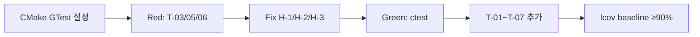

# Feedback Analyzer — 프로젝트 진행 보고서 (Doc·TestPlan)

| 항목 | 내용 |
|------|------|
| 프로젝트 | Feedback Analyzer (C++17 리팩토링 챌린지) |
| 워크스페이스 | `c:\DEV\FeedbackAnalyzer_12` |
| 저장소 | https://github.com/jvvoung/FeedbackAnalyzer_12.git |
| 보고 일자 | 2026-05-22 |
| 보고 범위 | README 전면 갱신 · 테스트 계획서 수립 (코드 구현 변경 없음) |
| 선행 보고서 | [`01.Spec_진행완료.md`](01.Spec_진행완료.md) |

---

## 1. Executive Summary

본 세션에서는 Spec 단계(보고서 01) 이후 **사용자·학습자 대상 README 정합성 보강**과 **Phase 1 착수를 위한 테스트 계획서** 작성을 완료하였다. **C++ 소스·CMake·테스트 코드는 변경하지 않았으며**, 산출물은 문서 2건으로 한정된다.

| 구분 | 상태 |
|------|------|
| README 전면 갱신 | ✅ 완료 (`README.md`) |
| 테스트 계획서 작성 | ✅ 완료 (`docs/test_plan.md`) |
| PRD ↔ README 키워드 계약 정합 | ✅ README 측 정정 (`main` 기준) |
| Phase 1 구현 (GTest·P0 버그 수정) | ⏳ 미착수 (test_plan 기준 착수 대기) |
| git commit | ⏳ 미수행 (사용자 요청 대기) |

---

## 2. 세션 배경 및 목적

### 2.1 선행 작업 (보고서 01)

Spec 단계에서 `docs/PRD.md`, `docs/analysis.md`, `.cursorrules`, 초판 README가 작성되었고, PRD ↔ README gap 분석 결과 **키워드 매칭 규칙(`main` vs `main+sub`) 불일치** 등이 식별되었다.

### 2.2 본 세션 목적

| # | 목적 | 산출물 |
|---|------|--------|
| 1 | PRD·analysis·project_purpose 기반 README 사용자 가이드 완성 | `README.md` |
| 2 | AC-1 중심 TDD 테스트 전략 수립 (Phase 1~5) | `docs/test_plan.md` |
| 3 | Spec gap 중 README 측 정합성 확보 | 본 보고서 §6 |

---

## 3. 수행 작업 요약

### 3.1 작업 일람

| 순서 | 작업 | 산출물 | 비고 |
|------|------|--------|------|
| 1 | PRD §1~§9·analysis·README 요구 템플릿 기반 README 전면 갱신 | `README.md` (~563줄) | 스크린샷 `feedback_analyzer.png` 유지 |
| 2 | QA 리드 관점 테스트 계획서 작성 | `docs/test_plan.md` (~417줄) | Given-When-Then·체크리스트·Phase 일정 |
| 3 | 진행 보고서 작성 | `Report/02.Doc_TestPlan_진행완료.md` | 본 문서 |

### 3.2 코드·빌드 변경 이력

| 유형 | 변경 |
|------|------|
| C++ 소스 (`src/cpp/*`) | **변경 없음** |
| CMakeLists.txt | **변경 없음** |
| Google Test / `tests/*` | **미생성** |
| 문서 | `README.md` 갱신, `docs/test_plan.md` 신규 |

### 3.3 Git 상태 (2026-05-22 기준)

| 파일 | 상태 |
|------|------|
| `README.md` | 수정됨 (unstaged) |
| `docs/test_plan.md` | 신규 (untracked) |
| `Report/02.Doc_TestPlan_진행완료.md` | 신규 (본 세션) |

최근 커밋: `a38472e` — Merge pull request #1 (Spec 단계)

---

## 4. README 갱신 핵심 내용

> 상세: [`README.md`](../README.md)

### 4.1 문서 구조 (전체 17개 섹션)

| 섹션 | PRD/analysis 근거 | 주요 내용 |
|------|-------------------|-----------|
| 한 줄 목적문 | §1.1 | What/Who/Why 1문장 |
| 개요 | §1.2~§1.3, analysis §6·§8 | God Function·P0·Phase 1~5 |
| Quick Start | README·analysis §5 | clone, MinGW 빌드, localhost:8080 |
| HTTP API | §3.2 F-01~F-05 | 5엔드포인트 Method/Path/Content-Type |
| 감정·키워드 | §3.3, §5.1, F-06 | 3분류 + 5카테고리 + sentinel `전체` |
| 입출력 계약 | §3.2, README | CSV/Form 정상·비정상 + alert 메시지 |
| 아키텍처 | §4.2 | Mermaid As-Is/To-Be, httplib 수정 금지 |
| 프로젝트 구조 | analysis §3 | `docs/`, `tests/`(Phase 1 예정) |
| 테스트 실행 | §4.3, §7.1 | ctest 목표, 현재 미구성 명시 |
| 설정·데이터 | §5.1~§5.4 | Constants 하드코딩, Session, File DB(선택) |
| 출력 포맷 | §6.1~§6.3 | HTML alert, CSV BOM, Trend(선택) |
| Known Issues | analysis §6.1 | H-1~H-4, Phase 1 수정 예정 |
| Activities | §9, project_purpose §6.1 | L-0~L-7, 14h, Phase 매핑 |
| 기여 가이드 | §7.2, `.cursorrules` | Green 후 리팩토링, PRD 개정 필요 변경 |
| 라이선스 | — | LICENSE 파일 추가 예정 |

### 4.2 Spec 보고서(01) 대비 README 개선 사항

| # | 보고서 01 gap | 본 세션 README 조치 |
|---|---------------|---------------------|
| 1 | 키워드 `main` vs `main+sub` 불일치 | **집계·필터는 `main`만** 매칭; `sub`는 Constants 내부 분류용으로 명시 |
| 2 | HTTP 핸들러 검증 방식 미기재 | 테스트 §: HTTP 90% 목표 아님, 부록 A 체크리스트 |
| 3 | `/download` 0건 warning 문구 | Phase 4 warning `다운로드할 필터 결과가 없습니다.` 명시 |
| 4 | GET `/` alert 미기재 | (PRD F-01) — Activities·출력 포맷에 success alert 예시 포함 |
| 5 | 아키텍처 Browser→Handler→Service 흐름 | Mermaid As-Is/To-Be 다이어그램 보강 |
| 6 | 오타·표현 | `분  석`→`필터 적용`, `且`→`및` 등 정정 |

### 4.3 README 유지·의도적 범위

- GitHub clone URL, `feedback_analyzer.png` 스크린샷 유지
- `tests/` 디렉터리 **(Phase 1 목표)** 로 명시 (실제 폴더 미존재)
- UnitConverter(Catch2, meter/feet 등) 내용 **미포함**

---

## 5. 테스트 계획서 핵심 내용

> 상세: [`docs/test_plan.md`](../docs/test_plan.md)

### 5.1 문서 목적

P0 버그(H-1~H-3)를 **failing test → Green** 워크플로로 고정하고, Phase 1~5 리팩토링 전 구간의 **회귀 게이트(ctest + 부록 A)** 를 정의한다.

### 5.2 대표 샘플 (계획서 중심 시나리오)

| 항목 | 내용 |
|------|------|
| **시나리오** | POST `/filter` — `sentiment=중립&keyword=전체` |
| **Given** | `text="그냥 그래요. 특별한 감정 없음."` (긍/부정 키워드 없음) |
| **When** | Filters 감정 필터 `중립` 적용 |
| **Then** | Filters 결과 = TextAnalyzer `중립` 집합 **100% 일치** |
| **AC / 버그** | AC-1, H-1 |

### 5.3 단위 테스트 우선순위

| 순위 | 대상 | Phase | 커버리지 |
|------|------|-------|----------|
| **1순위** | TextAnalyzer, Filters, CsvParser | 1 | 각 ≥ 90% |
| **2순위** | Feedback, KeywordUtils | 1~3 | ≥ 90% |
| **3순위** | HTTP 핸들러 | 1~4 | 부록 A 5항목 (90% 목표 아님) |

### 5.4 경계값 케이스 (T-01 ~ T-11)

| ID | 요약 | AC | 버그 |
|----|------|-----|------|
| T-01 | 빈 목록 → 감정 0/0/0 | — | — |
| T-02 | 단일 피드백 analyze+filter → 1건 | — | — |
| **T-03** | 중립 텍스트 → filter 중립 = Analyzer 중립 | **AC-1** | **H-1** |
| T-04 | sentiment=전체, keyword=전체 → 전체 반환 | — | — |
| **T-05** | CSV `text` 없음 → 0건/오류 | **AC-2** | **H-2** |
| **T-06** | main 키워드(`택배`) → filter 배송 포함 | **AC-3** | **H-3** |
| T-07 | 품질만, 감정 없음 → 중립 (카테고리 분리) | — | — |
| T-08~T-11 | 빈 text, Session 비어 filter, 0건, 개행 E2E | AC-7(T-11) | — |

### 5.5 gcov/lcov 전략

| 항목 | 내용 |
|------|------|
| 플래그 | `-fprofile-arcs -ftest-coverage` 또는 CMake `ENABLE_COVERAGE` |
| **포함** | TextAnalyzer.cpp, Filters.cpp, CsvParser.cpp |
| **제외** | main.cpp, httplib.h, HtmlRenderer(Phase 2~) |
| Baseline | Phase 1 Green 직후 `coverage_baseline_phase1.info` |

### 5.6 Phase별 테스트 일정

| Phase | 테스트 활동 | Exit Criteria |
|-------|-------------|---------------|
| **1** | Red(T-03/05/06) → Green(H-1~3) → T-01~07 | ctest Green, Service ≥ 90% |
| **2** | UT 회귀 + 부록 A 스모크 | main.cpp ≤ 200줄, Green 유지 |
| **3** | Rename UT, KeywordUtilsTest | Constants 단일 소스, Green |
| **4** | AC-5 부록 A, AC-6/7 수동 | Logger UI, download warning |
| **5** (선택) | Trend·File DB 별도 AC | 사용자 요청 시 |

---

## 6. 문서 정합성 재검토 (Spec gap 후속)

보고서 01 §6 gap 대비 본 세션 조치 결과:

| 항목 | 보고서 01 | 본 세션 후 | 판정 |
|------|-----------|------------|------|
| 키워드 매칭 | PRD `main` vs README `main+sub` | README `main` 기준으로 정정 | ✅ **해소** |
| HTTP 핸들러 검증 | README 미기재 | README + test_plan §3.6, §9 | ✅ **보강** |
| `/download` warning | 문구 누락 | README·test_plan EX-04 | ✅ **보강** |
| GET `/` alert | README 미기재 | PRD F-01 수준 — 출력 포맷 success 예시 | △ 부분 보강 |
| AC-4 vs Feedback 커버리지 | PRD 내부 불일치 | README·test_plan 모두 Feedback ≥ 90% 포함 | △ PRD §7.1 AC-4 문구와 차이 유지 |
| `tests/` 실존 | README에만 표기 | 여전히 Phase 1 예정 (폴더 미생성) | ⏳ Phase 1에서 해소 |
| LICENSE | 없음 | README "추가 예정" | ⏳ 미해결 |

### 6.1 문서 간 관계 (갱신)

```
project_purpose.md
        ↓
docs/analysis.md
        ↓
docs/PRD.md
        ↓
docs/test_plan.md  ←── 신규 (본 세션)
        ↓
README.md          ←── 갱신 (본 세션)
        ↓
.cursorrules
        ↓
Report/01.Spec_진행완료.md
Report/02.Doc_TestPlan_진행완료.md  ←── 본 문서
```

---

## 7. Phase 1 착수 준비 상태

test_plan §8.1 기준 **즉시 착수 가능** 항목:

| # | 준비 항목 | 상태 |
|---|-----------|------|
| 1 | P0 버그 정의 (H-1~H-3) | ✅ analysis §6.1 |
| 2 | failing test 시나리오 (T-03, T-05, T-06) | ✅ test_plan §4.3 |
| 3 | AC 인수 기준 (AC-1~AC-4) | ✅ PRD §7.1 |
| 4 | CMake GTest 설계 방향 | ✅ test_plan §7, analysis §8 Phase 1 |
| 5 | 회귀 체크리스트 (부록 A) | ✅ test_plan §9 |
| 6 | README Quick Start·API 계약 | ✅ README |

### Phase 1 실행 순서 (test_plan 권고)



**예상 수정 파일:** `CMakeLists.txt`, `tests/*`, `Filters.cpp`, `TextAnalyzer.h`, `main.cpp`(CSV `text` 컬럼)

---

## 8. 리스크 및 미결 사항

| # | 리스크/미결 | 영향 | 대응 |
|---|-------------|------|------|
| 1 | `tests/` 미생성 | Phase 1 착수 시 README·test_plan과 불일치 | Phase 1 첫 PR에서 `tests/` 생성 |
| 2 | PRD AC-4 vs §4.3 Feedback 커버리지 문구 차이 | AC 판정 시 혼선 | Phase 1 완료 시 PRD §7.1 또는 §4.3 중 하나로 통일 |
| 3 | GET `/` alert `피드백 분석기 시작` README 미단독 기재 | F-01 수동 검증 시 누락 가능 | 부록 A 또는 Phase 4에서 보강 |
| 4 | git commit 미수행 | 원격 저장소 미반영 | 사용자 요청 시 commit |
| 5 | LICENSE 없음 | 배포·기여 시 불명확 | 별도 추가 |

---

## 9. 산출물 목록

| 파일 | 경로 | 상태 | 비고 |
|------|------|------|------|
| README | `README.md` | ✅ 갱신 | PRD 기반 전면 재작성 |
| 테스트 계획서 | `docs/test_plan.md` | ✅ 신규 | AC-1 중심, T-01~T-11 |
| 진행 보고서 | `Report/02.Doc_TestPlan_진행완료.md` | ✅ 신규 | 본 문서 |
| PRD | `docs/PRD.md` | 변경 없음 | Spec 단계 산출물 |
| analysis | `docs/analysis.md` | 변경 없음 | Spec 단계 산출물 |
| Cursor 규칙 | `.cursorrules` | 변경 없음 | Spec 단계 산출물 |
| Spec 보고서 | `Report/01.Spec_진행완료.md` | 변경 없음 | 선행 보고서 |
| C++ 소스 | `src/cpp/*` | 변경 없음 | — |
| 단위 테스트 | `tests/*` | 미생성 | Phase 1 대상 |

---

## 10. 결론 및 다음 액션

본 세션에서는 Spec 단계 문서를 기반으로 **README 사용자·학습자 가이드 완성**과 **Phase 1 TDD 착수를 위한 테스트 계획서**를 수립하였다. 보고서 01에서 식별된 PRD ↔ README **키워드 `main` 매칭 불일치**는 README 측에서 정정하였으며, AC-1(중립 필터 100% 일치)을 중심으로 failing test → Green 워크플로가 `docs/test_plan.md`에 구체화되었다.

**권장 다음 액션 (우선순위):**

1. **Phase 1 착수** — CMake GTest + T-03/T-05/T-06 failing test → H-1/H-2/H-3 수정 → Green
2. lcov baseline 수립 (TextAnalyzer·Filters·CsvParser ≥ 90%)
3. PRD AC-4 vs §4.3 Feedback 커버리지 문구 통일 검토
4. README·test_plan·본 보고서 git commit (사용자 요청 시)
5. LICENSE 파일 추가

---

## 부록 A — 참고 문서

| 문서 | 용도 |
|------|------|
| [`Report/01.Spec_진행완료.md`](01.Spec_진행완료.md) | Spec 단계 보고서 |
| [`docs/test_plan.md`](../docs/test_plan.md) | 테스트 전략·경계값·Phase 일정 |
| [`README.md`](../README.md) | 실행·API·Activities |
| [`docs/PRD.md`](../docs/PRD.md) | 기능·계약·AC |
| [`docs/analysis.md`](../docs/analysis.md) | 버그·Phase 로드맵 |
| [`.cursorrules`](../.cursorrules) | AI·TDD 작업 규칙 |

## 부록 B — 변경 이력

| 버전 | 일자 | 변경 |
|------|------|------|
| 1.0 | 2026-05-22 | 초판 — README 갱신·test_plan·gap 후속·Phase 1 준비 상태 |
