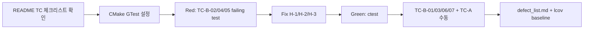

# Feedback Analyzer — 프로젝트 진행 보고서 (Red·To-Do)

| 항목 | 내용 |
|------|------|
| 프로젝트 | Feedback Analyzer (C++17 리팩토링 챌린지) |
| 워크스페이스 | `c:\DEV\FeedbackAnalyzer_12` |
| 저장소 | https://github.com/jvvoung/FeedbackAnalyzer_12.git |
| 브랜치 | `Red` |
| 보고 일자 | 2026-05-22 |
| 보고 범위 | README RED 단계 To-Do 체크리스트 삽입 (코드 구현 변경 없음) |
| 선행 보고서 | [`02.Doc_TestPlan_진행완료.md`](02.Doc_TestPlan_진행완료.md) |

---

## 1. Executive Summary

본 세션에서는 Doc·TestPlan 단계(보고서 02) 이후 **Phase 1 TDD Red 착수를 위한 실행 체크리스트**를 README에 추가하였다. `docs/test_plan.md`의 Track A(HTTP/Boundary)·Track B(Domain/Service) 시나리오, 커버리지 목표, 결함 목록 연결 항목을 **README 단일 진입점**으로 통합하였으며, **C++ 소스·CMake·테스트 코드는 변경하지 않았다.**

| 구분 | 상태 |
|------|------|
| README RED To-Do 섹션 추가 | ✅ 완료 (`README.md` +41줄) |
| 목차(## 목차) 링크 추가 | ✅ 완료 |
| Track A 체크리스트 (TC-A-01~08) | ✅ README 반영 |
| Track B 체크리스트 (TC-B-01~08) | ✅ README 반영 |
| 커버리지·결함 목록 연결 항목 | ✅ README 반영 |
| Phase 1 구현 (GTest·P0 버그 수정) | ⏳ 미착수 (Red 브랜치, 체크리스트만 준비) |
| `docs/defect_list.md` | ⏳ 미생성 (체크리스트 항목으로 예약) |
| git commit | ⏳ 미수행 (사용자 요청 대기) |

---

## 2. 세션 배경 및 목적

### 2.1 선행 작업 (보고서 02)

Doc·TestPlan 단계에서 README 전면 갱신과 `docs/test_plan.md` v1.0이 수립되었다. 테스트 전략·경계값(T-01~T-11)·Phase 일정은 test_plan에 상세 기술되어 있으나, **Phase 1 Red 착수 시 일일 추적용 체크리스트**는 README에 없었다.

### 2.2 본 세션 목적

| # | 목적 | 산출물 |
|---|------|--------|
| 1 | test_plan → README 실행 체크리스트 브릿지 | `README.md` §RED 단계 To-Do 리스트 |
| 2 | T-03/T-05/T-06 failing test → H-1/H-2/H-3 → Green 워크플로 가시화 | Track A·B 체크박스 24항목 |
| 3 | Phase 1 커버리지·결함 목록 연결 게이트 명시 | 커버리지 목표·결함 목록 연결 소절 |
| 4 | Red 브랜치 착수 문서화 | 본 보고서 |

---

## 3. 수행 작업 요약

### 3.1 작업 일람

| 순서 | 작업 | 산출물 | 비고 |
|------|------|--------|------|
| 1 | README `## 테스트 실행` 직후 RED To-Do 섹션 삽입 | `README.md` (+41줄) | 기존 내용 유지 |
| 2 | 목차에 `[RED 단계 To-Do 리스트]` 링크 추가 | `README.md` §목차 | 테스트 실행 ↔ 설정 및 데이터 사이 |
| 3 | 진행 보고서 작성 | `Report/03.Red_ToDo_진행완료.md` | 본 문서 |

### 3.2 코드·빌드 변경 이력

| 유형 | 변경 |
|------|------|
| C++ 소스 (`src/cpp/*`) | **변경 없음** |
| CMakeLists.txt | **변경 없음** |
| Google Test / `tests/*` | **미생성** |
| 문서 | `README.md` RED To-Do 섹션 추가 |
| `docs/defect_list.md` | **미생성** (체크리스트 예약) |

### 3.3 Git 상태 (2026-05-22 기준)

| 파일 | 상태 |
|------|------|
| `README.md` | 수정됨 (unstaged, +41줄) |
| `Report/03.Red_ToDo_진행완료.md` | 신규 (본 세션) |

| 항목 | 값 |
|------|-----|
| 브랜치 | `Red` (origin/Red 추적) |
| 최근 커밋 | `9e8d02a` — docs: Doc·TestPlan 단계 README 갱신·test_plan·보고서·프롬프트 Export 추가 |

---

## 4. README RED To-Do 섹션 핵심 내용

> 상세: [`README.md`](../README.md) §RED 단계 To-Do 리스트

### 4.1 삽입 위치

```
## 테스트 실행
  … (기존 내용 유지)
---
## RED 단계 To-Do 리스트   ← 신규
---
## 설정 및 데이터
```

목차 순서: `테스트 실행` → `RED 단계 To-Do 리스트` → `설정 및 데이터`

### 4.2 섹션 구조

| 소절 | 항목 수 | 근거 문서 |
|------|---------|-----------|
| Track A — HTTP / Boundary (수동·스모크) | 8 (TC-A-01~08) | `docs/test_plan.md` T-02, T-08~T-11, EX-04/06, 부록 A |
| Track B — Domain / Service (Google Test) | 8 (TC-B-01~08) | `docs/test_plan.md` T-01~T-07, EX-01/09 |
| 커버리지 목표 | 4 | `docs/PRD.md` §4.3·§7.1 AC-4, `docs/test_plan.md` §6.2 |
| 결함 목록 연결 | 4 | `docs/analysis.md` §6.1 H-1~H-4, `docs/test_plan.md` §7.4 |

### 4.3 Phase 1 Red 우선순위 (README 명시)

> Phase 1: T-03, T-05, T-06 failing test → H-1/H-2/H-3 수정 → Green.

| 우선순위 | test_plan ID | README TC | 버그 | AC |
|----------|--------------|-----------|------|-----|
| **1** | T-03 | TC-B-02 | H-1 (중립 필터 불일치) | AC-1 |
| **2** | T-05 | TC-B-04, TC-A-06 | H-2 (CSV `text` 컬럼 미사용) | AC-2 |
| **3** | T-06 | TC-B-05 | H-3 (main 키워드 필터 누락) | AC-3 |

### 4.4 Track A ↔ test_plan 매핑

| README TC | 시나리오 요약 | test_plan ID |
|-----------|---------------|--------------|
| TC-A-01 | Happy Path analyze → 부정+배송 stat | T-02 |
| TC-A-02 | 빈 text → 피드백 미추가 | T-08 |
| TC-A-03 | Session 비어 filter → warning | T-09 |
| TC-A-04 | 필터 0건 → warning | T-10 |
| TC-A-05 | download 필터 미실행 → BOM+헤더만 | EX-04, M-6 |
| TC-A-06 | CSV `text` 없음 → error | T-05, EX-06 |
| TC-A-07 | textarea 개행 E2E | T-11, AC-7 |
| TC-A-08 | HTTP-S-01~05 회귀 | AC-5, test_plan 부록 A |

### 4.5 Track B ↔ test_plan 매핑

| README TC | 시나리오 요약 | test_plan ID | 버그 |
|-----------|---------------|--------------|------|
| TC-B-01 | 빈 목록 → 감정 0/0/0 | T-01 | — |
| TC-B-02 | 중립 filter = Analyzer 중립 | T-03 | H-1 |
| TC-B-03 | 전체/전체 → 전체 반환 | T-04 | — |
| TC-B-04 | CSV `text` 컬럼 파싱 | T-05 | H-2 |
| TC-B-05 | `택배` → filter 배송 | T-06 | H-3 |
| TC-B-06 | 품질만 → 감정 중립 | T-07 | — |
| TC-B-07 | 긍정·부정 동시 → 긍정 우선 | EX-09 | — |
| TC-B-08 | SENTIMENT_KEYWORDS 단일 소스 | EX-01, M-7 | — |

---

## 5. 보고서 02 대비 변경 사항

| 항목 | 보고서 02 (Doc·TestPlan) | 본 세션 (Red·To-Do) |
|------|--------------------------|---------------------|
| README 테스트 § | ctest 목표·커버리지 표만 | **+ RED 실행 체크리스트 24항목** |
| test_plan 연계 | test_plan 단독 문서 | README에서 TC-A/B로 **실행 추적 가능** |
| 결함 목록 | analysis §6.1 표 (Known Issues) | **defect_list.md 생성 예약** + test_plan ID 연결 |
| 브랜치 | main/Spec 병합 후 | **`Red` 브랜치** Phase 1 착수 준비 |
| 코드 | 변경 없음 | 변경 없음 |

---

## 6. 문서 정합성

### 6.1 근거 문서 대조

| README 항목 | PRD | test_plan | analysis |
|-------------|-----|-----------|----------|
| TC-B-02 중립 100% 일치 | §7.1 AC-1 | §2, T-03 | §6.1 H-1 |
| TC-B-04 CSV `text` | §7.1 AC-2 | T-05, EX-06 | §6.1 H-2 |
| TC-B-05 main 키워드 | §7.1 AC-3 | T-06 | §6.1 H-3 |
| 커버리지 ≥ 90% | §4.3, AC-4 | §6 | — |
| H-4 테스트 부재 | §7.1 | §8.1 | §6.1 H-4 |

**판정:** README RED To-Do 항목은 PRD·test_plan·analysis와 **일치**. UnitConverter(Catch2, meter/feet 등) 내용 **미포함** (요청 준수).

### 6.2 문서 간 관계 (갱신)

```
docs/test_plan.md
        ↓ (체크리스트 브릿지)
README.md §RED 단계 To-Do 리스트  ←── 본 세션
        ↓ (향후)
docs/defect_list.md               ←── Phase 1 Red 시 생성 예정
        ↓
tests/* (GTest)                   ←── Phase 1 구현
        ↓
Report/03.Red_ToDo_진행완료.md    ←── 본 문서
```

---

## 7. Phase 1 Red 착수 준비 상태

보고서 02 §7 + 본 세션 README 체크리스트 기준:

| # | 준비 항목 | 상태 |
|---|-----------|------|
| 1 | failing test 시나리오 (T-03, T-05, T-06) | ✅ test_plan §4.3 + README TC-B-02/04/05 |
| 2 | HTTP 스모크 시나리오 | ✅ README TC-A-01~08 |
| 3 | 커버리지·lcov 게이트 | ✅ README 커버리지 목표 4항목 |
| 4 | 결함 추적 템플릿 | ⏳ `docs/defect_list.md` 미생성 |
| 5 | CMake GTest 타깃 | ⏳ 미구성 |
| 6 | Red 브랜치 | ✅ `Red` (origin 추적) |

### Phase 1 Red 실행 순서 (README + test_plan 권고)



**예상 수정 파일 (Phase 1 구현 시):** `CMakeLists.txt`, `tests/*`, `Filters.cpp`, `TextAnalyzer.h`, `main.cpp`(CSV `text` 컬럼)

---

## 8. 리스크 및 미결 사항

| # | 리스크/미결 | 영향 | 대응 |
|---|-------------|------|------|
| 1 | `docs/defect_list.md` 미생성 | H-1~H-4 추적 분산 | Phase 1 Red 첫 작업으로 생성 (README 결함 목록 연결 §) |
| 2 | `tests/` 미생성 | TC-B 체크리스트 실행 불가 | CMake GTest + failing test 우선 |
| 3 | README +41줄 미커밋 | Red 브랜치 원격 미반영 | 사용자 요청 시 commit |
| 4 | PRD AC-4 vs §4.3 Feedback 커버리지 문구 차이 | AC 판정 혼선 | Phase 1 Green 후 PRD 통일 검토 (보고서 02 §8 이월) |
| 5 | Track A 수동 검증 의존 | 자동화 공백 | test_plan 부록 A + TC-A-08로 Phase 1~4 회귀 |

---

## 9. 산출물 목록

| 파일 | 경로 | 상태 | 비고 |
|------|------|------|------|
| README | `README.md` | ✅ 갱신 | RED To-Do 섹션 +41줄, 목차 링크 |
| 진행 보고서 | `Report/03.Red_ToDo_진행완료.md` | ✅ 신규 | 본 문서 |
| 테스트 계획서 | `docs/test_plan.md` | 변경 없음 | Doc·TestPlan 산출물 |
| PRD | `docs/PRD.md` | 변경 없음 | Spec 산출물 |
| analysis | `docs/analysis.md` | 변경 없음 | Spec 산출물 |
| 결함 목록 | `docs/defect_list.md` | ⏳ 미생성 | README 체크리스트 예약 |
| Doc·TestPlan 보고서 | `Report/02.Doc_TestPlan_진행완료.md` | 변경 없음 | 선행 보고서 |
| C++ 소스 | `src/cpp/*` | 변경 없음 | — |
| 단위 테스트 | `tests/*` | 미생성 | Phase 1 대상 |

---

## 10. 결론 및 다음 액션

본 세션에서는 `docs/test_plan.md` 기반 **Phase 1 Red 실행 체크리스트**를 README에 통합하였다. Track A(HTTP/Boundary 8항목)·Track B(Domain/Service 8항목)·커버리지·결함 목록 연결(각 4항목)으로 **T-03/T-05/T-06 → H-1/H-2/H-3 → Green** 워크플로를 README 단일 화면에서 추적할 수 있게 되었다. 코드 변경은 없으며, `Red` 브랜치에서 Phase 1 구현 착수 준비가 완료된 상태이다.

**권장 다음 액션 (우선순위):**

1. **CMake GTest 설정** — `enable_testing()`, `tests/` 디렉터리 생성
2. **Red: TC-B-02/04/05** — T-03/T-05/T-06 failing test 작성 (H-1/H-2/H-3 고정)
3. **`docs/defect_list.md` 생성** — H-1~H-4 + test_plan ID + failing test명 연결
4. **Green: ctest** — H-1/H-2/H-3 수정 후 `ctest --test-dir build --output-on-failure`
5. **lcov baseline** — TextAnalyzer·Filters·CsvParser ≥ 90%
6. README·본 보고서 git commit (사용자 요청 시)

---

## 부록 A — 참고 문서

| 문서 | 용도 |
|------|------|
| [`Report/02.Doc_TestPlan_진행완료.md`](02.Doc_TestPlan_진행완료.md) | Doc·TestPlan 단계 보고서 |
| [`docs/test_plan.md`](../docs/test_plan.md) | 테스트 전략·T-01~T-11·부록 A |
| [`README.md`](../README.md) | RED To-Do 체크리스트 |
| [`docs/PRD.md`](../docs/PRD.md) | AC-1~AC-4, §4.3 커버리지 |
| [`docs/analysis.md`](../docs/analysis.md) | H-1~H-4 P0 버그 |

## 부록 B — 변경 이력

| 버전 | 일자 | 변경 |
|------|------|------|
| 1.0 | 2026-05-22 | 초판 — README RED To-Do 추가·Track A/B 매핑·Phase 1 Red 준비 상태 |
