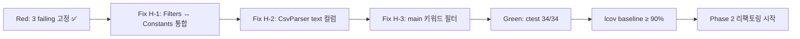

# Feedback Analyzer — 프로젝트 진행 보고서 (Red·GTest 구현)

| 항목 | 내용 |
|------|------|
| 프로젝트 | Feedback Analyzer (C++17 리팩토링 챌린지) |
| 워크스페이스 | `c:\DEV\FeedbackAnalyzer_12` |
| 저장소 | https://github.com/jvvoung/FeedbackAnalyzer_12.git |
| 브랜치 | `Red` |
| 보고 일자 | 2026-05-22 |
| 보고 범위 | Phase 1 RED — Google Test 인프라·단위 테스트 34건 작성 (레거시 `src/cpp/` 미수정) |
| 선행 보고서 | [`03.Red_ToDo_진행완료.md`](03.Red_ToDo_진행완료.md) |

---

## 1. Executive Summary

본 세션에서는 보고서 03(README RED To-Do 체크리스트) 이후 **Phase 1 TDD RED 단계 구현**을 완료하였다. CMake에 Google Test FetchContent·`feedback_analyzer_tests` 타깃을 추가하고, `docs/test_plan.md`·`docs/PRD.md` §4.3·§7.1 기준 **34개 Google Test**를 작성하였다. P0 결함 H-1/H-2/H-3을 재현하는 **3개 failing test**를 의도적으로 Red 상태로 유지하며, `src/cpp/` 레거시 프로덕션 코드는 **한 줄도 수정하지 않았다.**

| 구분 | 상태 |
|------|------|
| CMake GTest FetchContent + `enable_testing()` | ✅ 완료 |
| `feedback_analyzer_tests` executable 빌드 | ✅ Green |
| `feedback_analyzer` (메인 executable) 빌드 | ✅ Green (회귀 없음) |
| Google Test 34건 작성 (5개 대상 × 최소 5건) | ✅ 완료 |
| P0 failing test 3건 (T-03/T-05/T-06) | ✅ Red 유지 |
| ctest 전체 Green | ⏳ **미달** (31/34 통과, 91%) |
| H-1/H-2/H-3 프로덕션 수정 (GREEN) | ⏳ 미착수 |
| `docs/defect_list.md` | ⏳ 미생성 |
| lcov baseline | ⏳ GREEN 이후 |

---

## 2. 세션 배경 및 목적

### 2.1 선행 작업 (보고서 03)

README에 Track A/B 체크리스트 24항목이 추가되어 Phase 1 Red **실행 추적** 기반이 마련되었으나, `tests/` 디렉터리·CMake 테스트 타깃·Google Test 코드는 존재하지 않았다 (`docs/analysis.md` §6.1 H-4).

### 2.2 본 세션 목적

| # | 목적 | 산출물 |
|---|------|--------|
| 1 | Google Test 인프라 구축 | `CMakeLists.txt` 테스트 블록, GTest v1.14.0 FetchContent |
| 2 | Domain/Service 단위 테스트 RED 작성 | `tests/*.cpp` 5파일, `tests/support/*` 4파일 |
| 3 | P0 버그 failing test 고정 | T-03/H-1, T-05/H-2, T-06/H-3 각 1건 이상 Red |
| 4 | 레거시 코드 보호 | `src/cpp/*` 수정 0건, GREEN은 별도 Phase |
| 5 | Red 브랜치 구현 문서화 | 본 보고서 |

---

## 3. 수행 작업 요약

### 3.1 작업 일람

| 순서 | 작업 | 산출물 | 비고 |
|------|------|--------|------|
| 1 | CMake GTest 설정 | `CMakeLists.txt` (+45줄) | `feedback_analyzer` 타깃 유지 |
| 2 | TextAnalyzerTest | `tests/TextAnalyzerTest.cpp` (7건) | T-01, T-03, T-06, T-07, EX-09 |
| 3 | FiltersTest | `tests/FiltersTest.cpp` (8건) | T-02~T-04, T-03/H-1, T-06/H-3 |
| 4 | CsvParserTest + stub | `tests/CsvParserTest.cpp`, `tests/support/CsvParser.*` | T-05/H-2, AC-7 |
| 5 | FeedbackTest | `tests/FeedbackTest.cpp` (7건) | 도메인 모델 |
| 6 | KeywordUtilsTest | `tests/KeywordUtilsTest.cpp`, `tests/support/KeywordUtils.h` | Phase 2~3 `containsAny` 대비 |
| 7 | 테스트 헬퍼 | `tests/support/TestHelpers.h` | Analyzer 중립 집합·main 카테고리 매칭 |
| 8 | 빌드·ctest 검증 | MinGW GCC, 34 tests | 31 Pass / 3 Fail (Red) |

### 3.2 코드·빌드 변경 이력

| 유형 | 변경 |
|------|------|
| C++ 소스 (`src/cpp/*`) | **변경 없음** (main.cpp, TextAnalyzer.*, Filters.* 등) |
| CMakeLists.txt | GTest FetchContent, `feedback_analyzer_tests` 타깃 추가 |
| Google Test / `tests/*` | **신규 9파일** (테스트 5 + support 4) |
| `feedback_analyzer` | 기존 executable — 빌드·동작 유지 |
| 문서 (부수) | `README.md`, `docs/PRD.md`, `docs/analysis.md` v2.0 (커밋 포함) |

### 3.3 Git 상태 (2026-05-22 기준)

| 항목 | 값 |
|------|-----|
| 브랜치 | `Red` |
| 관련 커밋 | `62598de` — test: Phase 1 Red GTest 타깃·failing 테스트 추가 및 docs/analysis v2.0·다이어그램·PRD/README 정합 |
| 선행 커밋 | `ea7b4e1` — docs: Red 단계 README To-Do 체크리스트·보고서·프롬프트 Export 추가 |

---

## 4. 테스트 인프라

### 4.1 CMake 타깃

| 타깃 | 설명 | 상태 |
|------|------|------|
| `feedback_analyzer` | 프로덕션 HTTP executable | ✅ 빌드 Green |
| `feedback_analyzer_tests` | Google Test + Service 계층 링크 | ✅ 빌드 Green |

**테스트 executable 링크 대상 (프로덕션):**

- `src/cpp/Constants.cpp`
- `src/cpp/Filters.cpp`
- `src/cpp/TextAnalyzer.cpp`

**테스트 전용 (support):**

- `tests/support/CsvParser.cpp` — H-2 재현 stub (`text` 컬럼 없을 때 `fields[0]` fallback)
- `tests/support/KeywordUtils.h` — `containsAny` 헬퍼 (M-3 통합 전)
- `tests/support/TestHelpers.h` — Analyzer 규칙 기준 기대값 계산

### 4.2 빌드·실행 명령

```powershell
cmake -S . -B build -G "MinGW Makefiles" -DCMAKE_CXX_COMPILER=C:/mingw64/bin/g++.exe
cmake --build build
ctest --test-dir build --output-on-failure
```

### 4.3 ctest 결과 (2026-05-22 검증)

| 항목 | 값 |
|------|-----|
| 총 테스트 | **34** |
| 통과 | **31** (91%) |
| 실패 (Red 의도) | **3** |
| 실행 시간 | ~0.9초 |

> **Phase 1 RED Exit Criteria:** ctest 전체 Green **아님** — P0 failing 3건 존재가 정상. GREEN Phase에서 H-1/H-2/H-3 수정 후 34/34 Green 목표.

---

## 5. 테스트 파일별 상세

### 5.1 TextAnalyzerTest (7건) — `tests/TextAnalyzerTest.cpp`

| 테스트명 | test_plan ID | 검증 내용 | 결과 |
|----------|--------------|-----------|------|
| `Given_PositiveKeywordText_When_AnalyzeSentiment_Then_PositiveCountIsOne` | — | `SENTIMENT_KEYWORDS["긍정"]` 매칭 | ✅ Pass |
| `Given_NegativeKeywordText_When_AnalyzeSentiment_Then_NegativeCountIsOne` | T-02 | `SENTIMENT_KEYWORDS["부정"]`("불만") | ✅ Pass |
| `Given_NeutralTextWithoutSentimentKeywords_When_AnalyzeSentiment_Then_NeutralCountIsOne` | T-03 | 긍/부정 미매칭 → 중립 | ✅ Pass |
| `Given_EmptyFeedbackList_When_AnalyzeSentiment_Then_AllCountsAreZero` | T-01 | 빈 vector → 0/0/0 | ✅ Pass |
| `Given_CategoryKeywordOnly_When_AnalyzeSentiment_Then_ClassifiedAsNeutral` | T-07, EX-10 | 카테고리만, 감정=중립 | ✅ Pass |
| `Given_MixedPositiveAndNegativeKeywords_When_AnalyzeSentiment_Then_PositiveFirst` | EX-09 | 긍정 → 부정 → 중립 순서 | ✅ Pass |
| `Given_DeliveryMainKeywordText_When_AnalyzeKeywords_Then_BaeseongCountIsOne` | T-06 | `CATEGORY_KEYWORDS["배송"]["main"]` | ✅ Pass |

**판정 규칙 주석:** `Constants::SENTIMENT_KEYWORDS["긍정"]` → `["부정"]` → 기본 `"중립"`

### 5.2 FiltersTest (8건) — `tests/FiltersTest.cpp`

| 테스트명 | test_plan ID | 검증 내용 | 결과 |
|----------|--------------|-----------|------|
| `Given_NegativeDeliveryText_When_FilterNegativeAndBaeseong_Then_OneResult` | T-02 | sentiment=부정 + keyword=배송 교집합 | ✅ Pass |
| `Given_MixedThreeFeedbacks_When_FilterAllSentimentAllKeyword_Then_ReturnsAllThree` | T-04 | sentinel `전체`/`전체` | ✅ Pass |
| `Given_MixedFeedbacksIncludingNeutral_When_FilterSentimentNeutral_Then_MatchesTextAnalyzerSet` | **T-03, AC-1, H-1** | 중립 filter = Analyzer 중립 집합 100% | ❌ **Fail (Red)** |
| `Given_CanonicalNeutralText_When_FilterSentimentNeutral_Then_MatchesSingleAnalyzerNeutral` | T-03 | canonical 단일 피드백 | ✅ Pass |
| `Given_TaekbaeMainKeywordText_When_FilterKeywordBaeseong_Then_IncludedInResult` | T-06 | `"택배"` → keyword=배송 | ✅ Pass |
| `Given_QualityMainKeywordOnlyText_When_FilterKeywordQuality_Then_IncludedInResult` | **T-06, AC-3, H-3** | `"품질"` main-only → filter 누락 | ❌ **Fail (Red)** |
| `Given_MainCategoryFeedbacks_When_FilterKeywordBaeseong_Then_MatchesAnalyzerMainSet` | AC-3 | filter = main 집합 일치 (배송) | ✅ Pass |
| `Given_PositiveAndNegativeFeedbacks_When_FilterPositiveAllKeyword_Then_OnlyPositive` | — | keyword sentinel `전체` | ✅ Pass |

### 5.3 CsvParserTest (6건) — `tests/CsvParserTest.cpp`

| 테스트명 | test_plan ID | 검증 내용 | 결과 |
|----------|--------------|-----------|------|
| `Given_ValidTwoLineCsv_When_Parse_Then_OneFeedback` | — | `text\n...` 정상 파싱 | ✅ Pass |
| `Given_HeaderOnlyCsv_When_Parse_Then_ZeroFeedbacks` | EX-08 | 헤더만 → 0건 | ✅ Pass |
| `Given_NoTextColumnCsv_When_Parse_Then_ZeroFeedbacks` | **T-05, AC-2, H-2** | `id,comment` → 0건 | ❌ **Fail (Red)** |
| `Given_ExtraColumnsCsv_When_Parse_Then_UsesTextColumnOnly` | PRD §5.3 | 추가 컬럼 무시 | ✅ Pass |
| `Given_Utf8MultilineTextInCsv_When_Parse_Then_PreservesNewlines` | AC-7 | quoted field 개행 유지 | ✅ Pass |
| `Given_TwoDataRows_When_Parse_Then_TwoFeedbacks` | — | 2행 데이터 | ✅ Pass |

### 5.4 FeedbackTest (7건) — `tests/FeedbackTest.cpp`

| 테스트명 | 검증 내용 | 결과 |
|----------|-----------|------|
| `Given_Text_When_CreateFeedback_Then_GetTextReturnsSame` | 생성·getText() | ✅ Pass |
| `Given_EmptyString_When_CreateFeedback_Then_GetTextIsEmpty` | 빈 문자열 | ✅ Pass |
| `Given_WhitespaceOnly_When_CreateFeedback_Then_PreservesWhitespace` | 공백만 | ✅ Pass |
| `Given_MultilineText_When_CreateFeedback_Then_PreservesNewlines` | `\n` 포함 | ✅ Pass |
| `Given_Feedback_When_CopyAndMove_Then_IndependentAndTransferred` | 복사·이동 | ✅ Pass |
| `Given_LongUtf8KoreanText_When_CreateFeedback_Then_RetainsFullContent` | 긴 UTF-8 한글 | ✅ Pass |
| `Given_Utf8KoreanText_When_CreateFeedback_Then_GetTextMatches` | UTF-8 한글 | ✅ Pass |

### 5.5 KeywordUtilsTest (6건) — `tests/KeywordUtilsTest.cpp`

| 테스트명 | 검증 내용 | 결과 |
|----------|-----------|------|
| `Given_TextContainingKeyword_When_ContainsAny_Then_ReturnsTrue` | 부분 문자열 포함 | ✅ Pass |
| `Given_EmptyText_When_ContainsAny_Then_ReturnsFalse` | 빈 text | ✅ Pass |
| `Given_EmptyKeywords_When_ContainsAny_Then_ReturnsFalse` | 빈 keywords | ✅ Pass |
| `Given_NoMatchingKeyword_When_ContainsAny_Then_ReturnsFalse` | 미포함 | ✅ Pass |
| `Given_MultipleKeywords_When_OneMatches_Then_ReturnsTrue` | 다중 키워드 1건 매칭 | ✅ Pass |
| `Given_Utf8KoreanKeyword_When_ContainsAny_Then_ReturnsTrue` | UTF-8 한글 키워드 | ✅ Pass |

---

## 6. P0 Failing Test 상세 (Red)

### 6.1 T-03 / AC-1 / H-1 — 중립 필터 불일치

| 항목 | 내용 |
|------|------|
| **테스트** | `FiltersTest.Given_MixedFeedbacksIncludingNeutral_When_FilterSentimentNeutral_Then_MatchesTextAnalyzerSet` |
| **Given** | `"그냥 그래요. 특별한 감정 없음."` + `"와우 정말 대단해요."` |
| **When** | `Filters::fil(feedbacks, u8"중립", u8"전체")` |
| **Then (기대)** | 반환 집합 = TextAnalyzer 중립 집합 (1건) |
| **As-Is (실제)** | Filters 2건 반환 — `"와우"`가 `Constants::SENTIMENT_KEYWORDS["긍정"]`에만 있고 `Filters::S_KEYWORDS`에는 없어 TA=긍정, Filters=중립 |
| **근거** | `docs/analysis.md` §6.1 H-1, `Filters.cpp` vs `Constants.cpp` 이중 관리 |

> **참고:** T-03 canonical 단일 텍스트(`"그냥 그래요..."`)만으로는 As-Is에서도 통과. H-1은 **키워드 목록 불일치**를 혼합 데이터로 재현.

### 6.2 T-05 / AC-2 / H-2 — CSV `text` 컬럼 미사용

| 항목 | 내용 |
|------|------|
| **테스트** | `CsvParserTest.Given_NoTextColumnCsv_When_Parse_Then_ZeroFeedbacks` |
| **Given** | CSV `"id,comment\n1,hello\n"` |
| **When** | `CsvParser::parse(csv)` (tests/support stub) |
| **Then (기대)** | 0건 (또는 parse 실패) |
| **As-Is (실제)** | Feedback `"1"` 1건 적재 — stub이 H-2 fallback(`fields[0]`) 구현 |
| **근거** | `docs/analysis.md` §6.1 H-2, `main.cpp:303-305` 동일 패턴 |

> **참고:** CsvParser stub은 `main.cpp` `parseCsvLine` **복사 없이** 독립 구현. GREEN Phase에서 stub 수정 + `main.cpp` 추출·통합 예정.

### 6.3 T-06 / AC-3 / H-3 — main 키워드 필터 누락

| 항목 | 내용 |
|------|------|
| **테스트** | `FiltersTest.Given_QualityMainKeywordOnlyText_When_FilterKeywordQuality_Then_IncludedInResult` |
| **Given** | `Feedback(u8"품질이 좋아요.")` — `CATEGORY_KEYWORDS["품질"]["main"]`의 `"품질"`만 매칭 |
| **When** | `Filters::fil(..., u8"전체", u8"품질")` |
| **Then (기대)** | 1건 포함 |
| **As-Is (실제)** | 0건 — `Filters.cpp:56` `subEntry.first == "main"` skip |
| **근거** | `docs/analysis.md` §6.1 H-3 |

> **참고:** T-06 샘플 `"택배가 빨라요."`는 sub 카테고리(`type`)에 `"택배"`가 있어 As-Is에서 통과. H-3는 **`"품질"` main-only** 케이스로 재현.

---

## 7. 테스트 작성 규칙 준수

| 규칙 (`.cursorrules` §5, `docs/test_plan.md` §1) | 준수 |
|---------------------------------------------------|------|
| Google Test (`TEST`, `TEST_F`) — Catch2 미사용 | ✅ |
| Given-When-Then 주석 블록 | ✅ 전 테스트 |
| PRD/test_plan ID 주석 (T-01~T-07, AC-*, H-*, EX-*) | ✅ |
| 테스트명 `Given_[전제]_When_[행동]_Then_[기대]` | ✅ |
| Constants 출처 주석 (`SENTIMENT_KEYWORDS`, `CATEGORY_KEYWORDS["main"]`) | ✅ |
| `src/cpp/` 레거시 수정 금지 | ✅ |
| UnitConverter(Catch2, meter/feet 등) 코드 금지 | ✅ |

---

## 8. 보고서 03 대비 변경 사항

| 항목 | 보고서 03 (Red·To-Do) | 본 세션 (Red·GTest) |
|------|----------------------|---------------------|
| README RED 체크리스트 | ✅ 24항목 | 변경 없음 (TC-B 실행 가능) |
| CMake GTest 타깃 | ⏳ 미구성 | ✅ `feedback_analyzer_tests` |
| `tests/*` | 미생성 | ✅ 9파일, 34 tests |
| TC-B-02/04/05 failing test | ⏳ 미작성 | ✅ Red 3건 고정 |
| `src/cpp/*` | 변경 없음 | **변경 없음** (유지) |
| ctest | 실행 불가 | 31/34 (Red) |
| H-4 테스트 부재 | 미해소 | **부분 해소** (인프라·UT 존재) |

---

## 9. 문서·체크리스트 정합성

### 9.1 README Track B ↔ 구현 매핑

| README TC | test_plan ID | 구현 테스트 | 상태 |
|-----------|--------------|-------------|------|
| TC-B-01 | T-01 | `TextAnalyzerTest...EmptyFeedbackList...` | ✅ Pass |
| TC-B-02 | T-03, H-1 | `FiltersTest...MixedFeedbacksIncludingNeutral...` | ❌ Red |
| TC-B-03 | T-04 | `FiltersTest...FilterAllSentimentAllKeyword...` | ✅ Pass |
| TC-B-04 | T-05, H-2 | `CsvParserTest...NoTextColumnCsv...` | ❌ Red |
| TC-B-05 | T-06, H-3 | `FiltersTest...QualityMainKeywordOnlyText...` | ❌ Red |
| TC-B-06 | T-07 | `TextAnalyzerTest...CategoryKeywordOnly...` | ✅ Pass |
| TC-B-07 | EX-09 | `TextAnalyzerTest...MixedPositiveAndNegative...` | ✅ Pass |
| TC-B-08 | EX-01, M-7 | (GREEN Phase — `S_KEYWORDS` 제거 후) | ⏳ 미착수 |

### 9.2 문서 간 관계 (갱신)

```
docs/test_plan.md
        ↓
README.md §RED To-Do (Track B)
        ↓
tests/*.cpp (GTest 34건)          ←── 본 세션
        ↓ (RED: 3 failing)
Filters.cpp / main.cpp 수정       ←── GREEN Phase
        ↓
ctest 34/34 Green + lcov ≥ 90%
        ↓
Report/04.Red_GTest_진행완료.md   ←── 본 문서
```

---

## 10. Phase 1 GREEN 착수 준비

### 10.1 GREEN Phase 수정 대상 (예상)

| 버그 | 수정 파일 (예상) | failing test |
|------|------------------|--------------|
| **H-1** | `Filters.cpp`, `Filters.h` — `Constants::SENTIMENT_KEYWORDS` 단일 소스, `initFilterKeywords()` 제거 | T-03/H-1 |
| **H-2** | `main.cpp` CSV 파싱 + `tests/support/CsvParser.cpp` — `text` 컬럼 인덱스 탐색 | T-05/H-2 |
| **H-3** | `Filters.cpp:56` — `main` skip 제거 또는 `containsCategoryKeyword` 통합 | T-06/H-3 |

### 10.2 GREEN 실행 순서 (test_plan §5.1, §8.1)



### 10.3 준비 상태 체크리스트

| # | 항목 | 상태 |
|---|------|------|
| 1 | failing test 3건 (T-03, T-05, T-06) | ✅ |
| 2 | 비-failing test 31건 (회귀 기반) | ✅ |
| 3 | `feedback_analyzer` 빌드 유지 | ✅ |
| 4 | `docs/defect_list.md` | ⏳ |
| 5 | lcov `-fprofile-arcs -ftest-coverage` | ⏳ GREEN 후 |
| 6 | Track A 수동 HTTP 검증 (TC-A-01~08) | ⏳ GREEN 후 권장 |

---

## 11. 리스크 및 미결 사항

| # | 리스크/미결 | 영향 | 대응 |
|---|-------------|------|------|
| 1 | ctest Red 상태 merge | PRD §7.2 R-4 Red merge 금지 | GREEN 완료 후 merge |
| 2 | CsvParser stub vs main.cpp 이중 구현 | H-2 수정 시 2곳 동기화 | Phase 2 CsvParser 추출 시 단일화 |
| 3 | T-06 `"택배"` 샘플 As-Is 통과 | H-3 재현 누락 오해 | 본 보고서 §6.3 — `"품질"` 케이스로 Red |
| 4 | T-03 canonical 단일 건 Pass | H-1 재현 누락 오해 | 혼합 데이터 테스트로 Red (§6.1) |
| 5 | `docs/defect_list.md` 미생성 | 결함 추적 분산 | GREEN Phase 첫 작업으로 생성 |
| 6 | Filters `fil()` std::cout 출력 | 테스트 로그 노이즈 | Phase 2~3 Logger 연동·제거 검토 |

---

## 12. 산출물 목록

| 파일 | 경로 | 상태 | 비고 |
|------|------|------|------|
| CMakeLists.txt | `CMakeLists.txt` | ✅ 갱신 | GTest + `feedback_analyzer_tests` |
| TextAnalyzerTest | `tests/TextAnalyzerTest.cpp` | ✅ 신규 | 7 tests |
| FiltersTest | `tests/FiltersTest.cpp` | ✅ 신규 | 8 tests |
| CsvParserTest | `tests/CsvParserTest.cpp` | ✅ 신규 | 6 tests |
| FeedbackTest | `tests/FeedbackTest.cpp` | ✅ 신규 | 7 tests |
| KeywordUtilsTest | `tests/KeywordUtilsTest.cpp` | ✅ 신규 | 6 tests |
| CsvParser stub | `tests/support/CsvParser.h/cpp` | ✅ 신규 | H-2 Red |
| KeywordUtils | `tests/support/KeywordUtils.h` | ✅ 신규 | containsAny |
| TestHelpers | `tests/support/TestHelpers.h` | ✅ 신규 | Analyzer 규칙 헬퍼 |
| 진행 보고서 | `Report/04.Red_GTest_진행완료.md` | ✅ 신규 | 본 문서 |
| C++ 레거시 | `src/cpp/*` | 변경 없음 | GREEN Phase 대상 |
| RED To-Do 보고서 | `Report/03.Red_ToDo_진행완료.md` | 변경 없음 | 선행 보고서 |

---

## 13. 결론 및 다음 액션

본 세션에서는 Phase 1 **TDD RED** 구현을 완료하였다. Google Test 인프라·34개 단위 테스트·P0 failing 3건(H-1/H-2/H-3)을 `src/cpp/` 수정 없이 고정하였으며, `feedback_analyzer`·`feedback_analyzer_tests` 모두 빌드에 성공한다. ctest **31/34 통과(91%)** 는 RED Phase의 **정상 Exit 상태**이며, GREEN Phase에서 3건 수정 후 34/34 Green을 목표로 한다.

**권장 다음 액션 (우선순위):**

1. **H-1 수정** — `Filters`가 `Constants::SENTIMENT_KEYWORDS` 단일 소스 사용 (`Filters::initFilterKeywords()` 제거)
2. **H-2 수정** — CSV `text` 컬럼 인덱스 탐색 (`main.cpp` + CsvParser stub)
3. **H-3 수정** — `Filters.cpp` main 키워드 skip 제거
4. **Green: ctest 34/34** — `ctest --test-dir build --output-on-failure`
5. **`docs/defect_list.md` 생성** — H-1~H-4 + failing test명 연결
6. **lcov baseline** — TextAnalyzer·Filters·CsvParser ≥ 90%
7. **Track A 수동 검증** — README TC-A-01~08, HTTP-S-01~05

---

## 부록 A — 참고 문서

| 문서 | 용도 |
|------|------|
| [`Report/03.Red_ToDo_진행완료.md`](03.Red_ToDo_진행완료.md) | RED To-Do 체크리스트 보고서 |
| [`docs/test_plan.md`](../docs/test_plan.md) | T-01~T-11, Phase 1 일정 |
| [`docs/PRD.md`](../docs/PRD.md) | AC-1~AC-4, §4.3 커버리지 |
| [`docs/analysis.md`](../docs/analysis.md) | H-1~H-4 P0 버그 |
| [`README.md`](../README.md) | RED To-Do, 테스트 실행 |

## 부록 B — Expected RED Failures (CMakeLists.txt 주석)

```
T-05/H-2: CsvParserTest.Given_NoTextColumnCsv_When_Parse_Then_ZeroFeedbacks
T-03/H-1: FiltersTest.Given_MixedFeedbacksIncludingNeutral_When_FilterSentimentNeutral_Then_MatchesTextAnalyzerSet
T-06/H-3: FiltersTest.Given_QualityMainKeywordOnlyText_When_FilterKeywordQuality_Then_IncludedInResult
```

## 부록 C — 변경 이력

| 버전 | 일자 | 변경 |
|------|------|------|
| 1.0 | 2026-05-22 | 초판 — Phase 1 RED GTest 34건·P0 failing 3건·CMake 타깃·본 보고서 |
