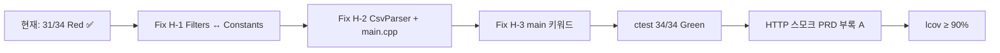

# Feedback Analyzer — 프로젝트 진행 보고서 (QA·GTest 진단)

| 항목 | 내용 |
|------|------|
| 프로젝트 | Feedback Analyzer (C++17 리팩토링 챌린지) |
| 워크스페이스 | `c:\DEV\FeedbackAnalyzer_12` |
| 저장소 | https://github.com/jvvoung/FeedbackAnalyzer_12.git |
| 보고 일자 | 2026-05-22 |
| 보고 범위 | Phase 1 RED — CMake/GTest 빌드·ctest 실측 검증 및 P0 결함 진단 (코드 수정 없음) |
| 선행 보고서 | [`04.Red_GTest_진행완료.md`](04.Red_GTest_진행완료.md) |

---

## 1. Executive Summary

본 세션에서는 보고서 04(Phase 1 RED GTest 34건 작성) 이후 **C++ QA 관점의 빌드·테스트 실패 진단**을 수행하였다. MinGW CMake 빌드와 `ctest`를 워크스페이스에서 직접 실행하여 **빌드 Green / 테스트 31·34(91%)** 상태를 확인하였고, 실패 3건을 P0 결함(H-1, H-2, H-3)과 1:1 매핑·근본 원인·최소 GREEN 수정안까지 문서화하였다. **`src/cpp/` 및 `tests/` 소스는 수정하지 않았다.**

| 구분 | 상태 |
|------|------|
| `cmake` configure (MinGW Makefiles) | ✅ 성공 |
| `cmake --build build` | ✅ Green (`feedback_analyzer`, `feedback_analyzer_tests`) |
| `ctest` 34건 | ⏳ **31 Pass / 3 Fail** (RED 의도, 정상) |
| 빌드 오류 (링크·GTest·ws2_32) | ❌ 미재현 |
| P0 H-1/H-2/H-3 근본 원인 특정 | ✅ 완료 (파일·줄·심볼) |
| GREEN 패치 적용 | ⏳ 미착수 (본 세션은 진단만) |
| lcov / 커버리지 | ⏳ GREEN 이후 |

---

## 2. 세션 배경 및 목적

### 2.1 선행 작업 (보고서 04)

- Google Test FetchContent, `feedback_analyzer_tests` 타깃, `tests/` 9파일·34 테스트 작성 완료
- P0 failing 3건(T-03/T-05/T-06)을 `src/cpp/` 수정 없이 Red 고정
- ctest 31/34(91%) — RED Phase 정상 Exit

### 2.2 본 세션 목적

| # | 목적 | 산출물 |
|---|------|--------|
| 1 | 빌드·ctest 실측 재현 | MinGW 로그, `LastTest.log` 대조 |
| 2 | 실패 요약 (기대 vs 실제) | §4 — AC·test_plan ID 매핑 |
| 3 | 버그 위치 특정 | §5 — 파일:줄, 함수/심볼 |
| 4 | 심각도 분류 | §6 — `docs/analysis.md` §6·§7 기준 |
| 5 | GREEN 최소 수정안 | §7 — 변경 파일·diff 요약 |
| 6 | 진행 보고서 | 본 문서 (`Report/05`) |

### 2.3 진단 제약 (프로젝트 규칙)

| 제약 | 내용 |
|------|------|
| `src/cpp/httplib.h` | diff 0 |
| HTTP 5엔드포인트 계약 | 변경 금지 |
| 감정 라벨 | `긍정` / `중립` / `부정` 문자열 변경 금지 |
| `Feedback.h` | 구조·시그니처 변경 금지 |
| 리팩토링 | God Function 일괄 분해 금지 (GREEN은 최소 diff) |
| UnitConverter | 언급·수정 금지 |

---

## 3. 수행 작업 요약

### 3.1 작업 일람

| 순서 | 작업 | 결과 |
|------|------|------|
| 1 | `cmake -S . -B build -G "MinGW Makefiles"` | Configure 성공 (CMP0135 FetchContent 경고만) |
| 2 | `cmake --build build` | 100% Built — `feedback_analyzer`, GTest, `feedback_analyzer_tests` |
| 3 | `ctest --test-dir build --output-on-failure` | 34 tests, 3 failed |
| 4 | 실패 로그·소스 대조 | H-1/H-2/H-3 위치·메커니즘 확정 |
| 5 | GREEN 수정안 도출 | §7 (미적용) |
| 6 | 본 보고서 작성 | `Report/05.QA_GTest진단_진행완료.md` |

### 3.2 코드·빌드 변경 이력

| 유형 | 변경 |
|------|------|
| C++ 소스 (`src/cpp/*`, `tests/*`) | **변경 없음** |
| CMakeLists.txt | **변경 없음** |
| 문서 | **본 보고서 신규** |

### 3.3 검증 환경

| 항목 | 값 |
|------|-----|
| OS | Windows 10 (10.0.19045) |
| Generator | MinGW Makefiles |
| Compiler | `C:/mingw64/bin/g++.exe` |
| CMake | 4.3 (FetchContent GTest v1.14.0) |
| 빌드 디렉터리 | `c:\DEV\FeedbackAnalyzer_12\build` |

---

## 4. 빌드·ctest 실측 결과

### 4.1 빌드

```
cmake -S . -B build -G "MinGW Makefiles" -DCMAKE_CXX_COMPILER=C:/mingw64/bin/g++.exe
cmake --build build
```

| 타깃 | 결과 |
|------|------|
| `feedback_analyzer` | ✅ Built |
| `gtest` / `gtest_main` | ✅ Built |
| `feedback_analyzer_tests` | ✅ Built |
| `gmock` / `gmock_main` | ✅ Built |

**미재현 이슈:** `undefined reference`, FetchContent 다운로드 실패, `ws2_32` 링크 오류 — 본 환경에서 발생하지 않음.

### 4.2 ctest 요약

| 항목 | 값 |
|------|-----|
| 총 테스트 | **34** |
| 통과 | **31** (91%) |
| 실패 | **3** (모두 [RED-EXPECTED]) |
| Exit code | 8 (CTest: tests failed) |
| 실행 시간 | ~0.9초 |

### 4.3 실패 3건 — 기대 vs 실제

| # | ctest 이름 | 기대 | 실제 | ID |
|---|------------|------|------|-----|
| 1 | `CsvParserTest.Given_NoTextColumnCsv_When_Parse_Then_ZeroFeedbacks` | `feedbacks.empty() == true` | **false** (1건, text=`"1"`) | T-05, AC-2, **H-2** |
| 2 | `FiltersTest.Given_MixedFeedbacksIncludingNeutral_When_FilterSentimentNeutral_Then_MatchesTextAnalyzerSet` | size **1**, TA 중립 집합 일치 | size **2**, 집합 불일치 | T-03, AC-1, **H-1** |
| 3 | `FiltersTest.Given_QualityMainKeywordOnlyText_When_FilterKeywordQuality_Then_IncludedInResult` | size **1** | size **0** | T-06, AC-3, **H-3** |

#### 실패 로그 발췌

**#16 — H-2**

```
CsvParserTest.cpp:46: Failure
Value of: result.feedbacks.empty()
  Actual: false
Expected: true
```

**#22 — H-1**

```
FiltersTest.cpp:65: feedbackSetsEqualByText  Actual: false  Expected: true
FiltersTest.cpp:66: filtered.size()  2  vs  expectedNeutral.size()  1
```

(출력: `그냥 그래요. 특별한 감정 없음.` / `와우 정말 대단해요.`)

**#25 — H-3**

```
FiltersTest.cpp:107: filtered.size()  Which is: 0  vs  1u
```

---

## 5. 버그 위치 특정

### 5.1 H-1 — 중립 필터 ≠ TextAnalyzer (AC-1)

| 위치 | 내용 |
|------|------|
| `src/cpp/Filters.h:28-39` | `fil()` 감성 판정 — `S_KEYWORDS` 3단계 + `S_KEYWORDS["중립"]` 키워드 의존 |
| `src/cpp/Filters.cpp:5-20` | `initFilterKeywords()` — `Constants::SENTIMENT_KEYWORDS`와 **별도** 목록 |
| `src/cpp/TextAnalyzer.h:29-34` | `sent()` — 긍→부→**기본 중립** (중립 전용 키워드 없음) |
| `src/cpp/Constants.cpp:10` | `SENTIMENT_KEYWORDS["긍정"]`에 `"와우"` 포함 |

**#22 재현 메커니즘**

| 피드백 | TextAnalyzer | Filters (`S_KEYWORDS`) |
|--------|--------------|------------------------|
| `그냥 그래요. 특별한 감정 없음.` | 중립 (긍/부 미매칭) | 중립 (`그냥`, `특별`, `없` 등 매칭) |
| `와우 정말 대단해요.` | **긍정** (`Constants`에 `"와우"`) | **중립** (`S_KEYWORDS` 긍정에 `"와우"` 없음, 기본·중립 경로) |

→ 필터 `sentiment=중립` 시 2건 반환, Analyzer 중립 집합은 1건 → **AC-1 위반**.

**참고:** canonical 단일 텍스트(`Given_CanonicalNeutralText_...`)는 As-Is에서도 Pass — H-1은 **혼합 데이터**로만 Red 재현 (보고서 04 §6.1과 동일).

### 5.2 H-2 — CSV `text` 컬럼 미사용 (AC-2)

| 위치 | 내용 |
|------|------|
| `tests/support/CsvParser.cpp:106-110` | `text` 없을 때 `textIndex = 0` fallback (주석 `RED(H-2)`) |
| `src/cpp/main.cpp:303-306` | `/upload` — `parseCsvLine` 후 **`fields[0]`만** `Feedback` 생성 |

**#16 재현:** `id,comment\n1,hello\n` → stub이 첫 컬럼 `"1"`을 text로 적재.

**HTTP 경로:** 프로덕션 `main.cpp`도 동일 패턴 — GREEN 시 stub + `main.cpp` 동기화 필요.

### 5.3 H-3 — 카테고리 `main` 키워드 필터 누락 (AC-3)

| 위치 | 내용 |
|------|------|
| `src/cpp/Filters.h:55-56` | `for (subEntry : catMap)` 내 `if (subEntry.first == "main") continue;` |
| `src/cpp/TextAnalyzer.h:52-57` | `kw()` — `CATEGORY_KEYWORDS[cat]["main"]`만 사용 |

**#25 재현:** `"품질이 좋아요."` — `"품질"`은 **main**에만 존재, sub(`physical`/`state`/`content`) 미매칭 → filter 0건.

**#24 Pass 이유:** `"택배가 빨라요."` — `배송`/`type` sub에 `"택배"` 존재 → main skip 없이도 통과 (H-3 오해 방지용).

### 5.4 부가 관찰 (P1·Info)

| ID | 위치 | 비고 |
|----|------|------|
| M-7 | `S_KEYWORDS` vs `Constants` | H-1과 동일 축 — GREEN 시 단일 소스 |
| M-1 | `Filters.h:23-73` `fil()` | God Function — GREEN에서 분해 금지 |
| Info | `Filters.h:68-70` | `std::cout` 디버그 출력 — 테스트 로그 노이즈 |
| H-4 | `tests/`, CMake GTest | **해소됨** (34 UT 존재) |

---

## 6. 결함 심각도 분류

기준: `docs/analysis.md` §6·§7, `docs/PRD.md` §7.1 (AC-1~AC-4)

| 등급 | ID | 본 세션 ctest 연계 | 근거 |
|------|-----|-------------------|------|
| **High (P0)** | **H-1** | Test #22 Fail | 핵심 기능: POST `/filter` 중립 ≠ 분석 통계 |
| **High (P0)** | **H-2** | Test #16 Fail + `main.cpp` | CSV 명세 위반, 업로드 데이터 오염 |
| **High (P0)** | **H-3** | Test #25 Fail | 품질 등 main-only 카테고리 필터 0건 |
| **Info** | H-4 | — | 테스트 인프라 구축 완료 (Red는 P0 재현용) |
| **Medium (P1)** | M-7 | H-1 동반 | 이중 키워드 사전 |
| **Medium (P1)** | M-1, M-6 등 | — | GREEN 이후 리팩토링·다운로드 |
| **Low (P2~P3)** | L-1 등 | — | 네이밍·dead code |
| **Info** | 커버리지 | — | 90% 미달 시 GREEN 후 lcov |

**Red 단계 판정:** 실패 3건 = test_plan·README TC-B-02/04/05 **의도적 Red**. merge 전 GREEN 필수 (`docs/PRD.md` §7.2 R-4).

---

## 7. GREEN Phase 최소 수정안 (미적용)

### 7.1 변경 파일 목록

| 파일 | H-ID | 변경 요약 |
|------|------|-----------|
| `src/cpp/Filters.h` | H-1, H-3 | 감성: `Constants::SENTIMENT_KEYWORDS`, TA 동일 순서(긍→부→중립); 카테고리: `main` skip 제거, `["main"]` 매칭 |
| `src/cpp/Filters.cpp` | H-1 | `initFilterKeywords()` / `S_KEYWORDS` 제거 또는 미사용 |
| `tests/support/CsvParser.cpp` | H-2 | `textIndex == -1` → 데이터 행 스킵, fallback 삭제 |
| `src/cpp/main.cpp` | H-2 | 헤더 `text` 컬럼 인덱스 탐색 후 해당 필드만 적재 |

**금지 준수:** `httplib.h` diff 0, `Feedback.h`·감정 라벨·5 HTTP 계약 유지.

### 7.2 H-1 핵심 diff (개념)

```cpp
// Filters.h 감성 블록 — S_KEYWORDS 제거, TextAnalyzer와 동일
std::string currentSentiment = u8"중립";
if (containsAny(txt, Constants::SENTIMENT_KEYWORDS[u8"긍정"]))
    currentSentiment = u8"긍정";
else if (containsAny(txt, Constants::SENTIMENT_KEYWORDS[u8"부정"]))
    currentSentiment = u8"부정";
```

### 7.3 H-3 핵심 diff (개념)

```cpp
// main skip 제거 → TextAnalyzer::kw와 동일
if (catMap.count("main") && containsAny(txt, catMap.at("main")))
    finalFiltered.push_back(item);
```

### 7.4 H-2 핵심 diff (개념)

```cpp
// CsvParser.cpp — text 컬럼 없으면 0건
if (textIndex == static_cast<std::size_t>(-1))
    return result;  // fallback textIndex = 0 삭제
```

### 7.5 권장 GREEN 실행 순서



---

## 8. GREEN 확인 절차

```powershell
cmake -S . -B build -G "MinGW Makefiles" -DCMAKE_CXX_COMPILER=C:/mingw64/bin/g++.exe
cmake --build build
ctest --test-dir build --output-on-failure
build\feedback_analyzer.exe   # 선택: HTTP 스모크
```

| 게이트 | 현재 | GREEN 목표 |
|--------|------|------------|
| 빌드 | ✅ | ✅ 유지 |
| ctest | 31/34 | **34/34** |
| 회귀 (수동) | ⏳ | PRD 부록 A 5항목 또는 HTTP-S-01~05 |

### 8.1 GREEN 후 수동 스모크 (권장)

| # | 시나리오 | 기대 |
|---|----------|------|
| 1 | `POST /filter` `sentiment=중립&keyword=전체` (canonical 중립 1건) | stat·목록 1건 |
| 2 | CSV `id,comment` 업로드 | **0건** (text 없음) |
| 3 | `keyword=품질`, `"품질이 좋아요."` | **1건** |
| 4 | CSV `id,text,...` | text 컬럼만 반영 |

---

## 9. 보고서 04 대비 변경 사항

| 항목 | 보고서 04 | 본 세션 (05) |
|------|-----------|--------------|
| GTest 34건 작성 | ✅ | 변경 없음 (재검증만) |
| ctest 31/34 | 문서화 | **실측 재확인** |
| H-1/H-2/H-3 메커니즘 | 개요 | **파일:줄·로그·TA vs Filters 표** |
| 빌드 실패 진단 | — | **Green 확인** (링크 오류 미재현) |
| GREEN diff 제안 | 예상 목록 | **§7 상세 (미적용)** |
| `src/cpp/*` 수정 | 없음 | **없음** (유지) |

---

## 10. 리스크 및 미결 사항

| # | 항목 | 영향 | 대응 |
|---|------|------|------|
| 1 | Red 브랜치 merge | R-4 위반 | GREEN 34/34 후 merge |
| 2 | CsvParser stub ↔ `main.cpp` | H-2 이중 수정 | 동일 커밋·동일 규칙으로 패치 |
| 3 | `택배` Pass / `품질` Fail | H-3 오해 | 본 보고서 §5.3 |
| 4 | canonical 중립 Pass | H-1 오해 | 혼합 데이터 #22만 Red |
| 5 | `docs/defect_list.md` | 추적 분산 | GREEN 첫 작업 |
| 6 | `Filters::fil` cout | 로그 노이즈 | Phase 2~3 정리 |

---

## 11. 산출물 목록

| 파일 | 경로 | 상태 | 비고 |
|------|------|------|------|
| QA 진단 보고서 | `Report/05.QA_GTest진단_진행완료.md` | ✅ 신규 | 본 문서 |
| ctest 로그 | `build/Testing/Temporary/LastTest.log` | 참조 | 3 Fail 기록 |
| C++ / CMake | `src/cpp/*`, `tests/*`, `CMakeLists.txt` | 변경 없음 | GREEN 대기 |
| 선행 보고서 | `Report/04.Red_GTest_진행완료.md` | 유지 | RED 구현 |

---

## 12. 결론 및 다음 액션

본 세션에서는 **빌드·링크는 Green**, **ctest는 RED Phase 정상(31/34)** 임을 실측으로 확인하였다. 실패 3건은 각각 **H-1(이중 감성 사전·`와우` 불일치)**, **H-2(text fallback / `main.cpp` fields[0])**, **H-3(`main` skip)** 에 대응하며, GREEN은 §7의 4파일 최소 diff로 34/34 통과가 가능하다.

**권장 다음 액션 (우선순위):**

1. **H-1** — `Filters` → `Constants::SENTIMENT_KEYWORDS` 단일 소스, `initFilterKeywords()` 제거
2. **H-3** — `Filters.h` `main` skip 제거
3. **H-2** — `CsvParser.cpp` fallback 제거 + `main.cpp` `text` 컬럼 탐색
4. **`ctest` 34/34 Green** 검증
5. **`docs/defect_list.md`** — H-1~H-3 + failing test명 연결
6. **Track A / HTTP-S** 수동 회귀 1회
7. **lcov baseline** — Service 계층 ≥ 90%

---

## 부록 A — 참고 문서

| 문서 | 용도 |
|------|------|
| [`Report/04.Red_GTest_진행완료.md`](04.Red_GTest_진행완료.md) | RED GTest 34건 구현 |
| [`docs/test_plan.md`](../docs/test_plan.md) | T-03/T-05/T-06, Phase 1 |
| [`docs/PRD.md`](../docs/PRD.md) | AC-1~AC-4, §7.2 R-4 |
| [`docs/analysis.md`](../docs/analysis.md) | H-1~H-4 P0 분석 |
| [`README.md`](../README.md) | RED To-Do, 빌드 명령 |

## 부록 B — Expected RED Failures (재확인)

```
T-05/H-2: CsvParserTest.Given_NoTextColumnCsv_When_Parse_Then_ZeroFeedbacks
T-03/H-1: FiltersTest.Given_MixedFeedbacksIncludingNeutral_When_FilterSentimentNeutral_Then_MatchesTextAnalyzerSet
T-06/H-3: FiltersTest.Given_QualityMainKeywordOnlyText_When_FilterKeywordQuality_Then_IncludedInResult
```

## 부록 C — 변경 이력

| 버전 | 일자 | 변경 |
|------|------|------|
| 1.0 | 2026-05-22 | 초판 — QA GTest 빌드·ctest 실측·P0 진단·GREEN 수정안 |
