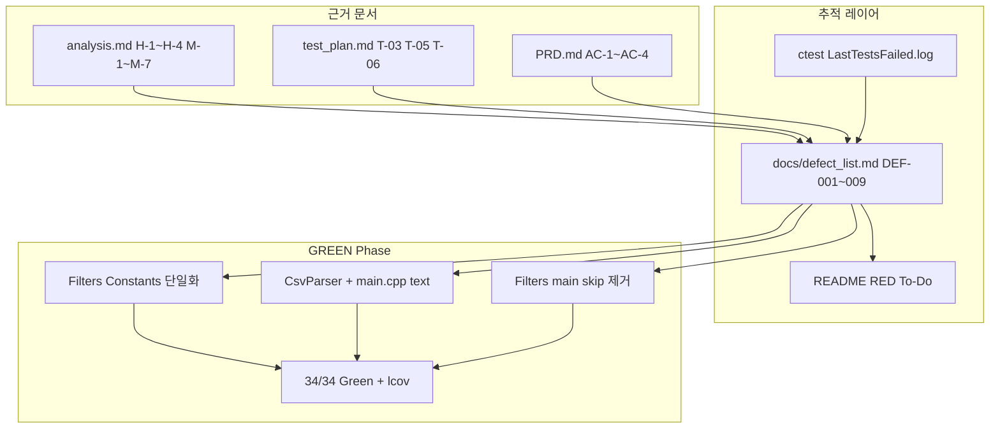

# Feedback Analyzer — 프로젝트 진행 보고서 (QA·결함 목록)

| 항목 | 내용 |
|------|------|
| 프로젝트 | Feedback Analyzer (C++17 리팩토링 챌린지) |
| 워크스페이스 | `c:\DEV\FeedbackAnalyzer_12` |
| 저장소 | https://github.com/jvvoung/FeedbackAnalyzer_12.git |
| 보고 일자 | 2026-05-22 |
| 보고 범위 | Phase 1 RED — `docs/defect_list.md` 작성 및 README 결함 목록 연결 체크박스 반영 (코드 수정 없음) |
| 선행 보고서 | [`05.QA_GTest진단_진행완료.md`](05.QA_GTest진단_진행완료.md) |

---

## 1. Executive Summary

본 세션에서는 보고서 05(QA GTest 진단)에서 **미완으로 남았던 결함 추적 문서**를 완성하였다. `docs/analysis.md` §6·§7, `docs/test_plan.md` §4~§5, `docs/PRD.md` §7.1 (AC-1~AC-4)를 근거로 **P0 결함 4건(H-1~H-4) + P1 결함 5건(M-1/M-2/M-4/M-6/M-7)** 을 `docs/defect_list.md`에 표 형식으로 정리하고, ctest 실패 3건과 1:1 매핑하였다. README RED To-Do의 **결함 목록 연결** 체크박스 2항목을 완료 처리하였으며, **`src/cpp/` 및 `tests/` 소스는 수정하지 않았다.**

| 구분 | 상태 |
|------|------|
| `docs/defect_list.md` 신규 작성 | ✅ 완료 (DEF-001~DEF-009) |
| P0 H-1~H-4 필수 기록 | ✅ 완료 |
| T-03/T-05/T-06 + failing test명 연결 | ✅ 완료 |
| ctest 31/34 스냅샷 반영 | ✅ 완료 (2026-05-22) |
| README 결함 목록 연결 체크 | ✅ 2/4 완료 |
| H-1/H-2/H-3 GREEN 수정 | ⏳ 미착수 (Open 3건) |
| ctest 34/34 Green | ⏳ 미달 |
| lcov baseline | ⏳ GREEN 이후 |

---

## 2. 세션 배경 및 목적

### 2.1 선행 작업 (보고서 05)

보고서 05에서 MinGW 빌드 Green, ctest **31 Pass / 3 Fail** 실측, H-1/H-2/H-3 근본 원인·GREEN 수정안(§7)까지 진단하였으나, **`docs/defect_list.md`는 미생성** 상태였다. README §RED 단계 To-Do의 결함 목록 연결 4항목도 모두 unchecked였다.

### 2.2 본 세션 목적

| # | 목적 | 산출물 |
|---|------|--------|
| 1 | QA 결함 추적 단일 문서 수립 | `docs/defect_list.md` |
| 2 | analysis H-ID ↔ test_plan ↔ AC ↔ ctest failing test 연결 | DEF-001~003 + 표·부록 |
| 3 | H-4(테스트 인프라) 레거시 vs RED 해소 상태 기록 | DEF-004 (Fixed) |
| 4 | Medium 이상 재현 가능 결함 문서화 | DEF-005~009 |
| 5 | README 실행 체크리스트 동기화 | README §결함 목록 연결 |
| 6 | 진행 보고서 | 본 문서 (`Report/06`) |

### 2.3 작업 제약

| 제약 | 내용 |
|------|------|
| `src/cpp/*` | **수정 금지** (문서화만) |
| `tests/*` | **수정 금지** |
| UnitConverter | 항목·언급 금지 |
| 프로덕션 diff | 없음 |

---

## 3. 수행 작업 요약

### 3.1 작업 일람

| 순서 | 작업 | 결과 |
|------|------|------|
| 1 | `docs/analysis.md` §6·§7, `docs/test_plan.md` §4~§5, PRD AC-1~4 수집 | P0/P1 결함 목록 확정 |
| 2 | `build/Testing/Temporary/LastTestsFailed.log` 대조 | failing 3건 ID 확정 |
| 3 | `docs/defect_list.md` 작성 | DEF-001~009, AC 매핑, 변경 이력 |
| 4 | README §결함 목록 연결 체크박스 갱신 | 2항목 `[x]`, 2항목 `[ ]` 유지 |
| 5 | 본 보고서 작성 | `Report/06.QA_DefectList_진행완료.md` |

### 3.2 코드·빌드 변경 이력

| 유형 | 변경 |
|------|------|
| C++ 소스 (`src/cpp/*`, `tests/*`) | **변경 없음** |
| CMakeLists.txt | **변경 없음** |
| `docs/defect_list.md` | **신규** (64줄) |
| `README.md` | 결함 목록 연결 체크박스 2건 `[x]` |
| `Report/06.QA_DefectList_진행완료.md` | **신규** (본 문서) |

---

## 4. 산출물 — `docs/defect_list.md` 요약

### 4.1 문서 메타

| 항목 | 값 |
|------|-----|
| Phase | Phase 1 **RED** (failing test 고정 → Green 대기) |
| 근거 | `analysis.md` §6·§7, `test_plan.md` §4~§5, `PRD.md` §7.1, `README.md` §RED |
| ctest 스냅샷 | **31/34 Passed**, 3 Failed |

### 4.2 P0 결함 (DEF-001 ~ DEF-004)

| DEF ID | analysis ID | AC | test_plan | Failing Test | 상태 |
|--------|-------------|-----|-----------|--------------|------|
| DEF-001 | H-1, M-7 | AC-1 | T-03 | `FiltersTest.Given_MixedFeedbacksIncludingNeutral_When_FilterSentimentNeutral_Then_MatchesTextAnalyzerSet` | **Open** |
| DEF-002 | H-2 | AC-2 | T-05 | `CsvParserTest.Given_NoTextColumnCsv_When_Parse_Then_ZeroFeedbacks` | **Open** |
| DEF-003 | H-3 | AC-3 | T-06 | `FiltersTest.Given_QualityMainKeywordOnlyText_When_FilterKeywordQuality_Then_IncludedInResult` | **Open** |
| DEF-004 | H-4 | AC-4 | — | — (인프라 결함) | **Fixed** |

#### P0 핵심 재현 요약

| ID | 재현 | 기대 | 실제 | 근본 원인 |
|----|------|------|------|-----------|
| DEF-001 | 혼합 2건 → filter `sentiment=중립` | TA 중립 집합 1건 | 2건 (`"와우…"` 포함) | `Filters.cpp:5-20` 이중 `S_KEYWORDS` · `Filters.h:33-38` |
| DEF-002 | CSV `id,comment\n1,hello` | 0건 | 1건 (`"1"`) | `CsvParser.cpp:106-110` fallback · `main.cpp:303-305` |
| DEF-003 | `"품질이 좋아요."` → keyword=품질 | 1건 | 0건 | `Filters.h:55-56` `main` skip |
| DEF-004 | 레거시: tests/·GTest 타깃 없음 | UT 인프라 | RED에서 34건 등록 | `CMakeLists.txt:42-72` |

### 4.3 P1 결함 (DEF-005 ~ DEF-009)

| DEF ID | analysis ID | 레이어 | 상태 |
|--------|-------------|--------|------|
| DEF-005 | M-1 | main.cpp God Module | Open |
| DEF-006 | M-2 | Session / 전역 상태 3곳 | Open |
| DEF-007 | M-4 | Logger UI 미완 | Open |
| DEF-008 | M-6 | GET `/download` 빈 파일 | Open |
| DEF-009 | M-7 | 이중 키워드 사전 (H-1 동반) | Open |

### 4.4 AC ↔ 결함 Green 게이트

| AC | 결함 | Green 조건 |
|----|------|------------|
| AC-1 | DEF-001, DEF-009 | T-03 ctest Pass |
| AC-2 | DEF-002 | T-05 ctest Pass |
| AC-3 | DEF-003 | T-06 ctest Pass |
| AC-4 | DEF-004 | ctest 34/34 + TA·Filters·CsvParser ≥90% |

---

## 5. ctest 실패 ↔ defect_list 매핑 (재확인)

보고서 05 실측과 동일. 본 세션에서 `defect_list.md`에 formal ID 부여.

| ctest # | Failing Test | DEF ID | Failure 요약 |
|---------|--------------|--------|--------------|
| 16 | `CsvParserTest.Given_NoTextColumnCsv_When_Parse_Then_ZeroFeedbacks` | DEF-002 | `feedbacks.empty()` Expected true, Actual false |
| 22 | `FiltersTest.Given_MixedFeedbacksIncludingNeutral_When_FilterSentimentNeutral_Then_MatchesTextAnalyzerSet` | DEF-001 | size 2 vs 1, 집합 불일치 |
| 25 | `FiltersTest.Given_QualityMainKeywordOnlyText_When_FilterKeywordQuality_Then_IncludedInResult` | DEF-003 | size 0 vs 1 |

### 5.1 진단 시 주의사항 (defect_list에 명시)

| 케이스 | ctest 결과 | 설명 |
|--------|------------|------|
| `"택배가 빨라요."` + keyword=배송 | **Pass** | `"택배"`가 sub `type`에도 있어 H-3 main skip 우회 |
| T-03 canonical 단일 중립 텍스트 | **Pass** | M-7 이중 사전은 **혼합 입력**에서만 Red 재현 |
| H-3 정확한 failing test | **품질 main-only** | DEF-003 / Test #25 |

---

## 6. README RED To-Do 반영

### 6.1 결함 목록 연결 체크박스

| 항목 | 이전 | 이후 |
|------|------|------|
| `docs/defect_list.md` 생성 — H-1~H-4 기록 | `[ ]` | **`[x]`** |
| test_plan ID + failing test명 연결 | `[ ]` | **`[x]`** |
| H-1/H-2/H-3 수정 후 ctest Green | `[ ]` | `[ ]` (Open 유지) |
| Phase 1 Green 직후 lcov baseline | `[ ]` | `[ ]` (Open 유지) |

### 6.2 Track B와의 정합

| README TC | defect_list | ctest |
|-----------|-------------|-------|
| TC-B-02 (T-03/H-1) | DEF-001 | Test #22 Fail |
| TC-B-04 (T-05/H-2) | DEF-002 | Test #16 Fail |
| TC-B-05 (T-06/H-3) | DEF-003 | Test #25 Fail |

Track B TC-B-02/04/05는 아직 `[ ]` — **GREEN 통과 후** 체크 예정.

---

## 7. 보고서 05 대비 변경 사항

| 항목 | 보고서 05 | 본 세션 (06) |
|------|-----------|--------------|
| H-1/H-2/H-3 진단 | ✅ 파일:줄·메커니즘 | defect_list formal ID (DEF-001~003) |
| GREEN 수정안 §7 | ✅ (미적용) | 변경 없음 — defect_list §수정 요약과 동일 |
| `docs/defect_list.md` | ⏳ 권장 next action | **✅ 생성** |
| README 결함 체크 | ⏳ | **2/4 완료** |
| ctest 재실행 | 31/34 | **재실행 없음** (05 스냅샷 인용) |
| `src/cpp/*` 수정 | 없음 | **없음** (유지) |

---

## 8. 결함 추적 체계

---

## 9. 리스크 및 미결 사항

| # | 항목 | 영향 | 대응 |
|---|------|------|------|
| 1 | Open P0 3건 | AC-1~AC-3 미충족, merge R-4 위반 | 보고서 05 §7 GREEN 순서 적용 |
| 2 | DEF-004 Fixed vs AC-4 미달 | 인프라는 해소, 기능 Green·커버리지 대기 | ctest 34/34 후 AC-4 재평가 |
| 3 | H-3 `택배` Pass 오해 | 잘못된 Green 판단 | defect_list §H-3 참고, 품질 케이스만 Gate |
| 4 | CsvParser stub + main.cpp | H-2 이중 수정 필요 | DEF-002 수정 요약 — 동일 커밋 |
| 5 | P1 DEF-005~009 | Phase 2~4 리팩토링 backlog | GREEN 후 우선순위 재조정 |
| 6 | git commit | 산출물 미커밋 | 사용자 요청 시 커밋 |

---

## 10. 산출물 목록

| 파일 | 경로 | 상태 | 비고 |
|------|------|------|------|
| 결함 목록 | `docs/defect_list.md` | ✅ 신규 | DEF-001~009, AC 매핑 |
| README | `README.md` | ✅ 수정 | 결함 목록 연결 2/4 `[x]` |
| QA 결함 보고서 | `Report/06.QA_DefectList_진행완료.md` | ✅ 신규 | 본 문서 |
| ctest 로그 | `build/Testing/Temporary/LastTest.log` | 참조 | 05와 동일 스냅샷 |
| C++ / CMake | `src/cpp/*`, `tests/*` | 변경 없음 | GREEN 대기 |
| 선행 보고서 | `Report/05.QA_GTest진단_진행완료.md` | 유지 | GTest 진단 |

---

## 11. 결론 및 다음 액션

Phase 1 RED에서 **결함 추적 문서화** 단계를 완료하였다. P0 3건(DEF-001~003)은 ctest failing test와 1:1 연결되었고, H-4(DEF-004)는 RED GTest 인프라 구축으로 **Fixed** 처리하였다. README 실행 체크리스트와 defect_list가 동기화되어, GREEN Phase 착수 조건(추적·게이트 명확화)을 충족한다.

**권장 다음 액션 (우선순위 — 보고서 05 §7과 동일):**

1. **DEF-001 / H-1** — `Filters` → `Constants::SENTIMENT_KEYWORDS`, `initFilterKeywords()` 제거
2. **DEF-003 / H-3** — `Filters.h` `main` skip 제거
3. **DEF-002 / H-2** — `CsvParser.cpp` fallback 제거 + `main.cpp` `text` 컬럼 탐색
4. **`ctest --test-dir build --output-on-failure`** → **34/34 Green**
5. README — TC-B-02/04/05, 결함 목록 연결 나머지 2항목 `[x]`
6. **lcov baseline** — TextAnalyzer·Filters·CsvParser ≥ 90%
7. Track A HTTP 스모크 (PRD 부록 A)

---

## 부록 A — 참고 문서

| 문서 | 용도 |
|------|------|
| [`docs/defect_list.md`](../docs/defect_list.md) | 결함 추적 마스터 (본 세션 산출) |
| [`Report/05.QA_GTest진단_진행완료.md`](05.QA_GTest진단_진행완료.md) | ctest 실측·GREEN 수정안 |
| [`Report/04.Red_GTest_진행완료.md`](04.Red_GTest_진행완료.md) | GTest 34건 RED 구현 |
| [`docs/test_plan.md`](../docs/test_plan.md) | T-03/T-05/T-06 |
| [`docs/PRD.md`](../docs/PRD.md) | AC-1~AC-4 |
| [`docs/analysis.md`](../docs/analysis.md) | H-1~H-4, M-1~M-7 |
| [`README.md`](../README.md) | RED To-Do |

## 부록 B — defect_list 표 컬럼 정의

| 컬럼 | 설명 |
|------|------|
| ID | DEF-001~ (프로젝트 결함 추적 ID) |
| Severity | High(P0) / Medium(P1) / Low / Info — `analysis.md` §6·§7 |
| 기능/레이어 | Filters, CsvParser, main.cpp 등 |
| test_plan ID | T-03, T-05, T-06, AC-x, H-x, M-x |
| 재현 절차 | Given-When 수준 재현 |
| 기대값 / 실제값 | To-Be vs As-Is |
| 근본 원인 | `파일:줄` |
| 수정 요약 | GREEN 최소 변경 방향 |
| 상태 | Open / Fixed / RED-Expected 등 |

## 부록 C — 변경 이력

| 버전 | 일자 | 변경 |
|------|------|------|
| 1.0 | 2026-05-22 | 초판 — defect_list.md 작성, README 체크박스, Report/06 |
