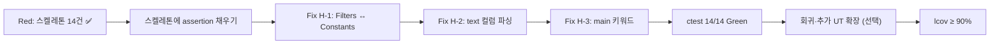

# Feedback Analyzer — 프로젝트 진행 보고서 (순수 RED GTest 스켈레톤)

| 항목 | 내용 |
|------|------|
| 프로젝트 | Feedback Analyzer (C++17 리팩토링 챌린지) |
| 워크스페이스 | `c:\DEV\FeedbackAnalyzer_12` |
| 저장소 | https://github.com/jvvoung/FeedbackAnalyzer_12.git |
| 보고 일자 | 2026-05-22 |
| 보고 범위 | Phase 1 RED — Google Test **스켈레톤 14건** 재작성 (`FAIL() << "RED"` 전용, `src/cpp/` 미수정) |
| 선행 보고서 | [`04.Red_GTest_진행완료.md`](04.Red_GTest_진행완료.md), [`07.Red_DualTrack_진행완료.md`](07.Red_DualTrack_진행완료.md) |

---

## 1. Executive Summary

본 세션에서는 보고서 04·07에서 구축한 **34건 혼합 RED/Green 단위 테스트**를 `docs/test_plan.md` §3~§4·`docs/PRD.md` §4.3 (T-01~T-07) 기준 **순수 RED 스켈레톤**으로 재정리하였다. 테스트 본문은 전부 `FAIL() << "RED";` 한 줄만 두고, Given-When-Then·test_plan ID 주석으로 **GREEN Phase에서 채울 계약**만 고정하였다. **`src/cpp/` 레거시 프로덕션 코드는 한 줄도 수정하지 않았다.**

| 구분 | 상태 |
|------|------|
| CMake GTest + `feedback_analyzer_tests` | ✅ 유지 (보고서 04 구성) |
| `feedback_analyzer_tests` 빌드 | ✅ Green |
| Google Test 스켈레톤 | ✅ **14건** (5파일) |
| ctest 실행 | ✅ 14건 등록·실행 가능 |
| ctest 통과 | ⏳ **0/14** (100% Fail — RED 스켈레톤 의도) |
| 테스트 본문 assertion / GREEN 코드 | ❌ 없음 (스켈레톤만) |
| `src/cpp/*` 프로덕션 수정 | ❌ 0건 |
| H-1/H-2/H-3 GREEN 수정 | ⏳ 미착수 |

> **Exit Criteria 변화:** 보고서 04·07의 **31 Pass / 3 Fail (91%)** 는 “P0만 Red, 나머지 Green” 모델이었다. 본 세션은 **전 테스트를 의도적 Red**로 통일하여, GREEN Phase에서 assertion을 **한 번에 채우는** TDD 순서를 명확히 한다.

---

## 2. 세션 배경 및 목적

### 2.1 선행 작업 (보고서 04·07)

| 보고서 | 핵심 산출 |
|--------|-----------|
| **04** | GTest 34건, P0 failing 3건 + Green 31건 |
| **07** | Dual-Track (`HTTP_BOUNDARY_RED.md`), 주석·스펙 정합 |

선행 구현은 Service 계층 assertion이 포함되어 **RED/Green이 혼재**하였고, 일부 P0 케이스는 보조 테스트명·혼합 데이터로 재현되어 onboarding 시 혼동 여지가 있었다.

### 2.2 본 세션 목적

| # | 목적 | 산출물 |
|---|------|--------|
| 1 | test_plan·PRD 필수 ID만 스켈레톤으로 고정 | `tests/*.cpp` 5파일, 14 `TEST`/`TEST_F` |
| 2 | RED 원칙 엄격 적용 | 본문 `FAIL() << "RED"` only |
| 3 | Given-When-Then + test_plan ID 문서화 | 각 테스트 상단 주석 블록 |
| 4 | 레거시 보호 | `src/cpp/*` 수정 0건 |
| 5 | 빌드·ctest 재검증 | §6 (14/14 Fail) |

### 2.3 작업 제약

| 제약 | 내용 |
|------|------|
| `src/cpp/*` | **수정·삭제·리팩토링 금지** |
| GREEN / REFACTOR | **금지** (assertion·프로덕션 수정 없음) |
| 허용 범위 | `tests/*.cpp`, `tests/support/*.h` (기존 stub 유지), `CMakeLists.txt` 테스트 타깃만 |
| Catch2 / UnitConverter | 사용·언급 금지 (`meter/feet`, `3.28084`, `registerUnit` 등) |

---

## 3. 수행 작업 요약

### 3.1 작업 일람

| 순서 | 작업 | 산출물 | 비고 |
|------|------|--------|------|
| 1 | TextAnalyzerTest 스켈레톤 | `tests/TextAnalyzerTest.cpp` (4건) | T-01, T-03, T-07, EX-09 |
| 2 | FiltersTest 스켈레톤 | `tests/FiltersTest.cpp` (4건) | T-02, T-03, T-04, T-06 |
| 3 | CsvParserTest 스켈레톤 | `tests/CsvParserTest.cpp` (3건) | T-05, 정상 2행, 헤더만 |
| 4 | FeedbackTest 스켈레톤 | `tests/FeedbackTest.cpp` (2건) | 멀티라인, 빈 문자열 |
| 5 | KeywordUtilsTest 스켈레톤 | `tests/KeywordUtilsTest.cpp` (1건) | containsAny 한글 |
| 6 | 빌드·ctest 검증 | 14 tests | 0 Pass / 14 Fail |
| 7 | 진행 보고서 | `Report/08.Red_GTestSkeleton_진행완료.md` | 본 문서 |

### 3.2 코드·문서 변경 이력

| 유형 | 변경 |
|------|------|
| C++ (`src/cpp/*`) | **변경 없음** |
| CMakeLists.txt | **변경 없음** (GTest 타깃·링크 구성 유지) |
| `tests/TextAnalyzerTest.cpp` | 7건 assertion → **4건 스켈레톤** |
| `tests/FiltersTest.cpp` | 8건 → **4건 스켈레톤** (P0 테스트명 단순화) |
| `tests/CsvParserTest.cpp` | 6건 → **3건 스켈레톤** |
| `tests/FeedbackTest.cpp` | 7건 → **2건 스켈레톤** |
| `tests/KeywordUtilsTest.cpp` | 6건 → **1건 스켈레톤** |
| `tests/support/*` | **유지** (CsvParser stub, KeywordUtils.h, TestHelpers.h — 본 세션 미참조) |
| `tests/HTTP_BOUNDARY_RED.md` | **변경 없음** (Track A, 보고서 07) |

---

## 4. 스켈레톤 작성 규칙

| 규칙 (`.cursorrules` §5, `docs/test_plan.md` §1) | 준수 |
|---------------------------------------------------|------|
| Google Test `TEST` / `TEST_F` | ✅ |
| Given-When-Then 주석 1블록 + `test_plan:` ID | ✅ 전 테스트 |
| 테스트명 `Given_[전제]_When_[행동]_Then_[기대]` | ✅ |
| 본문 `FAIL() << "RED";` only | ✅ |
| P0 인라인 주석 (`T-03, AC-1, H-1` 등) | ✅ P0·AC 연계 케이스 |
| `src/cpp/` 레거시 수정 금지 | ✅ |
| Catch2 / UnitConverter 금지 | ✅ |

**스켈레톤 예시 (Filters P0):**

```cpp
// Given-When-Then
// Given: Feedback text="그냥 그래요. 특별한 감정 없음." (긍/부정 키워드 없음)
// When:  filter sentiment=중립, keyword=전체
// Then:  Filters 결과 = TextAnalyzer 중립 집합 100% 일치
// test_plan: T-03, AC-1, H-1
TEST_F(FiltersTest, Given_NeutralText_When_FilterSentimentNeutral_Then_MatchesTextAnalyzerSet) {
    FAIL() << "RED";  // T-03, AC-1, H-1
}
```

---

## 5. 테스트 파일별 상세 (14건)

### 5.1 TextAnalyzerTest (4건) — `tests/TextAnalyzerTest.cpp`

| 테스트명 | test_plan ID | Then (GREEN Phase 목표) | ctest |
|----------|--------------|-------------------------|-------|
| `Given_EmptyFeedbackList_When_AnalyzeSentiment_Then_AllCountsAreZero` | T-01 | 긍정=0, 중립=0, 부정=0 | ❌ Fail |
| `Given_NeutralText_When_AnalyzeSentiment_Then_ClassifiedAsNeutral` | T-03, AC-1, H-1 (TA 측) | 감정=중립 | ❌ Fail |
| `Given_CategoryKeywordOnly_When_AnalyzeSentiment_Then_ClassifiedAsNeutral` | T-07, EX-10 | 카테고리만 → 감정 중립 | ❌ Fail |
| `Given_MixedPositiveAndNegativeKeywords_When_AnalyzeSentiment_Then_PositiveFirst` | EX-09, F-06 | 긍정 우선 | ❌ Fail |

**Fixture:** `TextAnalyzerTest` (`TEST_F`)

### 5.2 FiltersTest (4건) — `tests/FiltersTest.cpp`

| 테스트명 | test_plan ID | Then (GREEN Phase 목표) | ctest |
|----------|--------------|-------------------------|-------|
| `Given_NegativeDeliveryText_When_FilterNegativeAndBaeseong_Then_OneResult` | T-02 | 집계·필터 1건 | ❌ Fail |
| `Given_NeutralText_When_FilterSentimentNeutral_Then_MatchesTextAnalyzerSet` | **T-03, AC-1, H-1** | Analyzer 중립 집합 100% 일치 | ❌ Fail |
| `Given_MixedThreeFeedbacks_When_FilterAllSentimentAllKeyword_Then_ReturnsAllThree` | T-04 | sentinel `전체` → 3건 | ❌ Fail |
| `Given_MainKeywordOnly_When_FilterDelivery_Then_Included` | **T-06, AC-3, H-3** | keyword=배송, `"택배"` 포함 | ❌ Fail |

**Fixture:** `FiltersTest` (`TEST_F`)

> **보고서 04 대비 테스트명 변경:** H-1 재현은 `Given_MixedFeedbacksIncludingNeutral_...` (혼합 2건)에서 **`Given_NeutralText_...` (T-03 canonical 단일)** 로 단순화. GREEN Phase에서 assertion 추가 시 `docs/test_plan.md` §4.3·§2 샘플과 직접 대응.

### 5.3 CsvParserTest (3건) — `tests/CsvParserTest.cpp`

| 테스트명 | test_plan ID | Then (GREEN Phase 목표) | ctest |
|----------|--------------|-------------------------|-------|
| `Given_CsvWithoutTextColumn_When_Parse_Then_ZeroFeedbacks` | **T-05, AC-2, H-2** | `id,comment` → 0건 | ❌ Fail |
| `Given_TwoDataRows_When_Parse_Then_TwoFeedbacks` | §3.4 정상 2행 | Feedback 2건 | ❌ Fail |
| `Given_HeaderOnlyCsv_When_Parse_Then_ZeroFeedbacks` | README 비정상 | 헤더만 → 0건 | ❌ Fail |

**Fixture:** `CsvParserTest` (`TEST_F`)

> **보고서 04 대비:** `Given_NoTextColumnCsv_...` → `Given_CsvWithoutTextColumn_...` (의미 동일, 명명 정리).

### 5.4 FeedbackTest (2건) — `tests/FeedbackTest.cpp`

| 테스트명 | test_plan ID | Then (GREEN Phase 목표) | ctest |
|----------|--------------|-------------------------|-------|
| `Given_MultilineText_When_CreateFeedback_Then_PreservesNewlines` | T-11, AC-7 | `\n` 유지 | ❌ Fail |
| `Given_EmptyString_When_CreateFeedback_Then_GetTextIsEmpty` | §3.5 | 빈 문자열 | ❌ Fail |

**Fixture:** 없음 (`TEST` 매크로)

### 5.5 KeywordUtilsTest (1건) — `tests/KeywordUtilsTest.cpp`

| 테스트명 | test_plan ID | Then (GREEN Phase 목표) | ctest |
|----------|--------------|-------------------------|-------|
| `Given_Utf8KoreanKeyword_When_ContainsAny_Then_ReturnsTrue` | §3.5, Phase 2~3 | UTF-8 한글 부분 매칭 | ❌ Fail |

**연동:** `#include "support/KeywordUtils.h"` (stub `test_support::containsAny` — GREEN 시 assertion에서 사용 예정)

---

## 6. 빌드·ctest 검증

### 6.1 CMake 타깃 (변경 없음)

| 타깃 | 설명 | 빌드 |
|------|------|------|
| `feedback_analyzer` | 프로덕션 HTTP executable | ✅ Green |
| `feedback_analyzer_tests` | GTest + `Constants`/`Filters`/`TextAnalyzer` + `tests/support/CsvParser.cpp` | ✅ Green |

### 6.2 실행 명령

```powershell
cmake -S c:\DEV\FeedbackAnalyzer_12 -B c:\DEV\FeedbackAnalyzer_12\build -DCMAKE_BUILD_TYPE=Debug
cmake --build c:\DEV\FeedbackAnalyzer_12\build --target feedback_analyzer_tests
ctest --test-dir c:\DEV\FeedbackAnalyzer_12\build --output-on-failure
```

### 6.3 ctest 결과 (2026-05-22 검증)

| 항목 | 보고서 04·07 | 본 세션 (08) |
|------|--------------|--------------|
| 총 테스트 | 34 | **14** |
| 통과 | 31 (91%) | **0** |
| 실패 | 3 (P0 Red) | **14** (전건 `FAIL() << "RED"`) |
| 실행 시간 | ~0.9초 | ~0.4초 |

**실패 메시지 (공통):**

```
Failure
RED
```

### 6.4 Exit Criteria 대비

| 기준 (`docs/test_plan.md` §8.1, PRD §7.2 R-4) | 상태 |
|--------------------------------------------------|------|
| CMake GTest + `enable_testing()` | ✅ |
| Red: T-03, T-05, T-06 **스켈레톤 존재** | ✅ (본문 미구현, 전건 Red) |
| ctest 전체 Green | ⏳ GREEN Phase |
| `src/cpp/` 미수정 | ✅ |
| Service 커버리지 ≥ 90% (AC-4) | ⏳ GREEN + lcov 후 |

---

## 7. P0·AC 매핑 (GREEN Phase 대상)

스켈레톤만 존재하므로 **현재 ctest는 전건 Fail**이다. GREEN Phase에서 아래 결함 수정 후 해당 테스트에 assertion을 채우면 Pass가 된다.

### 7.1 T-03 / AC-1 / H-1 — 중립 필터

| 항목 | 내용 |
|------|------|
| **스켈레톤** | `FiltersTest.Given_NeutralText_When_FilterSentimentNeutral_Then_MatchesTextAnalyzerSet` |
| **Given** | `text="그냥 그래요. 특별한 감정 없음."` |
| **When** | `Filters::fil(..., u8"중립", u8"전체")` |
| **Then** | Filters 결과 = TextAnalyzer 중립 집합 |
| **As-Is** | `Filters::S_KEYWORDS` vs `Constants::SENTIMENT_KEYWORDS` 불일치 (`docs/analysis.md` §6.1 H-1) |

### 7.2 T-05 / AC-2 / H-2 — CSV `text` 컬럼

| 항목 | 내용 |
|------|------|
| **스켈레톤** | `CsvParserTest.Given_CsvWithoutTextColumn_When_Parse_Then_ZeroFeedbacks` |
| **Given** | `"id,comment\n1,hello"` |
| **Then** | 0건; `fields[0]` 사용 금지 |
| **As-Is** | stub·`main.cpp` `textIndex=0` fallback (`docs/analysis.md` §6.1 H-2) |

### 7.3 T-06 / AC-3 / H-3 — main 키워드

| 항목 | 내용 |
|------|------|
| **스켈레톤** | `FiltersTest.Given_MainKeywordOnly_When_FilterDelivery_Then_Included` |
| **Given** | `text="택배가 빨라요."` |
| **When** | `keyword=배송`, `sentiment=전체` |
| **Then** | 1건 포함 |
| **As-Is** | `Filters` `main` skip 또는 규칙 불일치 (`docs/analysis.md` §6.1 H-3) |

> **참고:** H-3 **품질 main-only** 재현(`"품질이 좋아요."`)은 보고서 04·`docs/defect_list.md` DEF-003 canonical. 본 스켈레톤은 PRD T-06 샘플 **`"택배가 빨라요."`** 기준. GREEN 시 DEF-003 보조 테스트 추가 여부 검토.

---

## 8. 보고서 04·07 대비 변경

| 항목 | 04·07 | 본 세션 (08) |
|------|-------|--------------|
| GTest 건수 | 34 | **14** (필수 ID만) |
| 테스트 본문 | assertion 포함 (31 Green) | **`FAIL() << "RED"` only** |
| ctest | 31 Pass / 3 Fail | **0 Pass / 14 Fail** |
| P0 테스트명 | 혼합·보조 케이스 병행 | T-03 canonical 단일명 등 **단순화** |
| `tests/support/TestHelpers.h` | 사용 | 스켈레톤에서 **미사용** (GREEN 시 재도입) |
| `src/cpp/*` | 미수정 | **미수정 유지** |
| Track A `HTTP_BOUNDARY_RED.md` | 07에서 신규 | 변경 없음 |

### 8.1 README Track B ↔ 스켈레톤 매핑

| README TC | test_plan ID | 스켈레톤 테스트 | 현재 ctest |
|-----------|--------------|-----------------|------------|
| TC-B-01 | T-01 | `TextAnalyzerTest...EmptyFeedbackList...` | ❌ Red |
| TC-B-02 | T-03, H-1 | `FiltersTest...NeutralText...FilterSentimentNeutral...` | ❌ Red |
| TC-B-03 | T-04 | `FiltersTest...FilterAllSentimentAllKeyword...` | ❌ Red |
| TC-B-04 | T-05, H-2 | `CsvParserTest...CsvWithoutTextColumn...` | ❌ Red |
| TC-B-05 | T-06, H-3 | `FiltersTest...MainKeywordOnly...FilterDelivery...` | ❌ Red |
| TC-B-06 | T-07 | `TextAnalyzerTest...CategoryKeywordOnly...` | ❌ Red |
| TC-B-07 | EX-09 | `TextAnalyzerTest...MixedPositiveAndNegative...` | ❌ Red |

---

## 9. 문서·결함 추적 정합성

```
docs/test_plan.md (T-01~T-07, EX-09)
        ↓
docs/PRD.md §4.3 · README §RED To-Do
        ↓
tests/*.cpp (스켈레톤 14건)     ←── 본 세션
        ↓
ctest 0/14 Pass (전건 RED)
        ↓
GREEN: assertion + H-1/H-2/H-3 수정 (src/cpp, CsvParser stub)
        ↓
ctest N/N Green + lcov ≥ 90% (AC-4)
        ↓
docs/defect_list.md DEF-001~003 Close
```

| 문서 | 본 세션 연계 |
|------|-------------|
| [`docs/test_plan.md`](../docs/test_plan.md) | §3.1~§3.5, §4.1~§4.3 ID 매핑 |
| [`docs/PRD.md`](../docs/PRD.md) | §4.3 T-01~T-07, §7.1 AC-1~AC-4 |
| [`docs/defect_list.md`](../docs/defect_list.md) | DEF-001~003 — GREEN 시 스켈레톤명 갱신 권장 |
| [`tests/HTTP_BOUNDARY_RED.md`](../tests/HTTP_BOUNDARY_RED.md) | Track A — 변경 없음 |

---

## 10. Phase 1 GREEN 착수 준비

### 10.1 권장 GREEN 순서



### 10.2 준비 체크리스트

| # | 항목 | 상태 |
|---|------|------|
| 1 | test_plan 필수 ID 스켈레톤 | ✅ |
| 2 | Given-When-Then·ID 주석 | ✅ |
| 3 | `feedback_analyzer_tests` 빌드 | ✅ |
| 4 | ctest 14건 등록 | ✅ |
| 5 | P0 스켈레톤 (T-03, T-05, T-06) | ✅ |
| 6 | assertion·Service 호출 구현 | ⏳ GREEN |
| 7 | `CMakeLists.txt` Expected RED 주석 갱신 | ⏳ (구 테스트명 잔존) |
| 8 | `docs/defect_list.md` 테스트명 동기화 | ⏳ |

---

## 11. 리스크 및 미결 사항

| # | 리스크/미결 | 영향 | 대응 |
|---|-------------|------|------|
| 1 | 전건 Red → 회귀 기반 없음 | GREEN 중 중간 커밋 시 전체 실패 | assertion을 P0→나머지 순으로 단계적 채우기 |
| 2 | 34건→14건 축소 | 커버리지·회귀 범위 축소 | GREEN 후 보고서 04 수준 보조 UT 재추가 검토 |
| 3 | T-06 스켈레톤 vs DEF-003 canonical | H-3 재현 경로 상이 | 품질 main-only 보조 테스트 추가 |
| 4 | `CMakeLists.txt` 주석 구식 | 3 failing 테스트명 불일치 | GREEN 착수 시 주석 갱신 |
| 5 | `TestHelpers.h` 미사용 | AC-1 집합 비교 헬퍼 미연결 | Filters T-03 GREEN 시 재도입 |
| 6 | Red merge 금지 (PRD R-4) | PR에 0/14 Fail | GREEN 완료 전 merge 지양 |

---

## 12. 산출물 목록

| 파일 | 경로 | 상태 | 비고 |
|------|------|------|------|
| TextAnalyzerTest | `tests/TextAnalyzerTest.cpp` | ✅ 스켈레톤 | 4 tests |
| FiltersTest | `tests/FiltersTest.cpp` | ✅ 스켈레톤 | 4 tests |
| CsvParserTest | `tests/CsvParserTest.cpp` | ✅ 스켈레톤 | 3 tests |
| FeedbackTest | `tests/FeedbackTest.cpp` | ✅ 스켈레톤 | 2 tests |
| KeywordUtilsTest | `tests/KeywordUtilsTest.cpp` | ✅ 스켈레톤 | 1 test |
| CsvParser stub | `tests/support/CsvParser.*` | 유지 | GREEN 시 T-05 연동 |
| KeywordUtils | `tests/support/KeywordUtils.h` | 유지 | containsAny stub |
| TestHelpers | `tests/support/TestHelpers.h` | 유지 | GREEN 시 AC-1 헬퍼 |
| HTTP Track A | `tests/HTTP_BOUNDARY_RED.md` | 유지 | 보고서 07 |
| 진행 보고서 | `Report/08.Red_GTestSkeleton_진행완료.md` | ✅ 신규 | 본 문서 |
| C++ 레거시 | `src/cpp/*` | 변경 없음 | GREEN 대상 |

---

## 13. 결론 및 다음 액션

본 세션에서는 Phase 1 **순수 RED 스켈레톤** 14건을 `docs/test_plan.md`·`docs/PRD.md` §4.3 기준으로 재작성하였다. 테스트는 **계약(이름·Given-When-Then·ID)만 고정**하고 구현은 GREEN Phase로 이관하였으며, `src/cpp/`는 수정하지 않았다. ctest **0/14 Pass** 는 스켈레톤 단계의 **정상 상태**이다.

**권장 다음 액션 (우선순위):**

1. **P0 스켈레톤에 assertion 구현** — T-03, T-05, T-06 (`TestHelpers`, `CsvParser` stub 연동)
2. **H-1 수정** — `Filters` ↔ `Constants::SENTIMENT_KEYWORDS` 단일화
3. **H-2 수정** — CSV `text` 컬럼 인덱스 (`main.cpp` + `tests/support/CsvParser.cpp`)
4. **H-3 수정** — `main` 키워드 필터 규칙 (`Filters.cpp`)
5. **나머지 스켈레톤 GREEN** — T-01, T-02, T-04, T-07, EX-09, Feedback, KeywordUtils
6. **`ctest` 14/14 Green** — `ctest --test-dir build --output-on-failure`
7. **`docs/defect_list.md`·`CMakeLists.txt` 주석** — 스켈레톤 테스트명 동기화
8. **(선택) 보조 UT 복원** — 보고서 04 수준 34건 회귀 범위 확대
9. **lcov baseline** — AC-4 Service ≥ 90%

---

## 부록 A — ctest 전체 목록 (14건)

| # | 테스트 |
|---|--------|
| 1 | `KeywordUtilsTest.Given_Utf8KoreanKeyword_When_ContainsAny_Then_ReturnsTrue` |
| 2 | `FeedbackTest.Given_MultilineText_When_CreateFeedback_Then_PreservesNewlines` |
| 3 | `FeedbackTest.Given_EmptyString_When_CreateFeedback_Then_GetTextIsEmpty` |
| 4 | `CsvParserTest.Given_CsvWithoutTextColumn_When_Parse_Then_ZeroFeedbacks` |
| 5 | `CsvParserTest.Given_TwoDataRows_When_Parse_Then_TwoFeedbacks` |
| 6 | `CsvParserTest.Given_HeaderOnlyCsv_When_Parse_Then_ZeroFeedbacks` |
| 7 | `FiltersTest.Given_NegativeDeliveryText_When_FilterNegativeAndBaeseong_Then_OneResult` |
| 8 | `FiltersTest.Given_NeutralText_When_FilterSentimentNeutral_Then_MatchesTextAnalyzerSet` |
| 9 | `FiltersTest.Given_MixedThreeFeedbacks_When_FilterAllSentimentAllKeyword_Then_ReturnsAllThree` |
| 10 | `FiltersTest.Given_MainKeywordOnly_When_FilterDelivery_Then_Included` |
| 11 | `TextAnalyzerTest.Given_EmptyFeedbackList_When_AnalyzeSentiment_Then_AllCountsAreZero` |
| 12 | `TextAnalyzerTest.Given_NeutralText_When_AnalyzeSentiment_Then_ClassifiedAsNeutral` |
| 13 | `TextAnalyzerTest.Given_CategoryKeywordOnly_When_AnalyzeSentiment_Then_ClassifiedAsNeutral` |
| 14 | `TextAnalyzerTest.Given_MixedPositiveAndNegativeKeywords_When_AnalyzeSentiment_Then_PositiveFirst` |

## 부록 B — 참고 문서

| 문서 | 용도 |
|------|------|
| [`Report/04.Red_GTest_진행완료.md`](04.Red_GTest_진행완료.md) | 34건 혼합 RED/Green (선행) |
| [`Report/07.Red_DualTrack_진행완료.md`](07.Red_DualTrack_진행완료.md) | Track A/B 정합 |
| [`docs/test_plan.md`](../docs/test_plan.md) | T-01~T-11, Phase 일정 |
| [`docs/PRD.md`](../docs/PRD.md) | AC-1~AC-4, §4.3 |
| [`docs/defect_list.md`](../docs/defect_list.md) | DEF-001~003 P0 |
| [`README.md`](../README.md) | RED To-Do, 테스트 실행 |

## 부록 C — 변경 이력

| 버전 | 일자 | 변경 |
|------|------|------|
| 1.0 | 2026-05-22 | 초판 — 순수 RED 스켈레톤 14건, ctest 0/14, 보고서 04·07 대비 diff |
