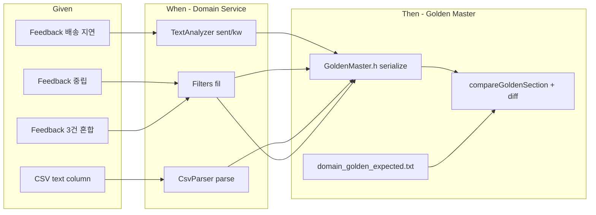

# Feedback Analyzer — 프로젝트 진행 보고서 (Refactoring·Golden Master Test 정식화)

| 항목 | 내용 |
|------|------|
| 프로젝트 | Feedback Analyzer (C++17 리팩토링 챌린지) |
| 워크스페이스 | `c:\DEV\FeedbackAnalyzer_12` |
| 저장소 | https://github.com/jvvoung/FeedbackAnalyzer_12.git |
| 보고 일자 | 2026-05-22 |
| 보고 범위 | **Domain Golden Master 테스트 정식화** — 섹션 파서·개별 GM-TC·unified diff·`GoldenMaster` ctest |
| 선행 보고서 | [`12.Refactoring_DomainGoldenMaster_진행완료.md`](12.Refactoring_DomainGoldenMaster_진행완료.md) |
| 근거 | `docs/test_plan.md` §2·§4, `docs/PRD.md` §3.2·§6.2, `tests/golden/domain_golden_expected.txt` |

---

## 1. Executive Summary

본 세션에서는 보고서 12(초기 Domain Golden Master, 통합 Approval 1건)를 **`docs/test_plan.md`·요구 명세에 맞는 정식 Golden Master 테스트 구조**로 재구성하였다. 프로덕션 로직(`src/cpp/*`, `httplib.h`)은 **변경하지 않았으며**, 테스트·헬퍼·기준 파일 형식·CMake만 수정하였다.

| 구분 | 상태 |
|------|------|
| 헬퍼 통합 | ✅ `tests/support/GoldenMaster.h` (직렬화·섹션 로드·diff·갱신) |
| 기준 파일 형식 | ✅ `[GM-D-xx: title]` + `---` 구분자 |
| 개별 Approval 테스트 | ✅ `GoldenMasterTest` GM-D-01~04 (4건) |
| 통합 ctest 타깃 | ✅ `add_test(NAME GoldenMaster ...)` |
| 실패 시 diff 출력 | ✅ unified diff (`--- expected` / `+++ actual` / `@@`) |
| Capture (로컬 갱신) | ✅ `GOLDEN_UPDATE=1` → `GoldenMasterCapture` |
| ctest GoldenMaster | ✅ **4/4 Pass** (`-R GoldenMaster`) |
| ctest 전체 | ✅ **19 passed, 0 failed, 1 skipped** (총 20 등록) |
| 프로덕션 코드 변경 | ❌ **0건** |

---

## 2. 세션 배경 및 목적

### 2.1 선행 작업 (보고서 12)

| 항목 | 보고서 12 구현 | 한계 |
|------|----------------|------|
| 헬퍼 위치 | `tests/golden/DomainGoldenCapture.h` | `tests/support/` 관례와 불일치 |
| Approval | `DomainGoldenMasterTest` **1건** (4시나리오 일괄 비교) | GM-D별 실패 위치 파악 어려움 |
| 기준 파일 헤더 | `=== GM-D-XX ===` | 명세 `[GM-D-xx: ...]` 형식과 상이 |
| 갱신 env | `UPDATE_GOLDEN=1` | 명세 `GOLDEN_UPDATE=1`과 상이 |
| 실패 출력 | `EXPECT_EQ` 전체 문자열만 | 섹션별 unified diff 없음 |
| ctest | gtest_discover만 | `GoldenMaster` 집계 타깃 없음 |

### 2.2 본 세션 목적

| # | 목적 | 산출물 |
|---|------|--------|
| 1 | Service 직렬화 헬퍼를 `tests/support/`로 통합 | `GoldenMaster.h` |
| 2 | 기준 파일 섹션 파서 (`[GM-D-xx]` ~ `---`) | `loadGoldenSection()` |
| 3 | GM-TC-01~04 개별 `TEST_F` | `GoldenMasterTest.cpp` |
| 4 | 불일치 시 unified diff | `compareGoldenSection()`, `printUnifiedDiff()` |
| 5 | `ctest -R GoldenMaster` 집계 실행 | `CMakeLists.txt` `add_test` |
| 6 | 로컬 baseline 갱신 경로 | `GOLDEN_UPDATE=1` + `GoldenMasterCapture` |

### 2.3 작업 제약 (준수 여부)

| 제약 | 내용 | 준수 |
|------|------|------|
| 프로덕션 로직 변경 금지 | `TextAnalyzer`·`Filters`·`main.cpp`·`httplib.h` 미수정 | ✅ |
| Catch2 / ApprovalTests 외부 의존 금지 | Google Test + 자체 헬퍼만 | ✅ |
| stdout 리디렉션 대신 Service 직렬화 | `sent`/`kw`/`fil`/`parse` canonical 문자열 | ✅ |
| 타임스탬프·HTML 제외 | Domain pipe 형식만 | ✅ |
| `Filters::fil` cout | `suppressStdout()` | ✅ |

---

## 3. Golden Master 설계 (정식화)

### 3.1 아키텍처



### 3.2 직렬화 형식 (canonical)

| 요소 | 규칙 | 예시 |
|------|------|------|
| 섹션 헤더 | `[GM-D-XX: Title]` | `[GM-D-01: AnalyzeNegativeDelivery]` |
| 섹션 구분 | `---` (단독 줄) | 시나리오 블록 경계 |
| 감정 map | `sentiment\|{키}\|{건수}` | `sentiment\|부정\|1` |
| 키워드 map | `keyword\|{키}\|{건수}` | `keyword\|배송\|1` |
| 필터/CSV | `count\|{N}` + `text\|{본문}` | 입력 순서 유지 |
| 키 순서 | `std::map` 삽입 순서 (UTF-8 바이트) | 결정적 출력 |
| 줄바꿈 | LF — `normalizeLineEndings()` | Windows Git 호환 |

### 3.3 보고서 12 대비 형식 변경

| 항목 | 보고서 12 | 본 세션 |
|------|-----------|---------|
| 섹션 헤더 | `=== GM-D-01 ===` | `[GM-D-01: AnalyzeNegativeDelivery]` |
| 구분자 | 다음 `===` 헤더 | 명시적 `---` |
| 헬퍼 파일 | `DomainGoldenCapture.h` | `tests/support/GoldenMaster.h` |
| 갱신 env | `UPDATE_GOLDEN=1` | `GOLDEN_UPDATE=1` |

> **스냅샷 내용(감정·키워드·건수·text)은 동일**하며, 헤더·파서·테스트 구조만 정식화하였다.

---

## 4. 시나리오 매핑 (GM-D-01 ~ GM-D-04)

`docs/test_plan.md` §2·§4, `docs/PRD.md` §3.2 및 단위 테스트 ID와 정합.

| GM-TC | ID | Given | When | test_plan 연계 | TEST_F |
|-------|-----|-------|------|----------------|--------|
| **GM-TC-01** | GM-D-01 | `"배송이 너무 늦어요. 화가 납니다."` | `TextAnalyzer::sent` + `kw` | T-02, TC-A-01 | `GM_D01_AnalyzeNegativeDelivery_MatchesGolden` |
| **GM-TC-02** | GM-D-02 | `"그냥 그래요. 특별한 감정 없음."` | `Filters::fil(중립, 전체)` | T-03, AC-1, TC-B-02 | `GM_D02_FilterNeutral_MatchesGolden` |
| **GM-TC-03** | GM-D-03 | CSV `text\n택배가 빨라요.\n` | `CsvParser::parse` | T-06, TC-B-05 | `GM_D03_CsvParseTextColumn_MatchesGolden` |
| **GM-TC-04** | GM-D-04 | Feedback 3건 혼합 | `Filters::fil(전체, 전체)` | T-04, TC-B-03 | `GM_D04_FilterAll_MatchesGolden` |

**GM-D-04 입력 (FiltersTest T-04와 동일):**

1. `"좋아요 만족합니다."` (긍정)
2. `"배송이 너무 늦어요."` (부정)
3. `"그냥 그래요. 특별한 감정 없음."` (중립)

**GM-D-01 기대 스냅샷:** 부정=1, 배송=1, 긍정·중립·나머지 키워드=0.

---

## 5. 산출물 및 파일 구조

```
tests/
├── GoldenMasterTest.cpp           # GoldenMasterTest 픽스처 + GM-D-01~04 + Capture
├── support/
│   └── GoldenMaster.h             # 직렬화·섹션 파서·diff·GOLDEN_UPDATE
└── golden/
    └── domain_golden_expected.txt # Git 추적 baseline (4섹션)

CMakeLists.txt                     # GOLDEN_DIR, gtest_discover, add_test GoldenMaster
```

### 5.1 제거·이관

| 파일 | 조치 |
|------|------|
| `tests/golden/DomainGoldenCapture.h` | **삭제** — `GoldenMaster.h`로 기능 이관 |

### 5.2 `GoldenMaster.h` 주요 API

| 함수 | 역할 |
|------|------|
| `serializeSentimentMap()` | 감정 map → `sentiment\|…` 줄 |
| `serializeKeywordMap()` | 키워드 map → `keyword\|…` 줄 |
| `serializeFilterResult()` | 필터/CSV 결과 → `count\|…` + `text\|…` |
| `loadGoldenSection()` | `[GM-D-xx:` ~ `---` 구간 body 추출 |
| `compareGoldenSection()` | 기대 vs 실제 비교 |
| `printUnifiedDiff()` | 실패 시 `---` / `+++` / `@@` diff |
| `captureGmD01Body()` ~ `captureGmD04Body()` | 시나리오별 actual 생성 |
| `buildGoldenFile()` / `updateGoldenFile()` | `GOLDEN_UPDATE=1` 갱신용 |
| `suppressStdout()` | `Filters::fil` cout 억제 |

### 5.3 `domain_golden_expected.txt` (전체 24행)

```
[GM-D-01: AnalyzeNegativeDelivery]
sentiment|긍정|0
sentiment|부정|1
...
---
[GM-D-02: FilterNeutral]
count|1
text|그냥 그래요. 특별한 감정 없음.
---
...
```

### 5.4 CMake 변경

| 항목 | 내용 |
|------|------|
| 테스트 소스 | `tests/GoldenMasterTest.cpp` (기존 유지) |
| compile definition | `GOLDEN_DIR="${CMAKE_SOURCE_DIR}/tests/golden"` |
| gtest_discover | 개별 GM-D 테스트 4건 + Capture 1건 자동 등록 |
| **신규** `add_test` | `NAME GoldenMaster` — `--gtest_filter=GoldenMasterTest.*` |
| LABELS | `golden`, `domain` |

---

## 6. 테스트 실행

### 6.1 빌드

```powershell
cmake -S . -B build
cmake --build build
```

### 6.2 Golden Master 집계 (권장)

```powershell
ctest --test-dir build -R GoldenMaster -V --output-on-failure
```

| 테스트 | 결과 |
|--------|------|
| `GoldenMasterTest.GM_D01_AnalyzeNegativeDelivery_MatchesGolden` | ✅ Pass |
| `GoldenMasterTest.GM_D02_FilterNeutral_MatchesGolden` | ✅ Pass |
| `GoldenMasterTest.GM_D03_CsvParseTextColumn_MatchesGolden` | ✅ Pass |
| `GoldenMasterTest.GM_D04_FilterAll_MatchesGolden` | ✅ Pass |
| **`GoldenMaster`** (aggregate, 4 tests) | ✅ Pass |

### 6.3 개별 GM-D 실행

```powershell
ctest --test-dir build -R "GoldenMasterTest.GM_D02" --output-on-failure
```

### 6.4 Capture (baseline 갱신 — 로컬만, CI 금지)

```powershell
$env:GOLDEN_UPDATE = "1"
ctest --test-dir build -R GoldenMasterCapture --output-on-failure
```

| 테스트 | 기본 동작 |
|--------|-----------|
| `GoldenMasterCapture.UpdateGoldenFile_WhenGoldenUpdateEnvSet` | `GOLDEN_UPDATE≠1` → **Skip** |

### 6.5 ctest 전체 (2026-05-22, `build/`)

| 항목 | 보고서 12 | 본 세션 |
|------|-----------|---------|
| 총 등록 테스트 | 16 | **20** |
| 통과 | 16 | **19** |
| 실패 | 0 | **0** |
| Skip | 1 (Capture) | **1** (Capture) |

**Golden 관련 등록 (6건):**

| # | ctest 이름 | 비고 |
|---|------------|------|
| 1~4 | `GoldenMasterTest.GM_D01` ~ `GM_D04` | 섹션별 Approval |
| 5 | `GoldenMasterCapture.UpdateGoldenFile_...` | Skip (env 미설정) |
| 20 | `GoldenMaster` | aggregate 4/4 |

기존 14건(TextAnalyzer·Filters·CsvParser·Feedback·KeywordUtils) **전건 Pass 유지**.

### 6.6 실패 시 diff 출력 예시

```
--- expected (GM-D-02)
+++ actual
@@ -1,2 +1,2 @@
 count|1
-text|그냥 그래요. 특별한 감정 없음.
+text|다른 텍스트
```

---

## 7. `GoldenMasterTest` Fixture

| 항목 | 내용 |
|------|------|
| 픽스처 | `GoldenMasterTest` |
| `SetUp()` | `Constants::init()` |
| `initFilterKeywords()` | **호출 없음** (Green TC-B-08 이후 제거 상태 반영) |
| 비교 헬퍼 | `assertMatchesGoldenSection(sectionId, actual)` |

---

## 8. 보고서 12 대비 변경 요약

| 항목 | 12 (초기 GM) | 13 (본 세션) |
|------|--------------|--------------|
| Approval 테스트 수 | 1 (일괄) | **4** (GM-D별) |
| ctest `-R GoldenMaster` | 없음 | **있음** (4/4) |
| 헬퍼 | `DomainGoldenCapture.h` | **`GoldenMaster.h`** |
| 섹션 파서 | 없음 (전체 파일 비교) | **`loadGoldenSection()`** |
| 실패 diff | 없음 | **unified diff** |
| 갱신 env | `UPDATE_GOLDEN` | **`GOLDEN_UPDATE`** |
| ctest 등록 | 16 | **20** |
| 프로덕션 diff | 0 | **0** |

---

## 9. 워크플로 정합성

```
보고서 12 — Domain Golden 초기 baseline (통합 Approval 1건, === 헤더)
        ↓
본 세션 — Golden Master Test 정식화
        · GoldenMaster.h + 섹션 파서 + GM-D별 TEST_F
        · ctest GoldenMaster 4/4 Pass
        ↓
[다음] Phase 2 REFACTOR
        · HtmlRenderer / RouteHandlers 분리
        · Domain Golden을 회귀 게이트로 사용 (ctest -R GoldenMaster)
        ↓
[병행] HTTP Golden Master (Phase 2)
        · scripts/capture_http_golden.ps1 (curl → actual)
        · in-process httplib 스모크
```

---

## 10. 다음 단계

| 우선순위 | 항목 | Phase | 비고 |
|----------|------|-------|------|
| 1 | `tests/support/GoldenMaster.h` + 갱신 baseline 커밋 | Refactoring | Git 추적 필수 |
| 2 | CI에서 `ctest -R GoldenMaster` 게이트 추가 | Refactoring | Capture는 env 없이 Skip |
| 3 | HtmlRenderer / RouteHandlers 분리 | 2 | GM 4/4 Green 유지 |
| 4 | HTTP Golden (`capture_http_golden.ps1`) | 2 | HTML stat만, body 전체 golden 금지 |
| 5 | CsvParser 경계 UT → AC-4 ≥90% | 1~2 | GM-D-03 보조 |

---

## 11. Git 등록 권장

```powershell
git add tests/support/GoldenMaster.h `
        tests/GoldenMasterTest.cpp `
        tests/golden/domain_golden_expected.txt `
        CMakeLists.txt
```

커밋 메시지 예시:

```
test(refactor): formalize Domain Golden Master (GM-D-01~04 per TEST_F)

- GoldenMaster.h: section parser, unified diff, GOLDEN_UPDATE
- add_test GoldenMaster; remove DomainGoldenCapture.h
- No production code changes
```

---

## 12. 변경 이력

| 일자 | Phase | 변경 내용 |
|------|-------|-----------|
| 2026-05-22 | REFACTORING | 보고서 12 — Domain Golden Master 초기 baseline |
| 2026-05-22 | REFACTORING | **본 보고서** — GM-D별 TEST_F·섹션 파서·`GoldenMaster` ctest, 19/20 Pass |

---

*본 보고서는 보고서 12의 Domain Golden Master를 **test_plan·명세 정합 구조**로 정식화한 세션의 스냅샷이다. HTTP Golden·HtmlRenderer 분리는 후속 Phase에서 진행한다.*
