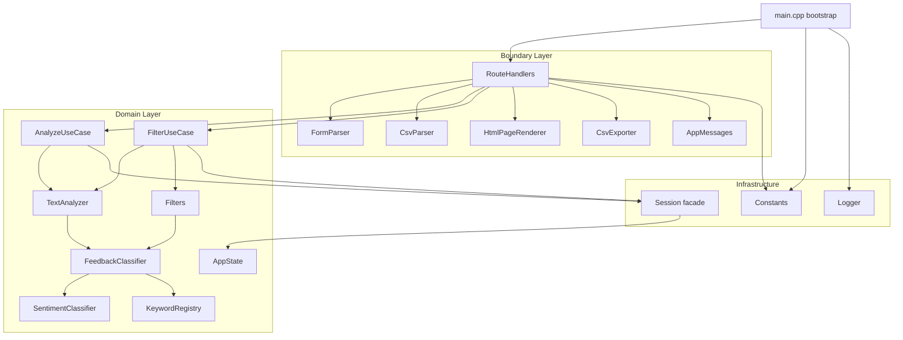

# Feedback Analyzer — 프로젝트 진행 보고서 (Refactoring·Phase 2 Dual-Track 완료)

| 항목 | 내용 |
|------|------|
| 프로젝트 | Feedback Analyzer (C++17 리팩토링 챌린지) |
| 워크스페이스 | `c:\DEV\FeedbackAnalyzer_12` |
| 저장소 | https://github.com/jvvoung/FeedbackAnalyzer_12.git |
| 브랜치 | `Refactoring` (origin 대비 **+8 commits**) |
| 보고 일자 | 2026-05-22 |
| 보고 범위 | **Phase 2 Dual-Track REFACTOR** — Domain Track R-L1~L5 + Boundary Track R-U1~U4 (커밋 8건) |
| 선행 보고서 | [`14.Refactoring_README_GoldenMasterToDo_진행완료.md`](14.Refactoring_README_GoldenMasterToDo_진행완료.md) |
| 근거 | `docs/PRD.md` §1.3·§9 (G-4, L-4), `docs/analysis.md` 부록 C Phase 2~3, `docs/test_plan.md` §2·§4 |

---

## 1. Executive Summary

본 세션에서는 보고서 14(Golden Master To-Do 문서화·ctest 19/20 Pass) 이후 **Dual-Track REFACTOR**를 **커밋 1건 단위**로 순차 수행하였다. Domain Track(R-L1~L5)에서 감정·키워드·UseCase·상태를 분리하고, Boundary Track(R-U1~U4)에서 파싱·메시지·HTML·CSV·HTTP 라우트를 `main.cpp` 밖으로 추출하였다.

| 구분 | 상태 |
|------|------|
| Domain Track R-L1~L5 | ✅ **완료** (5 commits) |
| Boundary Track R-U1~U4 | ✅ **완료** (3 commits) |
| `main.cpp` 축소 | ✅ **18줄** (PRD G-4 목표 ≤200줄 **달성**) |
| Golden Master GM-D-01~04 | ✅ **4/4 Pass** (baseline **미갱신**) |
| ctest 전체 | ✅ **19 passed, 0 failed, 1 skipped** (총 20) |
| P0 Gate (H-1/H-2/H-3) | ✅ Pass 유지 |
| HTTP §7.2 / CSV / HTML 계약 | ✅ 변경 없음 (리팩토링만) |
| `httplib.h` 수정 | ❌ **0건** (금지 준수) |
| 테스트 삭제·완화·skip 추가 | ❌ **0건** (금지 준수) |

**누적 diff (R-L1 첫 커밋~R-U4):** 35 files, **+768 / −495** lines.

---

## 2. 세션 배경 및 목적

### 2.1 시작 조건 (Phase 1 Green)

| 항목 | 상태 |
|------|------|
| H-1 중립 필터 | ✅ Green |
| H-2 CSV `text` 컬럼 | ✅ Green |
| H-3 배송 키워드 필터 | ✅ Green |
| Domain Golden Master | ✅ GM-D-01~04 baseline 고정 |
| ctest | 19/20 Pass (`GoldenMasterCapture` Skip) |

### 2.2 Dual-Track 전략

| Track | 범위 | 원칙 |
|-------|------|------|
| **Domain (Lower)** | SentimentClassifier, KeywordRegistry, FeedbackClassifier, UseCase, AppState | Golden Master 회귀 게이트 우선 |
| **Boundary (Upper)** | FormParser, CsvParser, AppMessages, HtmlPageRenderer, CsvExporter, RouteHandlers | HTTP/CSV/HTML **계약 불변** |

각 커밋 후 `cmake --build` + `ctest` 전체 + `ctest -R GoldenMaster` 검증을 수행하였다.

### 2.3 작업 제약 (준수 여부)

| 제약 | 내용 | 준수 |
|------|------|------|
| `httplib.h` 수정 금지 | 서드파티 헤더 무변경 | ✅ |
| Golden Master 무분별 갱신 금지 | `domain_golden_expected.txt` 유지 | ✅ |
| PRD §7.2 HTTP/CSV/HTML 계약 | 엔드포인트·응답 형식 동일 | ✅ |
| 테스트 삭제·완화·skip 추가 금지 | 19 Pass / 0 Fail 유지 | ✅ |
| 커밋 단위 | Track별 1 refactor = 1 commit | ✅ (8 commits) |

---

## 3. 커밋 이력 (8건)

| ID | SHA | 커밋 메시지 | Track |
|----|-----|-------------|-------|
| **R-L1** | `a2482e4` | `refactor(domain): replace sentiment if-else with SentimentClassifier` | Domain |
| **R-L2** | `4f58ce3` | `refactor(domain): unify keyword registry single source` | Domain |
| **R-L3** | `89837fa` | `refactor(domain): extract classify hub for sentiment and category` | Domain |
| **R-L4** | `f09d6c3` | `refactor(domain): extract analyzeAll and filterAll from main` | Domain |
| **R-L5** | `dbc2fce` | `refactor(domain): consolidate session state into AppState` | Domain |
| **R-U1** | `0253111` | `refactor(boundary): extract FormParser and CsvParser` | Boundary |
| **R-U2+U3** | `8ecca10` | `refactor(boundary): extract AppMessages, HtmlRenderer and CsvExporter` | Boundary |
| **R-U4** | `eda386c` | `refactor(boundary): extract RouteHandlers from main` | Boundary |

---

## 4. Domain Track (R-L1 ~ R-L5)

### 4.1 R-L1 — SentimentClassifier

| 항목 | 내용 |
|------|------|
| 신규 | `SentimentClassifier.h` — 긍정 → 부정 → 중립 우선순위 `classify()` |
| 변경 | `TextAnalyzer.h` — if-else 체인 제거, classifier 위임 |
| 효과 | 감정 분류 규칙 단일화 (TC-A-01, GM-D-01 회귀 안전) |

### 4.2 R-L2 — KeywordRegistry 단일 소스

| 항목 | 내용 |
|------|------|
| 신규 | `KeywordRegistry.h/cpp` — 카테고리명·키워드 등록 |
| 변경 | `Constants.cpp`, `UIComponents.h` — 중복 키워드 블록 제거 |
| 신규 | `KeywordUtils.h` — prod `containsAny()` (테스트 stub과 분리) |
| 효과 | H-3 배송 키워드·UI 드롭다운·필터가 동일 레지스트리 참조 |

### 4.3 R-L3 — FeedbackClassifier 허브

| 항목 | 내용 |
|------|------|
| 신규 | `FeedbackClassifier.h` — `classifySentiment()`, `matchCategory()` |
| 변경 | `TextAnalyzer.h`, `Filters.h` — classifier 허브 경유 |
| 효과 | 감정·카테고리 매칭 로직 중복 제거 |

### 4.4 R-L4 — UseCase 추출

| 항목 | 내용 |
|------|------|
| 신규 | `AnalyzeUseCase.h/cpp`, `FilterUseCase.h/cpp` |
| 이동 | `main.cpp`의 analyze/filter 오케스트레이션 → UseCase |
| 수정 | R-L4 빌드 이슈: `const auto params` → `auto params` (`map::operator[]` const 제약) |
| 효과 | HTTP 핸들러는 UseCase 호출만 담당 (이후 R-U4에서 RouteHandlers로 이동) |

### 4.5 R-L5 — AppState 통합

| 항목 | 내용 |
|------|------|
| 신규 | `AppState.h/cpp` — `currentFeedbacks` + `lastFilteredFeedbacks` |
| 변경 | `Session.h` — AppState 위임 파사드 유지 (레거시 API 호환) |
| 효과 | `main.cpp` 전역 `fil_data` + Session 분산 상태 → 단일 저장소 |

---

## 5. Boundary Track (R-U1 ~ R-U4)

### 5.1 R-U1 — FormParser · CsvParser

| 항목 | 내용 |
|------|------|
| 신규 | `FormParser.h/cpp` — URL decode, `application/x-www-form-urlencoded` 파싱 |
| 승격 | `tests/support/CsvParser.*` → `src/cpp/CsvParser.*` (prod 코드) |
| 추가 | `CsvParser::hasTextColumn` — H-2 업로드 검증 |
| 삭제 | `tests/support/CsvParser.*` (support stub 제거) |

### 5.2 R-U2+U3 — AppMessages · HtmlPageRenderer · CsvExporter

| 항목 | 내용 |
|------|------|
| 신규 | `AppMessages.h/cpp` — alert/error/warning/success 문자열 상수 |
| 신규 | `HtmlPageRenderer.h/cpp` + `PageViewModel` — 기존 `renderPage` (~130줄) 이동 |
| 신규 | `CsvExporter.h/cpp` — UTF-8 BOM, `text\n` 헤더, `Content-Disposition` |
| 변경 | `AnalyzeUseCase.cpp` — `AppMessages::feedbackCountSuccess()` 사용 |
| 효과 | HTML·CSV·메시지가 Boundary 계층으로 분리, PRD 부록 A 계약 유지 |

### 5.3 R-U4 — RouteHandlers

| 항목 | 내용 |
|------|------|
| 신규 | `RouteHandlers.h/cpp` — 5개 HTTP 핸들러 + `registerRoutes()` |
| 변경 | `main.cpp` — bootstrap만 (Constants → RouteHandlers → listen) |
| 변경 | `CMakeLists.txt` — `RouteHandlers.cpp` 타깃 추가 |
| 멤버 | `TextAnalyzer textAnalyzer_`, `Filters filters_` (기존 static과 동등) |

**`main.cpp` 최종 (18줄):**

```cpp
#include "httplib.h"
#include "Constants.h"
#include "RouteHandlers.h"
#include "Logger.h"

int main() {
    Constants::init();
    httplib::Server server;
    RouteHandlers routeHandlers;
    routeHandlers.registerRoutes(server);
    Logger::logInfo(u8"서버가 http://localhost:8080 에서 시작됩니다.");
    server.listen("0.0.0.0", 8080);
    return 0;
}
```

---

## 6. To-Be 아키텍처 (현재)



### 6.1 `src/cpp/` 신규·주요 파일

| 파일 | 역할 | 대략 LOC |
|------|------|----------|
| `SentimentClassifier.h` | 감정 분류 | 16 |
| `KeywordRegistry.h/cpp` | 키워드·카테고리 단일 소스 | 25 |
| `KeywordUtils.h` | `containsAny` | 14 |
| `FeedbackClassifier.h` | classify 허브 | 21 |
| `AnalyzeUseCase.h/cpp` | analyze 오케스트레이션 | 43 |
| `FilterUseCase.h/cpp` | filter 오케스트레이션 | 67 |
| `AppState.h/cpp` | 세션·필터 결과 상태 | 32 |
| `FormParser.h/cpp` | form body 파싱 | 43 |
| `CsvParser.h/cpp` | CSV 파싱 (prod) | 125 |
| `AppMessages.h/cpp` | UI 메시지 상수 | 35 |
| `HtmlPageRenderer.h/cpp` | HTML 렌더링 | 158 |
| `CsvExporter.h/cpp` | 필터 CSV 다운로드 | 32 |
| `RouteHandlers.h/cpp` | HTTP 5 route | 121 |
| `main.cpp` | bootstrap | **18** |

### 6.2 잔존 레거시·Dead Code

| 항목 | 위치 | 상태 |
|------|------|------|
| `FileHandler` | `FileHandler.h` | ⚠️ **미참조** (R-U4에서 `main` 제거됨) — L-5 후보 |
| `Session` 파사드 | `Session.h` | AppState 위임 유지 (Phase 3 Rename 전) |
| `8080` 하드코딩 | `main.cpp:15` | `ServerConfig` 추출 후보 |
| `initSessionStateUgly()` | `RouteHandlers` GET `/` | Phase 3 네이밍 대상 |

---

## 7. 테스트·회귀 검증

### 7.1 빌드·ctest (R-U4 커밋 직후, `build/`)

```powershell
cmake --build build --target feedback_analyzer feedback_analyzer_tests
ctest --test-dir build --output-on-failure
ctest --test-dir build -R GoldenMaster --output-on-failure
```

| 항목 | 결과 |
|------|------|
| 빌드 | ✅ `feedback_analyzer`, `feedback_analyzer_tests` 100% |
| ctest 전체 | ✅ **19 passed, 0 failed, 1 skipped** |
| GoldenMaster 집계 | ✅ **4/4 Pass** |
| Skip | `GoldenMasterCapture` (`GOLDEN_UPDATE` 미설정) |
| Total Test time | ~0.55s |

### 7.2 P0 Gate 테스트

| ID | 테스트 | 결과 |
|----|--------|------|
| H-1 / AC-1 | `FiltersTest.Given_NeutralText_When_FilterSentimentNeutral_Then_MatchesTextAnalyzerSet` | ✅ Pass |
| H-2 | `CsvParserTest.Given_CsvWithoutTextColumn_When_Parse_Then_ZeroFeedbacks` | ✅ Pass |
| H-3 | `FiltersTest.Given_MainKeywordOnly_When_FilterDelivery_Then_Included` | ✅ Pass |

### 7.3 Golden Master (baseline 불변 확인)

| 섹션 | 시나리오 | 결과 |
|------|----------|------|
| GM-D-01 | AnalyzeNegativeDelivery | ✅ Pass |
| GM-D-02 | FilterNeutral | ✅ Pass |
| GM-D-03 | CsvParseTextColumn | ✅ Pass |
| GM-D-04 | FilterAll | ✅ Pass |

> 리팩토링 8커밋 동안 `tests/golden/domain_golden_expected.txt` **갱신 없음** — Domain 동작 동일성 입증.

---

## 8. PRD·analysis 목표 대비

| ID | 목표 | 기준 | 달성 |
|----|------|------|------|
| **G-4** | `main.cpp` ≤ 200줄 | PRD §1.3 | ✅ **18줄** |
| **L-4** | HtmlRenderer, CsvParser, RouteHandlers 분리 | PRD §9 | ✅ |
| Phase 2 | 관심사 분리 | analysis 부록 C | ✅ (Domain 선행 + Boundary 완료) |
| Phase 1 Green | ctest 0 failures | AC-1~AC-3 | ✅ |
| GM-09 | 리팩토링 후 GM 재검증 | README | ✅ 4/4 Pass |
| 부록 A HTTP 스모크 | 5엔드포인트 수동 검증 | PRD 부록 A | ⏳ **미수행** |
| GM-07~08 | CI Golden Master workflow | README | ⏳ **미착수** |

---

## 9. 보고서 14 대비 변경

| 항목 | 14 (README GM To-Do) | 본 세션 |
|------|----------------------|---------|
| 프로덕션 코드 | 0건 | **8 refactor commits, 35 files** |
| `main.cpp` | ~372줄 (God Module) | **18줄** |
| HtmlRenderer / RouteHandlers | 계획만 | **추출 완료** |
| Domain UseCase / AppState | 없음 | **추출 완료** |
| ctest | 19/20 Pass | **19/20 Pass (유지)** |
| Golden Master | 4/4 Pass | **4/4 Pass (baseline 불변)** |
| README GM 체크박스 | GM-01~06 `[ ]` | ⏳ 동기화 미착수 |

---

## 10. 워크플로 정합성

```
보고서 14 — Golden Master To-Do README + ctest 19/20 재검증
        ↓
본 세션 — Dual-Track Phase 2 REFACTOR (8 commits)
        · Domain: SentimentClassifier → KeywordRegistry → FeedbackClassifier
                  → UseCase → AppState
        · Boundary: FormParser/CsvParser → AppMessages/HtmlRenderer/CsvExporter
                    → RouteHandlers
        · main.cpp 18줄 (G-4 달성)
        · ctest 19/20 + GM 4/4 Green 유지
        ↓
[다음] Phase 3 — Session Rename, Constants 정리, FileHandler dead code 제거
        ↓
[다음] PRD 부록 A HTTP 수동 스모크 (5 endpoints)
        ↓
[병행] GM-07~08 CI workflow + README 체크박스 동기화
        ↓
[선택] HTTP Golden Master (HTML stat 캡처, Phase 2 후속)
```

---

## 11. 다음 단계

| 우선순위 | 항목 | Phase | 비고 |
|----------|------|-------|------|
| 1 | PRD 부록 A HTTP 스모크 | Phase 2 DoD | curl/브라우저 5 route |
| 2 | `FileHandler` dead code 정리 | L-5 / Phase 3 | `FileHandler.h` 미참조 |
| 3 | `ServerConfig` (8080) 추출 | Phase 3 | `main.cpp` 설정 분리 |
| 4 | Session Rename · `initSessionStateUgly` | Phase 3 | PRD L-3 |
| 5 | README GM-01~06 `[x]` 동기화 | Docs | 보고서 14 잔여 |
| 6 | `.github/workflows/golden_master.yml` | GM-07~08 | CI required check |
| 7 | CsvParser 커버리지 70% → 90%+ | AC-4 | Phase 1 잔여 |

---

## 12. Git 상태 (보고 시점)

| 항목 | 상태 |
|------|------|
| 브랜치 | `Refactoring` |
| origin 대비 | **ahead 8 commits** (R-L1~R-U4) |
| 최신 커밋 | `eda386c` — `refactor(boundary): extract RouteHandlers from main` |
| 미추적 | `build_cov/`, `Prompting/Prompt정리-1.md` (본 작업 범위 외) |

**push 권장 (원격 반영 시):**

```powershell
git push -u origin Refactoring
```

---

## 13. 변경 이력

| 일자 | Phase | 변경 내용 |
|------|-------|-----------|
| 2026-05-22 | REFACTORING | 보고서 14 — README Golden Master To-Do, ctest 재검증 |
| 2026-05-22 | REFACTORING | **본 보고서** — Dual-Track Phase 2 완료 (R-L1~L5, R-U1~U4), main 18줄, GM 4/4 유지 |

---

*본 보고서는 Golden Master 게이트를 유지한 채 **God Module `main.cpp`를 Domain·Boundary 계층으로 분리**한 Phase 2 REFACTOR 세션의 스냅샷이다. HTTP 스모크·CI 연동·Phase 3 네이밍은 후속 작업이다.*
