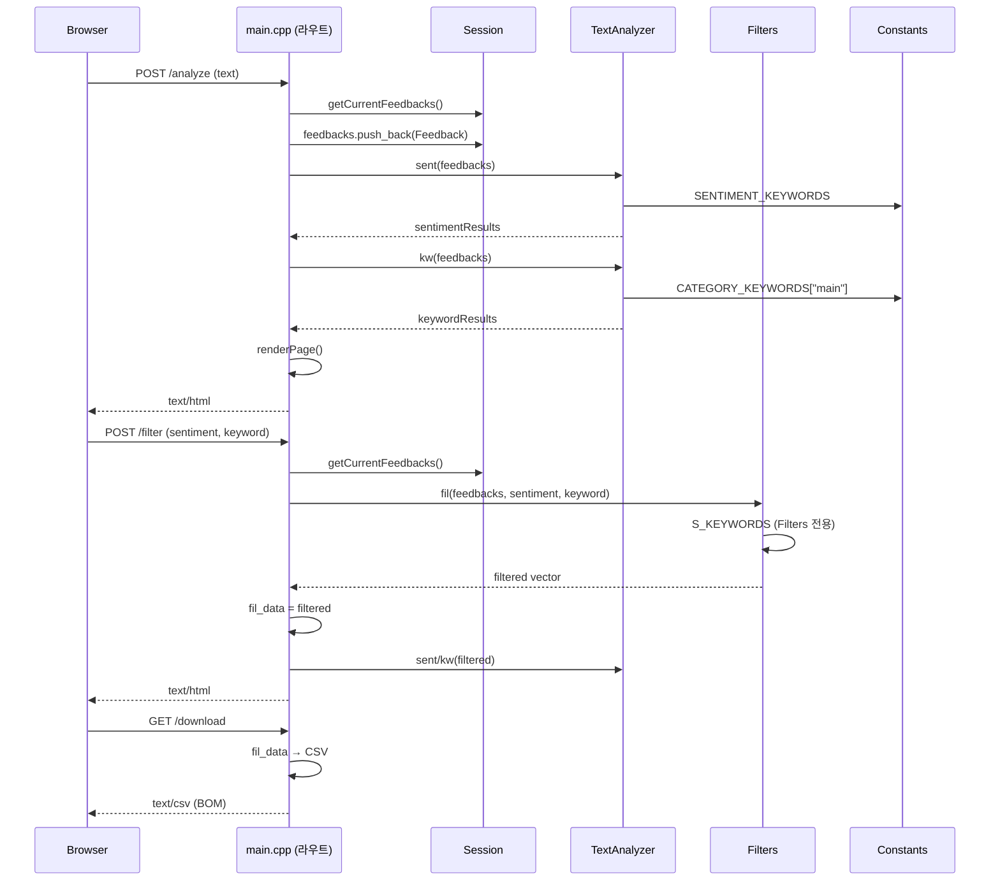

# Feedback Analyzer — 코드베이스 분석 보고서

> 분석 일자: 2026-05-21  
> 대상: `c:\DEV\FeedbackAnalyzer_12`  
> 분석 범위: 전체 소스·빌드 설정·문서 (코드 수정 없음)

---

## 1. 프로젝트 개요

**Feedback Analyzer**는 자연어 기반 고객 피드백을 수집·분류·시각화하는 **C++17 웹 애플리케이션**이다. cpp-httplib 기반 HTTP 서버가 `http://localhost:8080`에서 동작하며, 사용자는 텍스트 입력 또는 CSV 업로드로 피드백을 등록하고 감정(긍정/중립/부정)·키워드 카테고리로 필터링한 뒤 결과를 CSV로 다운로드할 수 있다.

본 프로젝트는 **리팩토링 챌린지** 목적으로 설계되었으며, God Function, 전역 상태, 중복 로직, Lava Flow 등 의도적 코드 스멜이 포함되어 있다. 학습자는 TDD·Clean Code 관점에서 점진적 개선을 수행한다.

참고 문서: `README.md`, `project_purpose.md`, `.cursorrules`

---

## 2. 기술 스택

| 항목 | 내용 |
|------|------|
| 언어 | C++17 |
| 빌드 | CMake 3.14+ |
| HTTP 서버 | cpp-httplib (`src/cpp/httplib.h`, 헤더 전용) |
| 컴파일러 | MinGW GCC / MSVC / Clang |
| 데이터 저장 | 인메모리 전역 상태 (DB 없음) |
| 테스트 | **없음** (Google Test 미구성) |
| 프론트엔드 | 서버 사이드 HTML 문자열 렌더링 |
| OS 타깃 | Windows 우선 (`_WIN32_WINNT`, `ws2_32` 링크) |

---

## 3. 디렉터리/패키지 구조

```
FeedbackAnalyzer_12/
├── CMakeLists.txt          # 빌드 설정 (단일 executable)
├── README.md
├── project_purpose.md
├── .cursorrules            # Cursor AI 작업 규칙
├── docs/
│   └── analysis.md         # 본 문서
└── src/cpp/
    ├── main.cpp            # HTTP 라우팅 + HTML 렌더링 + CSV 파싱 (God Function)
    ├── httplib.h           # 외부 HTTP 라이브러리 (수정 금지)
    ├── Feedback.h          # 피드백 도메인 모델
    ├── TextAnalyzer.h/cpp  # 감정·키워드 분석
    ├── Filters.h/cpp       # 감정·키워드 필터
    ├── Constants.h/cpp     # 감정·카테고리 키워드 상수
    ├── Session.h/cpp       # 세션(전역) 상태
    ├── UIComponents.h/cpp  # UI 카테고리 목록
    ├── Logger.h/cpp        # 콘솔 로깅
    └── FileHandler.h       # 미사용 파일 처리 (Lava Flow)
```

### 계층 분리 현황

| Spring Boot 대응 개념 | 본 프로젝트 실제 | 분리 여부 |
|----------------------|------------------|-----------|
| Controller | `main.cpp` 라우트 핸들러 (람다) | ❌ HTML·파싱·비즈니스 혼재 |
| Service | `TextAnalyzer`, `Filters` | △ 부분 분리 |
| Repository/DB | `Session` (static vector) | ❌ 전역 mutable 상태 |
| Domain | `Feedback` | △ 최소 모델만 존재 |
| DTO | 없음 (form body → string map) | ❌ |
| Config | `Constants::init()`, `Filters::initFilterKeywords()` | △ 분산·중복 |
| View | `renderPage()` in `main.cpp` | ❌ 130줄+ HTML inline |

---

## 4. 핵심 컴포넌트 및 데이터 흐름

### 4.1 HTTP 엔드포인트

| 메서드 | 경로 | 역할 |
|--------|------|------|
| GET | `/` | 세션 초기화 후 대시보드 HTML 반환 |
| POST | `/analyze` | 텍스트 피드백 추가 + 감정/키워드 집계 |
| POST | `/upload` | CSV 파일 업로드 + 피드백 추가 |
| POST | `/filter` | 감정·키워드 필터 적용 + 집계 |
| GET | `/download` | 필터 결과 CSV 다운로드 (UTF-8 BOM) |

### 4.2 요청 흐름 (Spring Boot Controller→Service→Repository 대응)



### 4.3 상태 관리

| 상태 | 위치 | 용도 |
|------|------|------|
| `Session::currentFeedbacks` | `Session.cpp` | 전체 피드백 목록 |
| `fil_data` | `main.cpp:16` | 필터 결과 (다운로드용) |
| `TextAnalyzer::globalSent/globalKw` | `TextAnalyzer.cpp` | 분석 결과 전역 캐시 |
| `Filters::S_KEYWORDS` | `Filters.cpp` | 필터 전용 감정 키워드 (Constants와 별도) |
| `Session::internalData`, `filterOptions` | `Session.cpp` | **미사용** |

---

## 5. 현재 동작 방식 (빌드·실행·테스트)

### 5.1 빌드

```powershell
cmake -S . -B build -G "MinGW Makefiles" -DCMAKE_CXX_COMPILER=C:/mingw64/bin/g++.exe
cmake --build build
```

- 빌드 검증: **성공** (2026-05-21, MinGW Makefiles)
- 산출물: `build/feedback_analyzer.exe`

### 5.2 실행

```powershell
build\feedback_analyzer.exe
```

- 바인딩: `0.0.0.0:8080` (`main.cpp:369`)
- 브라우저: `http://localhost:8080`

### 5.3 테스트

- 단위/통합 테스트: **0건**
- CMake `enable_testing()` / Google Test: **미구성**
- 커버리지 도구: **미구성**

### 5.4 환경(profile) 설정

- `application.yml` 등 설정 파일: **없음**
- 포트·키워드·로그 레벨 모두 **소스 코드 하드코딩**

---

## 6. 발견된 문제점

### 6.1 High

#### H-1. "중립" 감정 필터 동작 불일치

- **문제 요약:** 분석(`TextAnalyzer::sent`)과 필터(`Filters::fil`)의 중립 판정 기준이 달라 "중립" 필터 결과가 기대와 다름
- **근거:**
  - `TextAnalyzer.h:29-34` — 긍정/부정 키워드 미매칭 시 무조건 `u8"중립"` (중립 키워드 검사 없음)
  - `Filters.cpp:37-38` — `S_KEYWORDS[u8"중립"]` 키워드("보통", "그냥" 등)가 있어야만 중립으로 분류
  - `Constants.cpp` vs `Filters.cpp` — 감정 키워드 목록이 **별도 정의·중복**
- **영향:** 기능 오류, 테스트 불가능한 비즈니스 규칙
- **개선 방향:** 감정 분류 로직을 단일 함수/서비스로 통합하고, TextAnalyzer·Filters가 동일한 `Constants::SENTIMENT_KEYWORDS`를 사용하도록 수정

#### H-2. CSV 업로드가 `text` 컬럼을 무시함

- **문제 요약:** README 명세(`text` 컬럼 필수)와 달리 첫 번째 컬럼(`fields[0]`)만 사용
- **근거:** `main.cpp:299-306` — 헤더 행 skip 후 `fields[0]`만 Feedback 생성, 컬럼명 탐색 없음
- **영향:** 기능 오류, CSV 형식 호환성 실패
- **개선 방향:** 헤더에서 `text` 인덱스를 찾아 해당 컬럼 값을 파싱; 파싱 로직을 `CsvParser` 등으로 추출 후 테스트 추가

#### H-3. 키워드 필터가 `main` 키워드를 건너뜀

- **문제 요약:** 키워드 필터는 서브 카테고리만 검사하고, 집계(`TextAnalyzer::kw`)는 `main`만 사용 — 동작 불일치
- **근거:**
  - `TextAnalyzer.h:52-54` — `entry.second.at("main")`만 매칭
  - `Filters.cpp:55-57` — `subEntry.first == "main"`이면 **continue** (main 키워드 제외)
- **영향:** 기능 오류 (예: "배송" main 키워드만 포함된 피드백 필터 누락)
- **개선 방향:** 카테고리 매칭 규칙을 한 곳(`containsCategoryKeyword`)으로 통합

#### H-4. 테스트 인프라 전무

- **문제 요약:** 단위/통합 테스트 및 CMake 테스트 타깃이 없어 리팩토링 회귀 방지 불가
- **근거:** `CMakeLists.txt` — `enable_testing()` 없음; `src/` 하위 `*test*` 파일 0건
- **영향:** 테스트, 유지보수, 품질
- **개선 방향:** Google Test + FetchContent/ExternalProject 추가, TextAnalyzer·Filters·CSV 파싱 우선 테스트 (커버리지 90% 목표)

---

### 6.2 Medium

#### M-1. God Function — main.cpp 책임 과다

- **문제 요약:** HTTP 라우팅, HTML 렌더링, URL/CSV 파싱, 비즈니스 오케스트레이션이 단일 파일에 집중
- **근거:** `main.cpp` — `renderPage()`(81~211), `parseForm`, `parseCsvLine`, 5개 라우트 핸들러(240~366), 총 372줄
- **영향:** 유지보수, 테스트
- **개선 방향:** Extract Function → `HtmlRenderer`, `RouteHandlers`, `CsvParser` 순 점진 분리

#### M-2. 전역 mutable 상태 다중 존재

- **문제 요약:** 세션·필터 결과·분석 캐시가 static/전역 변수로 분산
- **근거:** `main.cpp:16` `fil_data`, `Session.cpp:3-5`, `TextAnalyzer.cpp:3-4`
- **영향:** 유지보수, 테스트, 동시성(향후)
- **개선 방향:** `AppState` 또는 `FeedbackRepository` 단일 객체로 캡슐화, 핸들러에 주입

#### M-3. `containsAny` 중복 구현

- **문제 요약:** 동일 문자열 포함 검사 로직이 TextAnalyzer·Filters에 각각 존재
- **근거:** `TextAnalyzer.h:13-18`, `Filters.h:13-18`
- **영향:** 유지보수 (한쪽만 수정 시 불일치)
- **개선 방향:** `StringUtils` 또는 `KeywordMatcher`로 통합

#### M-4. Logger 출력이 UI에 반영되지 않음

- **문제 요약:** `logWarning`/`logError`는 콘솔만 출력, 페이지 level별 로그 표시 요구사항 미충족
- **근거:**
  - `Logger.cpp:25-31` — stdout/stderr 출력만
  - `renderPage()` — success/warning/error 파라미터는 핸들러가 수동 전달 (`main.cpp:336-340` 등)
  - `Logger::logWarning` 호출 후 UI warning은 별도 문자열 하드코딩
- **영향:** 기능(UX), 운영
- **개선 방향:** `LogBuffer`(level별) 도입, `renderPage`가 버퍼를 읽어 표시; level 필터 설정 가능하게

#### M-5. FileHandler Lava Flow

- **문제 요약:** 선언·인스턴스만 있고 실제 기능 없음
- **근거:** `main.cpp:19` `fileHandler` 생성 후 미사용; `FileHandler.h` — `saveResult`가 cout만 출력
- **영향:** 유지보수 (혼란)
- **개선 방향:** `/download` CSV 생성 역할을 부여하거나 클래스·include 제거

#### M-6. `/download`가 필터 미실행 시 빈 파일

- **문제 요약:** `fil_data`는 `/filter` 성공 시에만 채워짐; 분석만 한 사용자는 빈 CSV 다운로드
- **근거:** `main.cpp:332` (fil_data 설정), `main.cpp:361-363` (fil_data 순회)
- **영향:** 기능(UX)
- **개선 방향:** 다운로드 대상을 `Session::currentFeedbacks` 또는 마지막 분석 결과로 명확히 정의

#### M-7. 감정 키워드 중복·불일치

- **문제 요약:** Constants와 Filters에 감정 키워드가 이중 관리되며 내용이 다름
- **근거:** `Constants.cpp:7-21` vs `Filters.cpp:6-20` — 긍정/부정 목록·중립 존재 여부 상이; `Constants.cpp:11-12` 내부 중복 항목
- **영향:** 유지보수, 기능
- **개선 방향:** `Constants::SENTIMENT_KEYWORDS` 단일 소스; `Filters::initFilterKeywords()` 제거

---

### 6.3 Low

#### L-1. 부적절한 네이밍

- **문제 요약:** `sent`, `kw`, `fil`, `fil_data` 등 문맥 없는 축약명
- **근거:** `TextAnalyzer.h:21,42`, `Filters.h:23`, `main.cpp:16,330`
- **영향:** 유지보수
- **개선 방향:** `analyzeSentiment`, `analyzeKeywords`, `filterFeedbacks`, `filteredFeedbacks` 등으로 Rename

#### L-2. Session dead code

- **문제 요약:** `internalData`, `filterOptions`, `getOldDataFromSession`의 key 파라미터 미사용
- **근거:** `Session.cpp:4-5`, `Session.h:18-19`
- **영향:** 유지보수
- **개선 방향:** 미사용 멤버 제거 또는 실제 세션 기능 구현

#### L-3. Filters에서 std::cout 직접 출력

- **문제 요약:** 필터 클래스가 Logger 대신 cout 사용
- **근거:** `Filters.cpp:68-70`
- **영향:** 운영(로깅 일관성)
- **개선 방향:** `Logger::logDebug` 또는 제거

#### L-4. .gitignore가 Spring Boot 템플릿 잔재

- **문제 요약:** Maven/Spring 관련 ignore 규칙만 있고 C++ build/ 규칙은 `build/` 한 줄
- **근거:** `.gitignore` — `target/`, `.mvn/`, `.springBeans` 등
- **영향:** 유지보수(혼란)
- **개선 방향:** C++ 프로젝트에 맞게 정리 (`build/`, `*.exe`, `CMakeFiles/` 등)

#### L-5. 보안·운영 하드코딩

- **문제 요약:** 인증 없이 `0.0.0.0:8080` 바인딩, 업로드 크기·형식 검증 없음
- **근거:** `main.cpp:369`, `main.cpp:290-318` (파일 타입/크기 검사 없음)
- **영향:** 보안(로컬 실습 수준에서는 Low)
- **개선 방향:** localhost 바인딩 옵션, CSV MIME/크기 제한 (선택)

#### L-6. textarea 멀티라인 — 현재 구현 확인

- **문제 요약:** `project_purpose.md`에 멀티라인 입력 수정 항목 있으나, 현재 `<textarea>` 사용으로 **기본 HTML 수준에서는 멀티라인 지원**
- **근거:** `main.cpp:131` — `<textarea>` 요소 사용
- **영향:** 기능 — 실제 버그 여부는 수동/자동 테스트로 재검증 필요
- **개선 방향:** 개행 포함 입력·분석·CSV 저장 E2E 테스트로 회귀 방지

---

## 7. 리스크 및 우선순위

| 우선순위 | ID | 문제 | 리스크 |
|----------|-----|------|--------|
| P0 | H-4 | 테스트 없음 | 리팩토링 시 silent regression |
| P0 | H-1 | 중립 필터 버그 | 핵심 기능 신뢰성 |
| P0 | H-2 | CSV text 컬럼 | 데이터 입력 파이프라인 |
| P0 | H-3 | 키워드 필터 main 누락 | 필터 결과 왜곡 |
| P1 | M-7, M-3 | 키워드·로직 중복 | 수정 시 불일치 재발 |
| P1 | M-1, M-2 | God Function·전역 상태 | 변경 비용 증가 |
| P2 | M-4, M-6 | Logger UI·다운로드 | UX |
| P2 | M-5, L-1~L-3 | Dead code·네이밍 | 가독성 |
| P3 | L-4, L-5 | gitignore·보안 | 운영 편의 |

---

## 8. 단계별 개선 로드맵

### Phase 1 — 테스트 기반 구축 + 핵심 버그 고정 (Green 기반 마련)

**목표:** Google Test 인프라 추가, TextAnalyzer·Filters·CSV 파싱 단위 테스트 작성, H-1/H-2/H-3 버그 수정

**수정 대상 (예상):**
- `CMakeLists.txt` — GTest FetchContent, `feedback_analyzer_tests` 타깃
- `tests/` — `TextAnalyzerTest.cpp`, `FiltersTest.cpp`, `CsvParserTest.cpp` (신규)
- `src/cpp/TextAnalyzer.h`, `Filters.cpp` — 분류·필터 로직 통합
- `src/cpp/main.cpp` — CSV 파싱 추출 (최소 Extract Function)

**예상 리스크:** CSV/키워드 로직 추출 시 main.cpp 대규모 변경 유발 → 파싱만 먼저 추출, HTML은 Phase 2로 연기

**검증:**
- `cmake --build build && ctest --test-dir build --output-on-failure`
- 수동: `/filter` 중립·키워드·전체, CSV `text` 컬럼 업로드

---

### Phase 2 — 관심사 분리 (Extract Function/Class)

**목표:** `renderPage`, 라우트 핸들러, CSV 파서를 별도 파일로 분리; main.cpp 200줄 이하

**수정 대상:** `HtmlRenderer.h/cpp`, `RouteHandlers.h/cpp`, `CsvParser.h/cpp`, `main.cpp`

**검증:** Phase 1 테스트 Green 유지 + HTTP 수동 스모크 테스트

---

### Phase 3 — 상태·네이밍 정리

**목표:** 전역 상태(`fil_data`, `globalSent/Kw`) → `AppState`; `sent/kw/fil` Rename; FileHandler 정리

**수정 대상:** `Session`, `main.cpp`, `TextAnalyzer`, `Filters`, `FileHandler`

**검증:** 전체 테스트 + 엔드포인트 계약 체크리스트

---

### Phase 4 — Logger/UI·운영 개선

**목표:** level별 로그 UI 표시, `/download` 대상 명확화, .gitignore 정리

**수정 대상:** `Logger`, `main.cpp`/`HtmlRenderer`, `.gitignore`

---

### Phase 5 — 선택 과제 (명시 요청 시)

- Trend 시각화 (`test_feedback_trend.csv`)
- 감정 필터 설정 File DB화

---

## 9. 즉시 착수 가능한 Quick Wins

- [ ] **QW-1:** `Filters::initFilterKeywords()` 제거하고 `Filters`가 `Constants::SENTIMENT_KEYWORDS` 참조 (M-7, H-1 일부 해결)
- [ ] **QW-2:** `containsAny`를 공통 헤더(`KeywordUtils.h`)로 추출 (M-3)
- [ ] **QW-3:** `main.cpp` CSV 파싱에서 헤더 `text` 컬럼 인덱스 탐색 (H-2, 로직 10줄 내)
- [ ] **QW-4:** `Filters.cpp:56` `main` skip 제거 또는 main 포함 통합 (H-3)
- [ ] **QW-5:** `main.cpp:19` 미사용 `fileHandler` 및 `#include "FileHandler.h"` 제거 (M-5)

---

## 부록: 엔드포인트 계약 체크리스트 (회귀 테스트용)

- [ ] GET `/` → 200, HTML, UTF-8 한국어 UI
- [ ] POST `/analyze` → 텍스트 추가, 감정 3분류 집계 표시
- [ ] POST `/upload` → CSV `text` 컬럼 파싱
- [ ] POST `/filter` → sentiment=`전체|긍정|중립|부정`, keyword=`전체|배송|...`
- [ ] GET `/download` → UTF-8 BOM + `text\n` 헤더 CSV
