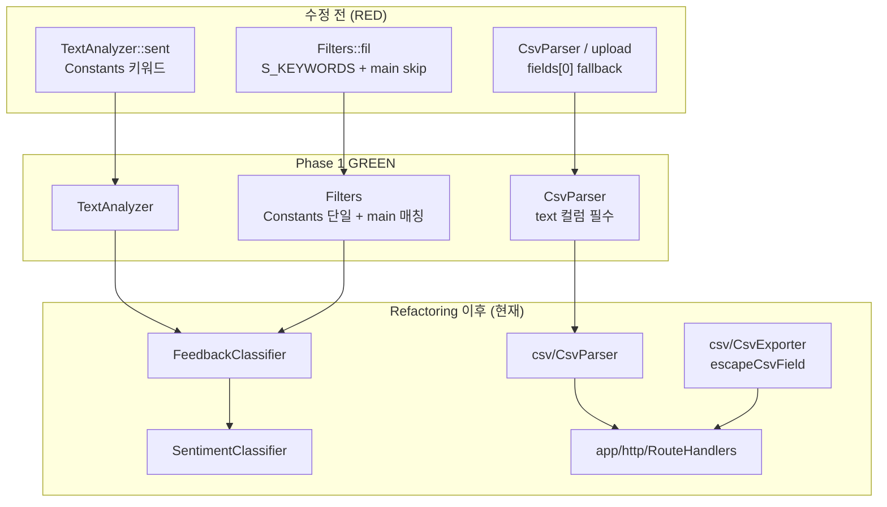

# Feedback Analyzer 12 — Phase 1 버그 수정 보고서

| 항목 | 내용 |
|------|------|
| 문서 | `docs/bug_fix.md` |
| 프로젝트 | FeedbackAnalyzer_12 (C++17 리팩토링 챌린지) |
| Phase | **Phase 1 GREEN** — P0 결함 H-1~H-3 수정 + 테스트 인프라 (H-4) |
| 선행 문서 | [defect_list.md](defect_list.md), [test_plan.md](test_plan.md) §4~§7, [analysis.md](analysis.md) §2.1 |
| 공식 보고서 | [Report/Green/10.Green_Phase1_전체완료.md](../Report/Green/10.Green_Phase1_전체완료.md), [Report/Green/11.Green_Phase1_검증완료.md](../Report/Green/11.Green_Phase1_검증완료.md) |
| H-1 선행 커밋 | [Report/Green/09.Green_TC-B-02_진행완료.md](../Report/Green/09.Green_TC-B-02_진행완료.md) |
| 검증 일시 | 2026-05-22 (로컬 `ctest`, Phase 1 baseline **14/14**) |
| 문서 버전 | 1.0 |

> **교육 과정 대응:** Feedback Analyzer 11의 **미션 3(버그 수정)** 에 해당하는 단계가 본 프로젝트에서는 **Phase 1 GREEN** 이다. RED(14건 `FAIL()`) → GREEN(14/14 Pass) → 이후 Refactoring·Feature 확장.

---

## 1. Executive Summary

| 구분 | 수정 전 (RED) | 수정 후 (Phase 1 GREEN) |
|------|---------------|-------------------------|
| GTest 스켈레톤 | 14건 **Fail** (`FAIL() << "RED"`) | **14/14 Pass** |
| P0 결함 H-1~H-3 | 3건 Open | **Fixed** (DEF-001~003) |
| 테스트 인프라 H-4 | CMake GTest 없음 | **Fixed** (DEF-004) |
| 감정 분류 | `TextAnalyzer` vs `Filters::S_KEYWORDS` **이중 규칙** | **`Constants::SENTIMENT_KEYWORDS` 단일** (이후 Refactoring에서 `SentimentClassifier`/`FeedbackClassifier`로 정식화) |
| 키워드 필터 | `Filters`가 `main` 서브맵 **스킵** | **`main` 포함** (TextAnalyzer `kw()`와 동일) |
| CSV 업로드 | 첫 번째 컬럼 fallback (`fields[0]`) | **`text` 헤더 컬럼만** 파싱 |
| M-7 | `initFilterKeywords()` / `S_KEYWORDS` stub | **제거** |
| M-6 (download) | 빈 `fil_data` → 빈 CSV | **warning HTML** (`다운로드할 필터 결과가 없습니다.`) |
| Golden Master | — | GM-D-01~04 baseline (Refactoring 이후 **4/4 Pass** 유지) |

**결론: Phase 1 P0 버그 수정 완료** — AC-1~AC-3 ctest Gate + H-1/H-2/H-3 Gate Pass.

```powershell
cmake --build build --target feedback_analyzer_tests
ctest --test-dir build --output-on-failure
# Phase 1 baseline: 14 passed, 0 failed out of 14
# (Refactoring+GM 등록 후: 19 passed, 1 skipped / Feature 브랜치: 44 passed, 1 skipped)
```

---

## 2. Phase 1 정의

Phase 1 RED는 **의도적 버그를 GTest로 고정**한 상태(`tests/*Test.cpp` 스켈레톤 전건 `FAIL()`). Phase 1 GREEN은 P0 결함을 **최소 diff로 수정**하여 2차 GREEN(14/14 Pass)을 달성하는 단계다.

| | Phase 1 RED | Phase 1 GREEN (본 문서) |
|---|-------------|-------------------------|
| 코드 변경 | 없음 (스켈레톤만) | **H-1~H-3·H-4 수정** |
| `sent` / `fil` | 이중 규칙 (`S_KEYWORDS` vs `Constants`) | **단일 소스** |
| `ctest` | 0/14 Pass | **14/14 Pass** |
| REFACTOR | 금지 | 금지 (Green 단계) |
| 전면 재작성 | 금지 | 금지 (동일) |

**후속 Phase (본 문서 범위 밖, 참고만):**

| Phase | 내용 | bug_fix와의 관계 |
|-------|------|------------------|
| Phase 2 REFACTOR | HtmlRenderer, RouteHandlers, UseCase, AppState | H-1~H-3 **동작 유지** (GM 4/4) |
| Feature | 가중치 감성(`classifyWeighted`), CSV `escapeCsvField`, 경계 GTest 12건 | AC-7·EX-07 **보강** |
| Phase 4 (잔여) | Logger → HTML alert 버퍼 (AC-6) | **Open** — warning/error는 `AppMessages`+라우트 하드코딩 |

---

## 3. 수정 대상 버그

### 3.1 H-1 / DEF-001 — 중립 필터·통계 불일치 (P0)

**증상**: 대시보드 `TextAnalyzer` 중립 건수와 필터 「중립」 결과 목록이 **서로 다른 감성 사전**으로 계산됨.

| 모듈 (수정 전) | 키워드 소스 | 중립 판정 |
|----------------|-------------|-----------|
| `TextAnalyzer::sent()` | `Constants::SENTIMENT_KEYWORDS` | 긍·부 없으면 **기본 중립** |
| `Filters::fil()` | `Filters::S_KEYWORDS` (`initFilterKeywords()`) | 중립 **전용 키워드** + 긍정 우선; `괜찮` **중복** |

**재현 (수정 전, `docs/analysis.md` §2.1.2)**

| 입력 | `sent` 중립 | `fil(중립)` | 기대 |
|------|-------------|-------------|------|
| `"그냥 그래요. 특별한 감정 없음."` | 1 | 1 | ✅ (TC-B-02 canonical) |
| `"괜찮해요"` (교육 예시) | 1 | 0 (긍정 처리) | ❌ 불일치 |

**수정 (Phase 1 GREEN, TC-B-02 `12cdfbd`):**

- `Filters` 감성 분기를 `Constants::SENTIMENT_KEYWORDS`만 사용
- 판정 순서: **긍정 → 부정 → 중립** (TextAnalyzer와 동일)

**Gate 테스트:**

```
FiltersTest.Given_NeutralText_When_FilterSentimentNeutral_Then_MatchesTextAnalyzerSet
```

**Refactoring 이후 (현재 코드):** `FeedbackClassifier::classifySentiment()` → `SentimentClassifier::classify()` — 규칙 단일화 **유지**.

---

### 3.2 H-2 / DEF-002 — CSV `text` 컬럼 미사용 (P0)

**증상**: POST `/upload` 및 `CsvParser`가 `text` 헤더를 찾지 못하면 **첫 번째 컬럼**(`fields[0]`)을 본문으로 사용.

**재현 (수정 전)**

| CSV | 기대 | 실제 (RED) |
|-----|------|------------|
| `"id,comment\n1,hello\n"` | 0건 (text 컬럼 없음) | `"1"` 적재 |

**수정 (TC-B-04 `40197eb`, TC-A-06):**

```cpp
const std::size_t textIndex = findTextColumnIndex(headerFields);
if (textIndex == static_cast<std::size_t>(-1)) {
    return result;  // 0건, hasTextColumn=false
}
```

- `main.cpp` POST `/upload`: text 컬럼 없으면 **error alert** (`파일 업로드 중 오류가 발생했습니다.`)
- 이후 prod `CsvParser` 단일 구현으로 main·UT·GoldenMaster **통합** (R-U1)

**Gate 테스트:**

```
CsvParserTest.Given_CsvWithoutTextColumn_When_Parse_Then_ZeroFeedbacks
GoldenMasterTest.GM_D03_CsvParseTextColumn_MatchesGolden
```

---

### 3.3 H-3 / DEF-003 — 카테고리 필터 `main` 스킵 (P0)

**증상**: `TextAnalyzer::kw()`는 `CATEGORY_KEYWORDS[cat]["main"]`만 집계하지만, `Filters::fil()`은 `"main"` 서브맵을 **건너뜀**.

```cpp
// 수정 전 (Filters.h)
if (subEntry.first == "main") continue;
```

**재현 (수정 전)**

1. 입력: `"택배가 빨라요."` (또는 `"품질이 좋습니다"`)
2. analyze → 키워드 **배송/품질: 1**
3. filter keyword=배송/품질 → **0건** (버그)

**수정 (TC-B-05 `693598c`):**

```cpp
if (catMap.count("main") && containsAny(txt, catMap.at("main"))) {
    finalFiltered.push_back(item);
}
```

**Gate 테스트:**

```
FiltersTest.Given_MainKeywordOnly_When_FilterDelivery_Then_Included
```

**Refactoring 이후:** `FeedbackClassifier::matchCategory()` — `main` 키워드만 매칭 (동일 계약).

---

### 3.4 H-4 / DEF-004 — 테스트 인프라 부재 (P0)

**증상**: 레거시 As-Is — `CMakeLists.txt`에 GTest 타깃 없음, `tests/` 미존재.

**수정 (RED 단계 `04.Red_GTest`, Green 유지):**

- FetchContent Google Test
- `feedback_analyzer_tests` 타깃 + `gtest_discover_tests`
- `tests/*Test.cpp` 14건 스켈레톤 → GREEN 전환

---

### 3.5 M-7 / DEF-009 — 감성 키워드 이중 관리 (P0 연계)

**증상**: `Filters.cpp`의 `initFilterKeywords()` / `S_KEYWORDS`가 `Constants`와 **별도 유지** → H-1 근본 원인.

**수정 (TC-B-08 `e47396e`):**

| As-Is | To-Be |
|-------|-------|
| `Filters.cpp` stub | **파일 삭제** |
| `main.cpp` `Filters::initFilterKeywords()` | **호출 제거** |
| `CMakeLists.txt` `Filters.cpp` | **제거** (Filters header-only) |

---

### 3.6 M-6 — download 빈 결과 (P1, Phase 1 부분 수정)

**증상**: 필터 없이 GET `/download` → BOM+헤더만 있는 **빈 CSV** (사용자 혼란).

**수정 (TC-A-05/07 `3c6bca7`):**

- `fil_data`(현재 `AppState::lastFilteredFeedbacks`) 비어 있으면 **warning HTML**
- 메시지: `다운로드할 필터 결과가 없습니다.`

**Gate (Feature 이후):** `RouteHandlersBoundaryTest.EX04_*`, `T11_*`

---

### 3.7 AC-7 — 멀티라인·CSV (Phase 1 부분 / Feature 보강)

| 구간 | Phase 1 GREEN | Feature 이후 |
|------|---------------|--------------|
| Feedback 저장 | `Feedback` 개행 유지 (`FeedbackTest`) | 동일 |
| HTML 표시 | textarea 입력; 목록 섹션 제한적 | `HtmlPageRenderer` + `escapeHtml` |
| CSV 다운로드 | `text + "\n"` 단순 연결 | `CsvExporter::escapeCsvField()` RFC 4180 스타일 |
| E2E 검증 | `FeedbackTest` only | `BoundaryUseCaseTest.T11_*`, `RouteHandlersBoundaryTest.T11_*` |

---

### 3.8 AC-6 — Logger UI (미완, Phase 4)

**증상**: `Logger::logWarning` / `logError`는 콘sole만; FA11 미션 3의 `pageWarning`/`pageError` 버퍼 패턴은 **미도입**.

**현재 상태:**

- T-09/T-10 warning은 **`AppMessages` + `HtmlPageRenderer`** alert로 표시 (라우트 분기)
- Logger → HTML **자동 연동**은 DEF-007 **Open** (`docs/defect_list.md` §2)

---

## 4. 구현 상세

### 4.1 Phase 1 핵심 수정 (Green 브랜치)

| 파일 (당시 flat `src/cpp/`) | 변경 요약 |
|-----------------------------|-----------|
| `Filters.h` | H-1: `Constants::SENTIMENT_KEYWORDS` 단일화; H-3: `main` skip 제거 |
| `tests/support/CsvParser.cpp` → 이후 `src/cpp/csv/CsvParser.cpp` | H-2: `textIndex == -1` → 0건 |
| `main.cpp` → 이후 `app/http/RouteHandlers.cpp` | upload text 컬럼 검증, download warning |
| `Constants.cpp` | TC-A-01: `화가`, `늦` 키워드 추가 |
| `Filters.cpp` | **삭제** (M-7) |
| `CMakeLists.txt` | GTest 타깃, `Filters.cpp` 제거 |

### 4.2 Refactoring 이후 정식화 (동작 동일, 구조 개선)

| 모듈 (현재 `src/cpp/`) | 역할 |
|------------------------|------|
| `feedback/SentimentClassifier.h` | 감성 분류 단일 소스 (H-1 고정) |
| `feedback/FeedbackClassifier.h` | `classifySentiment` / `matchCategory` 허브 (H-1·H-3) |
| `feedback/Filters.h` | `filter()` — classifier 위임 |
| `csv/CsvParser.cpp` | H-2 단일 prod 파서 |
| `csv/CsvExporter.cpp` | BOM + `text\n` + `escapeCsvField` (AC-7 보강) |
| `app/http/RouteHandlers.cpp` | HTTP 5 route (계약 불변) |

### 4.3 미수정·범위 밖 (Phase 1 GREEN 시점)

| 항목 | 상태 |
|------|------|
| `httplib.h` | 수정 금지 · **0 diff** |
| God Module `main.cpp` 372줄 | Phase 2 REFACTOR에서 해소 (현재 bootstrap ~18줄) |
| Logger UI 버퍼 (AC-6) | Phase 4 |
| Trend / File DB | Phase 5 선택 |

---

## 5. 테스트·검증 결과

### 5.1 Phase 1 `ctest` (공식 baseline)

```powershell
cmake -S . -B build
cmake --build build --target feedback_analyzer_tests
ctest --test-dir build --output-on-failure
```

| 항목 | RED | Phase 1 GREEN |
|------|-----|---------------|
| 등록 | 14 | 14 |
| Pass | 0 | **14** |
| Fail | 14 | **0** |

### 5.2 P0 Gate 테스트 (H-1 / H-2 / H-3)

| ID | test_plan | gtest_name | 결함 |
|----|-----------|------------|------|
| H-1 / AC-1 | T-03 | `FiltersTest.Given_NeutralText_When_FilterSentimentNeutral_Then_MatchesTextAnalyzerSet` | DEF-001 |
| H-2 / AC-2 | T-05 | `CsvParserTest.Given_CsvWithoutTextColumn_When_Parse_Then_ZeroFeedbacks` | DEF-002 |
| H-3 / AC-3 | T-06 | `FiltersTest.Given_MainKeywordOnly_When_FilterDelivery_Then_Included` | DEF-003 |

```powershell
ctest --test-dir build -R "FiltersTest.Given_NeutralText|CsvParserTest.Given_CsvWithoutTextColumn|FiltersTest.Given_MainKeywordOnly" --output-on-failure
```

### 5.3 Phase 1 전체 14건 매핑

| # | 테스트 | TC / ID |
|---|--------|---------|
| 1 | `KeywordUtilsTest.Given_Utf8KoreanKeyword_...` | 보조 |
| 2 | `FeedbackTest.Given_MultilineText_...` | TC-A-05/07, T-11 |
| 3 | `FeedbackTest.Given_EmptyString_...` | TC-A-02, T-08 |
| 4~6 | `CsvParserTest.*` (3건) | TC-B-04, H-2 |
| 7 | `FiltersTest.Given_NegativeDeliveryText_...` | TC-A-01, T-02 |
| 8 | `FiltersTest.Given_NeutralText_...` | TC-B-02, **H-1** |
| 9 | `FiltersTest.Given_MixedThreeFeedbacks_...` | TC-B-03, T-04 |
| 10 | `FiltersTest.Given_MainKeywordOnly_...` | TC-B-05, **H-3** |
| 11~14 | `TextAnalyzerTest.*` (4건) | TC-B-01, 06, 07, 보조 |

### 5.4 Golden Master (Refactoring 이후 회귀 Gate)

| 섹션 | 시나리오 | H-x 연계 |
|------|----------|----------|
| GM-D-01 | AnalyzeNegativeDelivery | T-02 |
| GM-D-02 | FilterNeutral | **H-1** |
| GM-D-03 | CsvParseTextColumn | **H-2** |
| GM-D-04 | FilterAll | T-04 |

```powershell
ctest --test-dir build -R GoldenMaster --output-on-failure
# 4/4 Pass (baseline: tests/golden/domain_golden_expected.txt)
```

### 5.5 커버리지 (Phase 1 검증, Report 11)

| 모듈 | Phase 1 gcov | AC-4 목표 |
|------|--------------|-----------|
| TextAnalyzer | ≥90% | ✅ |
| Filters | ≥90% | ✅ |
| CsvParser | **~70%** | ⚠️ Partial |

---

## 6. 완료 기준 (AC) 체크리스트

| AC | 내용 | Phase 1 | 비고 |
|----|------|---------|------|
| AC-1 | 「중립」 필터 = TextAnalyzer 중립 집합 | ✅ | TC-B-02, H-1 |
| AC-2 | CSV `text` 컬럼 파싱 | ✅ | TC-B-04, H-2 |
| AC-3 | 카테고리 `main` 키워드 필터 | ✅ | TC-B-05, H-3 |
| AC-4 | Service 커버리지 ≥90% | ⚠️ Partial | CsvParser 70% |
| AC-5 | HTTP 부록 A 5항목 | ✅ | `docs/appendix_a_http_checklist.md` (Green) |
| AC-6 | Logger warning/error → HTML alert | ⏳ Open | `AppMessages` 경로만; Logger 버퍼 미연동 |
| AC-7 | textarea 개행 → CSV 유지 | ✅ (Feature) | `CsvExporter::escapeCsvField` + T-11 GTest |

---

## 7. 수동 검증 가이드 (선택)

앱 실행:

```powershell
cmake --build build --target feedback_analyzer
.\build\feedback_analyzer.exe
# http://localhost:8080
```

| # | 시나리오 | 기대 (P0) |
|---|----------|-----------|
| M1 | `"그냥 그래요. 특별한 감정 없음."` → analyze → 필터 「중립」 | 통계 중립 1 = 필터 1건 (**H-1**) |
| M2 | `"택배가 빨라요."` → analyze → 필터 keyword=「배송」 | 1건 (**H-3**) |
| M3 | CSV `id,comment` 업로드 | error alert, 0건 추가 (**H-2**) |
| M4 | CSV `text\n택배가 빨라요.\n` 업로드 | 1건 추가 |
| M5 | 필터 없이 「결과 다운로드」 | warning alert (**M-6**) |
| M6 | textarea `줄1` + Enter + `줄2` → filter → download | CSV 개행 유지 (**AC-7**, Feature) |

> 서버 실행 중 `feedback_analyzer.exe` 재빌드 시 Windows에서 링크 Permission denied 가능 — 프로세스 종료 후 재빌드.

---

## 8. 아키텍처 변화 (요약)



---

## 9. Green 커밋 이력 (Phase 1, 요약)

| TC | 커밋 메시지 | 결함 |
|----|-------------|------|
| TC-B-02 | `fix: TC-B-02 GREEN — Filters neutral sentiment matches TextAnalyzer (AC-1, H-1)` | H-1 |
| TC-B-05 | `feat(green): include main keywords in category filter (AC-3, H-3)` | H-3 |
| TC-B-04 | `feat(green): parse CSV text column by header (AC-2, H-2)` | H-2 |
| TC-B-08 | `feat(green): unify sentiment keywords in Constants (M-7)` | M-7 |
| TC-A-05/07 | `feat(green): download boundary and multiline (M-6, AC-7)` | M-6 |
| TC-A-06 | `feat(green): upload error when text column missing` | H-2 HTTP |

> 전체 17건: [Report/Green/10.Green_Phase1_전체완료.md](../Report/Green/10.Green_Phase1_전체완료.md) §3

---

## 10. 다음 단계

| Phase | 내용 | 문서 |
|-------|------|------|
| Phase 2 | 관심사 분리 — HtmlRenderer, RouteHandlers, UseCase | [Report/Refactoring/15.*](../Report/Refactoring/15.Refactoring_Phase2_DualTrack_진행완료.md) |
| Phase 3 | Session Rename, AppState, Constants 정리 | `docs/analysis.md` 부록 C |
| Phase 4 | Logger UI (AC-6), `.gitignore` | `docs/PRD.md` §9 |
| Phase 5 | Trend + File DB (선택) | `project_purpose.md` §6.1-7 |

---

## 11. 참고 문서

| 경로 | 설명 |
|------|------|
| [defect_list.md](defect_list.md) | DEF-001~009, H-1~H-4 상태 |
| [test_plan.md](test_plan.md) | T-01~T-11, AC-1~AC-7, Gate 명령 |
| [analysis.md](analysis.md) §2.1 | H-1~H-3 재현 시나리오 원문 |
| [PRD.md](PRD.md) §7.1 | AC 정의 |
| [Report/Green/09.Green_TC-B-02_진행완료.md](../Report/Green/09.Green_TC-B-02_진행완료.md) | H-1 첫 GREEN |
| [Report/Green/10.Green_Phase1_전체완료.md](../Report/Green/10.Green_Phase1_전체완료.md) | Phase 1 GREEN 공식 보고서 |
| [Report/Green/11.Green_Phase1_검증완료.md](../Report/Green/11.Green_Phase1_검증완료.md) | ctest·커버리지 검증 |
| [Report/Feature/22.Green_BoundaryTestAutomation_진행완료.md](../Report/Feature/22.Green_BoundaryTestAutomation_진행완료.md) | T-08~T-11·EX 경계 GTest |
| [tests/HTTP_BOUNDARY_RED.md](../tests/HTTP_BOUNDARY_RED.md) | Track A RED 스펙 (수동→GTest 승격) |

---

## 12. 변경 이력

| 일자 | Phase | 변경 내용 |
|------|-------|-----------|
| 2026-05-22 | GREEN | Phase 1 H-1~H-3 수정 완료 (Report 09~11) |
| 2026-05-22 | DOCS | **본 문서** — FA11 미션 3 양식을 FA12 Phase 1에 접목 |

---

*본 문서는 Phase 1 GREEN에서 수정된 P0 버그(H-1~H-3)와 테스트 인프라(H-4)의 **단일 참조 스냅샷**이다. Refactoring·Feature 브랜치의 구조 변경은 §4.2·§8에 보조 기술하며, 동작 회귀는 Golden Master GM-D-01~04로 검증한다.*
