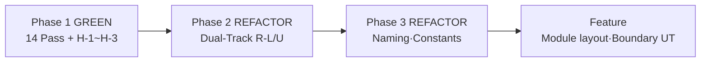
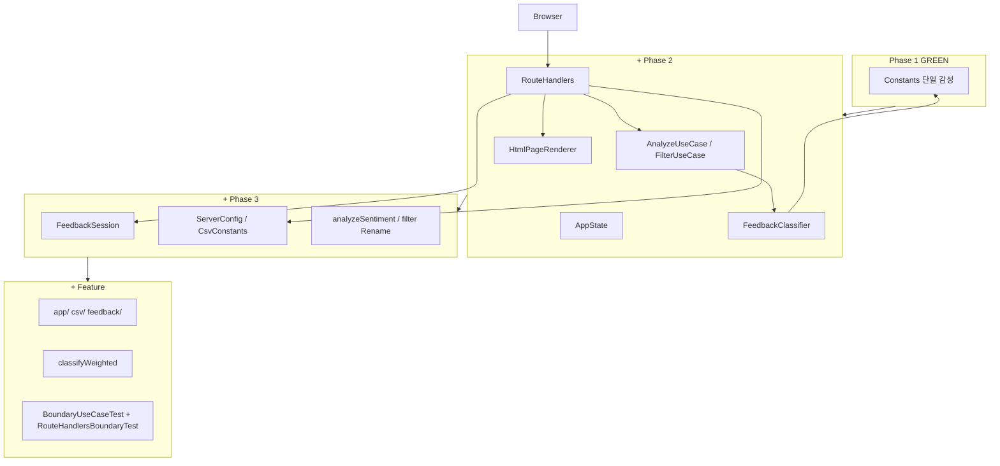

# Feedback Analyzer 12 — Phase 2·3 리팩토링 보고서

| 항목 | 내용 |
|------|------|
| 문서 | `docs/refactoring.md` |
| 프로젝트 | FeedbackAnalyzer_12 (C++17 리팩토링 챌린지) |
| Phase | **Phase 2** — 관심사 분리·Dual-Track (~1.5h, PRD L-4) · **Phase 3** — 네이밍·전역·매직·레거시 (~1h, PRD L-3·L-5) |
| 선행 문서 | [bug_fix.md](bug_fix.md) (Phase 1 GREEN 14/14 Pass) |
| 공식 보고서 | [Report/Refactoring/15.*](../Report/Refactoring/15.Refactoring_Phase2_DualTrack_진행완료.md), [Report/Refactoring/17.*](../Report/Refactoring/17.Refactoring_Exercise4_NamingDesign_진행완료.md), [Report/Refactoring/18.*](../Report/Refactoring/18.Refactoring_Phase3_NamingConstants_LegacyCleanup_진행완료.md) |
| 검증 일시 | 2026-05-22 (`ctest` + Golden Master + lcov, Feature 브랜치 기준) |
| 문서 버전 | 1.0 |

> **교육 과정 대응:** Feedback Analyzer 11 **미션 4(네이밍·전역·매직)** ≈ FA12 **Phase 3 + 연습 #4**, **미션 5(긴 함수·HtmlRenderer)** ≈ FA12 **Phase 2 Dual-Track**.

---

## 1. Executive Summary

[bug_fix.md](bug_fix.md)에서 확정한 **동작·P0 Gate·Golden Master baseline**을 유지한 채, **구조·가독성**만 개선한 REFACTOR 단계다. Phase 2는 **`main.cpp` God Module·긴 함수·Boundary 혼재**, Phase 3는 **축약 API명·전역 static·매직 리터럴·Dead Code**를 다룬다. 두 Phase 모두 **신규 RED 없음**, **GREEN = 기존 ctest Pass + GM 4/4 재확인**이다.

| 구분 | Phase 1 GREEN (기준선) | Phase 2 REFACTOR | Phase 3 REFACTOR |
|------|------------------------|------------------|------------------|
| ctest (Domain UT) | 14 Pass | **19 Pass** (+GM 5건) | **20 Pass** (1 Skipped) |
| ctest (Feature, 경계 UT 포함) | — | — | **44 Pass** (1 Skipped) |
| 공개 API | `sent()` / `kw()` / `fil()` | 동일 (Phase 2) | **`analyzeSentiment()` / `analyzeKeywords()` / `filter()`** |
| 필터 결과 저장 | `main.cpp` `fil_data` | `AppState::lastFilteredFeedbacks` | **`FeedbackSession::getLastFiltered()`** |
| 분석 캐시 | `globalSent`/`globalKw` | static **잔존** | **제거** (반환값만) |
| dead code | `S_KEYWORDS`, `initFilterKeywords()` (M7 GREEN) | `FileHandler` main 참조 제거 | **`FileHandler` stub 삭제** → Feature에서 `saveToCsv` 재도입 |
| 서버/UI 매직 | `8080`, BOM, `전체` 리터럴 | `8080` in main | **`ServerConfig` / `CsvConstants` / `FilterConstants`** |
| `main.cpp` | ~372줄, `renderPage` + 람다 5개 | **~18줄** bootstrap | **~19줄** (`ServerConfig`) |
| HTML | `static renderPage()` in main | **`HtmlPageRenderer`** | 동일 |
| 파싱·CSV | main inline + support CsvParser | **`FormParser` + prod `CsvParser`** | **`CsvExporter::escapeCsvField`** |
| `containsAny` | prod `KeywordUtils` | **`FeedbackClassifier` 허브** | **`std::any_of` 패턴** |
| Golden Master | GM-D-01~04 baseline | **4/4 Pass, baseline 불변** | **4/4 Pass, baseline 불변** |
| `src/cpp/` 레이아웃 | flat 39파일 | flat | **`app/` · `csv/` · `feedback/`** (Report 23) |

**결론: Phase 2·3 REFACTOR 완료** — P0 Gate·GM 4/4 유지, PRD G-4(`main.cpp` ≤200줄) **달성**, `classifySentiment`·필터 `main` 매칭 규칙 **유지**.

```powershell
cmake --build build --target feedback_analyzer_tests
ctest --test-dir build --output-on-failure
# Phase 2 baseline: 19 passed, 0 failed, 1 skipped (총 20)
# Feature 브랜치: 44 passed, 0 failed, 1 skipped (총 45)

ctest --test-dir build -R GoldenMaster --output-on-failure
# 4/4 Pass
```

---

## 2. REFACTOR 단계 정의 (Phase 2·3 공통)

| | 클래식 RED→GREEN | FeedbackAnalyzer Phase 2·3 |
|---|------------------|------------------------------|
| 선행 | 실패 테스트 작성 | **Phase 1 GREEN 14/14 Pass** + GM baseline |
| 코드 변경 | 동작 추가·수정 | **이름·구조·상수만** (Phase 3) / **분리만** (Phase 2) |
| RED | 신규 Fail | **없음** (Refactor 커밋마다 ctest Green) |
| GREEN | Fail→Pass | **ctest Pass 유지** = 회귀 GREEN |
| Golden 갱신 | — | **필수 아님** (GM-D-01~04 baseline **불변**) |



| Phase | Report | docs |
|-------|--------|------|
| 1 (BUGFIX) | [Report/Green/10.*](../Report/Green/10.Green_Phase1_전체완료.md) | [bug_fix.md](bug_fix.md) |
| 2 | [Report/Refactoring/15.*](../Report/Refactoring/15.Refactoring_Phase2_DualTrack_진행완료.md) | **본 문서 §4** |
| 2 검증 | [Report/Refactoring/16.*](../Report/Refactoring/16.Refactoring_Phase2_DualTrack_검증완료.md) | §5 |
| 3 (연습 #4) | [Report/Refactoring/17.*](../Report/Refactoring/17.Refactoring_Exercise4_NamingDesign_진행완료.md) | **본 문서 §3.1~3.2** |
| 3 (상수·레거시) | [Report/Refactoring/18.*](../Report/Refactoring/18.Refactoring_Phase3_NamingConstants_LegacyCleanup_진행완료.md) | **본 문서 §3.3~3.6** |
| Feature | [Report/Feature/20~23](../Report/Feature/) | §8 참고 |

---

## 3. Phase 3 — 네이밍·전역·매직 값 (FA11 M4 대응)

### 3.1 대상 스멜

| 스멜 | 수정 전 | 수정 후 |
|------|---------|---------|
| 부적절한 네이밍 | `sent`, `kw`, `fil` | **`analyzeSentiment`, `analyzeKeywords`, `filter`** |
| 전역 변수 | `fil_data`, `globalSent`, `globalKw` | **`AppState` → `FeedbackSession`** |
| 매직/하드코딩 | `8080`, BOM, `u8"전체"` | **`ServerConfig`, `CsvConstants`, `FilterConstants`** |
| 죽은 코드 | `UIComponents` Lazy Class, `FileHandler` stub | **삭제** (Feature 20에서 FileHandler 재구현) |
| Session Fake Object | `getOldDataFromSession`, `initSessionStateUgly` | **`FeedbackSession::getCurrent/clear`** |

### 3.2 API 리네이밍 (Report 17)

| 이전 | 이후 |
|------|------|
| `TextAnalyzer::sent()` | `TextAnalyzer::analyzeSentiment()` |
| `TextAnalyzer::kw()` | `TextAnalyzer::analyzeKeywords()` |
| `Filters::fil()` | `Filters::filter()` |
| `sFilter` / `kFilter` | `sentimentFilter` / `keywordFilter` |
| `Session` | **`FeedbackSession`** |

`tests/*Test.cpp`, `tests/support/GoldenMaster.h`, UseCase·RouteHandlers 호출부 동기화.

> gtest **케이스 이름**(`Given_NeutralText_...`, GM-D-xx)은 test_plan ID 대응을 위해 **유지**.

### 3.3 전역 상태 → AppState → FeedbackSession

**`fil_data`** (`main.cpp` static, Phase 1) → **`AppState::lastFilteredFeedbacks`** (Phase 2 R-L5) → **`FeedbackSession::getLastFiltered()` / `setLastFiltered()`** (Phase 3)

```cpp
FilterUseCase → FeedbackSession::setLastFiltered(filtered);
RouteHandlers GET /download → FeedbackSession::getLastFiltered();
```

**`globalSent` / `globalKw`** (`TextAnalyzer` static) → **제거** (Report 18). `analyzeSentiment` / `analyzeKeywords`는 `std::map` **반환만**.

### 3.4 상수 모듈 (Report 18)

#### `ServerConfig.h` (≈ FA11 `AppConfig`)

| 상수 | 값 | 용도 |
|------|-----|------|
| `kBindHost` | `"0.0.0.0"` | `listen` 바인드 |
| `kPort` | 8080 | 포트·로그 URL |
| `publicUrl()` | `http://localhost:8080` | 시작 로그 |

#### `CsvConstants.h`

| 상수 | 값 | 용도 |
|------|-----|------|
| `kUtf8Bom` | `\xEF\xBB\xBF` | Excel UTF-8 |
| `kTextColumnHeader` | `text\n` | PRD §7.2 |
| `kAttachmentFilename` | `filtered_feedback.csv` | Content-Disposition |
| `kContentType` | `text/csv; charset=UTF-8` | MIME |

#### `FilterConstants.h`

| 상수 | 값 | 용도 |
|------|-----|------|
| `kAllSentinel` | `u8"전체"` | sentiment/keyword 필터 sentinel |

### 3.5 Dead code·Lazy Class 제거

| 항목 | 조치 |
|------|------|
| `Filters::S_KEYWORDS`, `initFilterKeywords()` | Phase 1 GREEN에서 **이미 삭제** |
| `UIComponents` (KeywordRegistry 1줄 래퍼) | **삭제** → `HtmlPageRenderer`가 `KeywordRegistry` 직접 사용 |
| `TextAnalyzer.cpp` | static 제거 후 **header-only** |
| `Filters` `std::cout` 디버그 루프 | **삭제** (DEF-007 부분 해소) |
| `FileHandler` cout stub | Phase 3 **삭제** → [Report/Feature/20](../Report/Feature/20.Feature_FileHandler_SaveToCsv_진행완료.md)에서 `saveToCsv` 재도입 |

### 3.6 Phase 3 수정 파일 (요약)

| 파일 | 변경 |
|------|------|
| `TextAnalyzer.h`, `Filters.h` | Rename, static 제거, cout 제거 |
| `FeedbackSession.h/cpp` | **신규** — Session 대체 |
| `ServerConfig.h`, `CsvConstants.h`, `FilterConstants.h` | **신규** |
| `CsvExporter.cpp` | `escapeCsvField()` (AC-7) |
| `RouteHandlers.cpp`, `FilterUseCase.cpp` | FeedbackSession API |
| `CMakeLists.txt` | dead `.cpp` 제거 |

**미변경 (동작):** `SentimentClassifier` 규칙, `Constants` 키워드 맵, Golden baseline.

### 3.7 Phase 3 완료 기준

| AC | 내용 | 상태 |
|----|------|------|
| AC-1 | API Rename (`sent`/`kw`/`fil`) | ✅ |
| AC-2 | `fil_data`·`global*` 정리 | ✅ |
| AC-3 | 매직 값 상수 모듈 | ✅ |
| AC-4 | Dead code·Lazy Class | ✅ |
| AC-5 | ctest 20/20 (+ GM) | ✅ |
| AC-6 | 커버리지 ≥90% | ⚠️ Partial — CsvParser ~71% ([Report/19](../Report/Refactoring/19.Refactoring_CoverageInvariant_검증완료.md)) |

---

## 4. Phase 2 — 긴 함수·중복 코드·Dual-Track (FA11 M5 대응)

### 4.1 대상 스멜

| 스멜 | 수정 전 | 수정 후 |
|------|---------|---------|
| 긴 함수 | `renderPage()` ~130줄 in `main.cpp` | **`HtmlPageRenderer` + `PageViewModel`** |
| God Module | `main()` + HTML + 라우트 + CSV + UseCase | **`RouteHandlers` + bootstrap `main()`** |
| 중복 파싱 | `parseForm`, CSV inline in main | **`FormParser`, prod `CsvParser`** |
| 감성·카테고리 if-else 3벌 | TextAnalyzer·Filters 각각 | **`SentimentClassifier` + `FeedbackClassifier`** |
| 키워드 3중 정의 | Constants·UIComponents·renderPage | **`KeywordRegistry` 단일 소스** |
| `containsAny` 중복 | (Phase 1 prod `KeywordUtils`) | **`FeedbackClassifier` 허브** (규칙 불변) |

### 4.2 Dual-Track 커밋 (8건, Report 15)

#### Domain Track (R-L1 ~ R-L5)

| ID | 산출물 | 역할 |
|----|--------|------|
| R-L1 | `SentimentClassifier`, `KeywordUtils` | 감성 if-else 단일화 |
| R-L2 | `KeywordRegistry` | 카테고리·키워드 단일 소스 |
| R-L3 | `FeedbackClassifier` | `classifySentiment` / `matchCategory` 허브 |
| R-L4 | `AnalyzeUseCase`, `FilterUseCase` | analyze/filter 오케스트레이션 |
| R-L5 | `AppState` | `currentFeedbacks` + `lastFilteredFeedbacks` |

#### Boundary Track (R-U1 ~ R-U4)

| ID | 산출물 | 역할 |
|----|--------|------|
| R-U1 | `FormParser`, `CsvParser` (prod) | form/CSV 파싱 분리 |
| R-U2 | `AppMessages` | alert/error/warning 상수 |
| R-U3 | `HtmlPageRenderer`, `CsvExporter` | HTML·CSV 출력 |
| R-U4 | `RouteHandlers` | HTTP 5 route |

### 4.3 `HtmlPageRenderer` (Extract Class)

```cpp
// HtmlPageRenderer.h
struct PageViewModel {
    std::string success, warning, error;
    std::map<std::string, int> sentimentResults, keywordResults;
};

class HtmlPageRenderer {
public:
    static std::string render(const PageViewModel& viewModel);
};
```

| 책임 | 내용 |
|------|------|
| CSS·레이아웃 | DOCTYPE, stat 표, form 섹션 |
| alert | success(타임스탬프) / warning / error |
| 카테고리 select | `KeywordRegistry::categoryNames()` |
| escape | `escapeHtml()` 내부 |

### 4.4 `RouteHandlers` (Extract Class)

| 핸들러 | HTTP | 핵심 로직 |
|--------|------|-----------|
| `handleGetRoot` | `GET /` | session init, 시작 메시지 |
| `handlePostAnalyze` | `POST /analyze` | `FormParser`, `AnalyzeUseCase` |
| `handlePostUpload` | `POST /upload` | `CsvParser`, text 컬럼 검증 |
| `handlePostFilter` | `POST /filter` | `FilterUseCase`, warning 분기 |
| `handleGetDownload` | `GET /download` | `CsvExporter`, BOM + `text\n` |

`main()` (Phase 3 이후):

```cpp
Constants::init();
httplib::Server server;
RouteHandlers routeHandlers;
routeHandlers.registerRoutes(server);
server.listen(ServerConfig::kBindHost, ServerConfig::kPort);
```

### 4.5 Boundary 파서·Exporter

| 모듈 | 함수/역할 | FA11 `ParseUtils` 대응 |
|------|-----------|------------------------|
| `FormParser` | `urlDecode`, `parse(body)` | `parseForm` |
| `CsvParser` | `parse()`, `hasTextColumn` | `parseCsvLine` + upload |
| `CsvExporter` | `exportFilteredFeedbacks`, `escapeCsvField` | `escapeCsvField` |
| `HtmlPageRenderer` | `escapeHtml` | `escapeHtml` |

> Boundary 모듈은 Domain gcov 대상 밖일 수 있음 — 회귀는 **gtest + Golden Master**로 검증 ([test_plan.md](test_plan.md) §7).

### 4.6 Phase 2 수정 파일 (요약)

| 파일 | 변경 |
|------|------|
| `HtmlPageRenderer.h/cpp`, `AppMessages.*`, `CsvExporter.*` | **신규** |
| `FormParser.*`, `CsvParser.*` (prod) | **신규/승격** |
| `RouteHandlers.*`, UseCase.*, AppState.* | **신규** |
| `SentimentClassifier.h`, `FeedbackClassifier.h`, `KeywordRegistry.*` | **신규** |
| `main.cpp` | **372줄 → 18줄** |
| `CMakeLists.txt` | 타깃 소스 추가 |

**미변경:** H-1~H-3 판정 규칙, HTTP 5 route, CSV BOM 형식, GM baseline.

### 4.7 Phase 2 완료 기준

| AC | 내용 | 상태 |
|----|------|------|
| AC-1 | `renderPage` → `HtmlPageRenderer` | ✅ |
| AC-2 | `RouteHandlers` 5 route | ✅ |
| AC-3 | Form/Csv/Html/CsvExporter 분리 | ✅ |
| AC-4 | `FeedbackClassifier` 단일 허브 | ✅ |
| AC-5 | ctest 19/20 + GM 4/4 | ✅ |
| AC-6 | PRD G-4 `main` ≤200줄 | ✅ **18줄** |

---

## 5. 검증 (GREEN 회귀)

### 5.1 ctest

| 항목 | Phase 1 | Phase 2 | Phase 3 | Feature |
|------|---------|---------|---------|---------|
| Domain UT | 14 | 14 (+GM 6) | **20** (1 Skip) | **44** (1 Skip) |
| Passed | 14 | **19** | **20** | **44** |
| Failed | 0 | **0** | **0** | **0** |
| Golden Master | — | **4/4** | **4/4** | **4/4** |

P0 Gate (H-1/H-2/H-3), REG(중립), F05(`main` 키워드), GM-D-01~04 전부 Pass.

```powershell
ctest --test-dir build -R "FiltersTest.Given_NeutralText|CsvParserTest.Given_CsvWithoutTextColumn|FiltersTest.Given_MainKeywordOnly" --output-on-failure
```

### 5.2 Golden Master

| 섹션 | 검증 |
|------|------|
| GM-D-01~04 | Phase 2·3·Feature 전 구간 **baseline 불변**, 4/4 Pass |
| 갱신 | `GOLDEN_UPDATE=1` 로컬만; CI·Refactor PR에서 **무분별 갱신 금지** |

### 5.3 커버리지 (Report 16·19)

| 모듈 | Phase 1 | Phase 2 후 | 비고 |
|------|---------|------------|------|
| TextAnalyzer | ≥90% | ≥90% | ✅ |
| Filters | ≥90% | ≥90% | ✅ |
| CsvParser | ~70% | **~71%** | ⚠️ AC-4 Partial |
| Boundary (RouteHandlers 등) | — | lcov **0%** (UT 타깃 미포함) | Report 16 |

### 5.4 애플리케이션 빌드

```powershell
cmake --build build --target feedback_analyzer
# build/feedback_analyzer.exe → http://localhost:8080
```

---

## 6. 아키텍처 변화 (Phase 1 → Feature)



**현재 `src/cpp/` 핵심 모듈 (Feature 브랜치)**

| 모듈 | 역할 |
|------|------|
| `app/main.cpp` | bootstrap (~19줄) |
| `app/http/RouteHandlers` | HTTP 5 route |
| `app/http/FormParser` | URL/form 파싱 |
| `app/http/ServerConfig` | 포트·호스트 (Phase 3) |
| `app/ui/HtmlPageRenderer` | 서버 사이드 HTML |
| `app/ui/AppMessages` | alert 문자열 |
| `app/usecase/*UseCase` | analyze/filter 오케스트레이션 |
| `app/state/FeedbackSession` | 피드백·필터 결과 세션 |
| `csv/CsvParser`, `CsvExporter` | CSV I/O |
| `feedback/TextAnalyzer`, `Filters` | 분석·필터 (Phase 3 API) |
| `feedback/SentimentClassifier` | 감성·`KeywordUtils` (Feature: 가중치) |
| `feedback/FeedbackClassifier` | classify 허브 (Phase 2) |

---

## 7. BAD / GOOD 요약

### 7.1 Phase 3 (네이밍·전역·매직)

```cpp
// BAD
auto r = filters.fil(data, u8"중립", u8"전체");
static std::map<std::string, int> globalSent;
server.listen("0.0.0.0", 8080);

// GOOD
auto r = filters.filter(data, u8"중립", u8"전체");
const auto counts = analyzer.analyzeSentiment(feedbacks);
server.listen(ServerConfig::kBindHost, ServerConfig::kPort);
```

### 7.2 Phase 2 (God Module·긴 함수)

```cpp
// BAD — 372줄 main + 130줄 renderPage + 인라인 람다
static std::string renderPage(...) { /* entire HTML */ }
svr.Post("/analyze", [](...) { /* 40 lines */ });

// GOOD
HtmlPageRenderer::render(viewModel);
RouteHandlers routeHandlers;
routeHandlers.registerRoutes(server);
```

---

## 8. Feature 브랜치 보강 (Phase 2·3 이후, REFACTOR 범위 확장)

| 항목 | Report | 내용 |
|------|--------|------|
| 가중치 감성 | [21](../Report/Feature/21.Feature_SentimentClassifier_WeightedScoring_진행완료.md) | `classifyWeighted()` — 동점→중립 |
| FileHandler | [20](../Report/Feature/20.Feature_FileHandler_SaveToCsv_진행완료.md) | `saveToCsv(data, path)` RAII |
| 경계 GTest | [22](../Report/Feature/22.Green_BoundaryTestAutomation_진행완료.md) | T-08~T-11, EX-04~08 in-process HTTP |
| 모듈 레이아웃 | [23](../Report/Feature/23.Feature_SrcModuleLayout_ClassDiagram_진행완료.md) | `app/csv/feedback/` + UML drawio |

> Feature 작업은 **동작 계약(PRD §7.2) 유지** + GM 4/4 전제; Phase 2·3 REFACTOR와 **별 트랙**이지만 본 문서 §6 아키텍처에 포함한다.

---

## 9. 범위 밖 · 알려진 이슈 (Phase 2·3 미수정)

| 항목 | 비고 |
|------|------|
| Logger → HTML alert 버퍼 (AC-6) | `AppMessages`+라우트만; DEF-007 **Open** — Phase 4 |
| `/upload` 후 자동 analyze | Phase 1 이후 동일 (by design) |
| CI Golden Master (GM-07~08) | `.github/workflows` **미착수** |
| CsvParser 커버리지 ≥90% | **Partial** — Report 19 |
| Trend / File DB | Phase 5 선택 |
| `httplib.h` 수정, `build/` 커밋 | **금지** |

---

## 10. 다음 단계

| Phase | 내용 |
|-------|------|
| Phase 4 | Logger UI (AC-6), `.gitignore`, download 정책 (DEF-008) |
| Phase 5 | Trend chart + File DB (선택) |
| CI | `golden_master.yml` + required check (GM-07~08) |
| 커버리지 | CsvParser·Boundary lcov 게이트 충족 |

---

## 11. 참고 문서

| 경로 | 설명 |
|------|------|
| [bug_fix.md](bug_fix.md) | Phase 1 버그 수정 (REFACTOR 선행) |
| [defect_list.md](defect_list.md) | DEF-001~009, H-1~H-4 |
| [analysis.md](analysis.md) | 코드 스멜·Phase 매핑 부록 C |
| [test_plan.md](test_plan.md) | T-01~T-11, AC, Gate 명령 |
| [PRD.md](PRD.md) §1.3 G-4, §9 L-3~L-5 | 측정 목표·학습 Phase |
| [report.md](report.md) | 코드 리뷰 종합 (Spec→Feature) |
| [diagrams/FeedbackAnalyzer_class_diagram_Refactoring.drawio](diagrams/FeedbackAnalyzer_class_diagram_Refactoring.drawio) | Refactoring UML |
| [Report/Refactoring/15~19](../Report/Refactoring/) | Phase 2·3 공식 Report |
| [Report/Feature/20~23](../Report/Feature/) | Feature 보강 Report |

---

*본 문서는 Phase 2 Dual-Track REFACTOR와 Phase 3 네이밍·상수·레거시 정리를 `docs/` 관점에서 통합 정리한 보고서이며, 상세 AC·커밋 SHA·검증 로그는 Report 15~19·Feature 20~23을 참고한다.*
