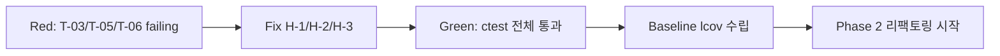

# Feedback Analyzer — 테스트 계획서

| 항목 | 내용 |
|------|------|
| 문서 버전 | 1.0 |
| 작성일 | 2026-05-22 |
| 워크스페이스 | `c:\DEV\FeedbackAnalyzer_12` |
| 기술 스택 | C++17, CMake 3.14+, Google Test, cpp-httplib |
| 근거 문서 | `README.md`, `docs/PRD.md`, `docs/analysis.md`, `.cursorrules` |
| 대상 Phase | Phase 1 (필수) ~ Phase 5 (선택) |

---

## 1. 목적 및 범위

본 문서는 Feedback Analyzer 리팩토링 챌린지의 **테스트 전략**을 정의한다. 목표는 P0 버그(H-1~H-3)를 failing test로 고정한 뒤 Green 상태에서 점진적 리팩토링을 수행하는 **TDD 기반 품질 게이트**를 수립하는 것이다.

| 구분 | 포함 | 제외 |
|------|------|------|
| **단위 테스트** | TextAnalyzer, Filters, CsvParser, Feedback, KeywordUtils | — |
| **통합/스모크** | HTTP 5엔드포인트 (부록 A 체크리스트) | httplib.h 내부 |
| **E2E (수동)** | 브라우저 시나리오 A/B, alert 계약 | 자동 E2E 프레임워크 (Phase 1) |
| **선택** | Trend·File DB (Phase 5, 별도 AC) | ML/NLP 기반 분류 |

**핵심 원칙 (`.cursorrules` §5, §6):**

- Given-When-Then 형식, `TEST` / `TEST_F` 매크로 사용
- 리팩토링은 **ctest Green 상태에서만** 진행
- Red 상태 merge 금지 (`docs/PRD.md` §7.2 R-4)

---

## 2. 대표 샘플 예제 — AC-1 / H-1 (중립 필터 일치)

본 계획서의 **중심 시나리오**이다. Phase 1 failing test 작성 시 최우선으로 구현한다.

### 2.1 HTTP 계약 (F-04, F-06)

| 항목 | 값 |
|------|-----|
| Method / Path | POST `/filter` |
| Content-Type | `application/x-www-form-urlencoded` |
| Form fields | `sentiment=중립&keyword=전체` |
| PRD 참조 | F-04 (필터), F-06 (분류 규칙 단일화), AC-1 |
| 버그 ID | H-1 (`docs/analysis.md` §6.1) |

### 2.2 Given-When-Then

| 단계 | 내용 |
|------|------|
| **Given** | Session에 Feedback 1건: `text="그냥 그래요. 특별한 감정 없음."` (긍정·부정 키워드 미포함) |
| **When** | `Filters::filterFeedbacks(feedbacks, u8"중립", u8"전체")` 실행 |
| **Then** | 반환 집합 = TextAnalyzer가 동일 입력에 대해 `u8"중립"`으로 분류한 Feedback 집합과 **100% 일치** (건수·내용) |

### 2.3 현재 As-Is vs 목표 To-Be

| 구분 | TextAnalyzer (분석) | Filters (필터) | 기대 |
|------|---------------------|----------------|------|
| **As-Is** | 긍정/부정 미매칭 → `중립` | `S_KEYWORDS[u8"중립"]`("보통","그냥" 등) 필요 | **불일치 → H-1** |
| **To-Be** | 긍정 → 부정 → **중립** (기본값) | TextAnalyzer와 **동일 규칙** + `Constants::SENTIMENT_KEYWORDS` 단일 소스 | **AC-1 충족** |

### 2.4 단위 테스트 매핑

| 테스트 ID | 파일 (예정) | 테스트명 (예시) | Phase |
|-----------|-------------|-----------------|-------|
| UT-TA-03 | `tests/TextAnalyzerTest.cpp` | `Given_NeutralText_When_AnalyzeSentiment_Then_ClassifiedAsNeutral` | 1 |
| UT-FL-03 | `tests/FiltersTest.cpp` | `Given_NeutralText_When_FilterSentimentNeutral_Then_MatchesTextAnalyzerSet` | 1 |
| IT-AC-01 | `tests/FiltersTest.cpp` | `Given_MixedFeedbacks_When_FilterNeutral_Then_EqualsAnalyzerNeutralSubset` | 1 |

### 2.5 HTTP 수동 검증 (부록 A 보조)

```
POST http://localhost:8080/filter
Content-Type: application/x-www-form-urlencoded

sentiment=중립&keyword=전체
```

→ stat 영역에 해당 피드백 1건 포함; 다운로드 버튼 표시.

---

## 3. Google Test 단위 테스트 범위·우선순위

### 3.1 우선순위 요약

| 순위 | 대상 | 테스트 파일 (예정) | Phase | 목표 커버리지 |
|------|------|-------------------|-------|---------------|
| **1순위** | TextAnalyzer | `tests/TextAnalyzerTest.cpp` | 1 | ≥ 90% |
| **1순위** | Filters | `tests/FiltersTest.cpp` | 1 | ≥ 90% |
| **1순위** | CsvParser | `tests/CsvParserTest.cpp` | 1 | ≥ 90% |
| **2순위** | Feedback | `tests/FeedbackTest.cpp` | 1~3 | ≥ 90% |
| **2순위** | KeywordUtils / containsAny | `tests/KeywordUtilsTest.cpp` | 2~3 | ≥ 90% |
| **3순위** | HTTP 핸들러 | 수동 / 부록 A 체크리스트 | 1~4 | 90% 목표 **아님** |

### 3.2 1순위 — TextAnalyzer (Phase 1)

| 테스트 그룹 | 검증 대상 | 대표 케이스 |
|-------------|-----------|-------------|
| 감정 분류 | `analyzeSentiment` (또는 `sent`) | T-01, T-03, T-07 |
| 키워드 집계 | `analyzeKeywords` (또는 `kw`) | T-06, T-07 |
| 판정 순서 | 긍정 → 부정 → 중립 | 긍정·부정 동시 포함 시 긍정 우선 |
| Constants 연동 | `SENTIMENT_KEYWORDS`, `CATEGORY_KEYWORDS["main"]` | H-1, H-3 수정 후 단일 소스 |

### 3.3 1순위 — Filters (Phase 1)

| 테스트 그룹 | 검증 대상 | 대표 케이스 |
|-------------|-----------|-------------|
| 감정 필터 | sentiment=`긍정`/`중립`/`부정`/`전체` | T-03, T-04, **§2 샘플** |
| 키워드 필터 | keyword=`배송`/`품질`/…/`전체` | T-06 |
| sentinel | `전체` = 해당 축 미적용 | T-04 |
| Analyzer 일치 | filter 결과 ⊆ analyzer 분류 | AC-1, AC-3 |

### 3.4 1순위 — CsvParser (Phase 1)

| 테스트 그룹 | 검증 대상 | 대표 케이스 |
|-------------|-----------|-------------|
| 헤더 파싱 | `text` 컬럼 인덱스 탐색 | T-05, AC-2 |
| 데이터 행 | `text` 값 → Feedback 목록 | 정상 CSV 2행 |
| 오류 처리 | `text` 없음, 빈 파일, 헤더만 | T-05, README 비정상 3건 |
| BOM (출력) | UTF-8 BOM + `text\n` | GET `/download` (Phase 4, CsvParser 분리 후) |

### 3.5 2순위 — Feedback · KeywordUtils (Phase 1~3)

| 대상 | 검증 내용 | Phase |
|------|-----------|-------|
| **Feedback** | 생성, `text` getter/setter, 빈 문자열 | 1~3 |
| **KeywordUtils** | `containsAny` 통합 후 TextAnalyzer·Filters 공통 사용 | 2~3 (M-3 해소) |

### 3.6 3순위 — HTTP 핸들러 (수동 / 스모크)

90% 커버리지 목표 **미적용**. `docs/PRD.md` 부록 A 5항목 체크리스트로 회귀 검증.

| ID | 검증 방법 | Phase |
|----|-----------|-------|
| HTTP-S-01 ~ S-05 | 부록 A 체크리스트 (수동) | 1~4 |
| HTTP-S-06 | (선택) cpp-httplib in-process 스모크 | 2 이후 |

---

## 4. 경계값 테스트 케이스

PRD §4.3 T-01~T-07 및 `README.md` §입력·출력 계약을 반영한다.

### 4.1 PRD 필수 경계값 (T-01 ~ T-07)

| ID | Given | When | Then | AC | 버그 | 레이어 | 우선순위 |
|----|-------|------|------|-----|------|--------|----------|
| **T-01** | 빈 `vector<Feedback>` | `TextAnalyzer::analyzeSentiment` | `긍정=0`, `중립=0`, `부정=0` | — | — | TextAnalyzer | P1 |
| **T-02** | Feedback 1건 (`text="배송이 너무 늦어요. 화가 납니다."`) | analyze + filter (`sentiment=부정`, `keyword=배송`) | 집계 건수 1, 필터 결과 1건 | — | — | TA + Filters | P1 |
| **T-03** | Feedback `text="그냥 그래요. 특별한 감정 없음."` (긍/부정 키워드 없음) | filter `sentiment=중립&keyword=전체` | Filters 결과 = TextAnalyzer `중립` 집합 **100% 일치** | **AC-1** | **H-1** | Filters | **P0** |
| **T-04** | Feedback 3건 (감정·카테고리 혼합) | filter `sentiment=전체&keyword=전체` | 입력 전체 3건 반환 | — | — | Filters | P1 |
| **T-05** | CSV `id,comment\n1,hello` (`text` 컬럼 없음) | `CsvParser::parse` | 오류 반환 또는 0건 적재 | **AC-2** | **H-2** | CsvParser | **P0** |
| **T-06** | Feedback `text="택배가 빨라요."` (`배송` main 키워드만) | filter `keyword=배송` | 해당 Feedback **포함** | **AC-3** | **H-3** | Filters | **P0** |
| **T-07** | Feedback `text="품질이 별로예요."` (품질 카테고리만, 감정 키워드 없음) | `analyzeSentiment` | 감정=`중립` (카테고리≠감정 분리) | — | — | TextAnalyzer | P1 |

### 4.2 README 입력·출력 계약 추가 케이스

| ID | Given | When | Then | AC | 레이어 | 검증 |
|----|-------|------|------|-----|--------|------|
| **T-08** | Session에 기존 N건 | POST `/analyze`, `text=` 또는 공백만 | 피드백 미추가, 건수 N 유지 | — | HTTP / Handler | 수동·스모크 |
| **T-09** | Session 비어 있음 | POST `/filter` | warning: `분석할 피드백이 없습니다.` | — | HTTP / Handler | 수동·Phase 4 |
| **T-10** | Feedback 있으나 조건 불일치 | POST `/filter` | warning: `필터링 결과가 없습니다.` | — | HTTP / Handler | 수동·Phase 4 |
| **T-11** | `text="첫 줄\n두 번째 줄"` | analyze → filter → GET `/download` | Session·CSV 본문에 개행(`\n`) 유지 | **AC-7** | E2E | 수동·Phase 4 |

### 4.3 Given-When-Then 상세 — P0 케이스

#### T-03 / AC-1 / H-1 (중립 필터 — §2와 동일)

| Given | When | Then |
|-------|------|------|
| `[Feedback("그냥 그래요. 특별한 감정 없음.")]` | `Filters::filter(..., u8"중립", u8"전체")` | `result == TextAnalyzer::getNeutralSubset(feedbacks)` |

#### T-05 / AC-2 / H-2 (CSV text 컬럼)

| Given | When | Then |
|-------|------|------|
| CSV 문자열 `"id,comment\n1,hello"` | `CsvParser::parse(csv)` | `feedbacks.size() == 0` **또는** `parse` 실패 상태; `fields[0]`("1")을 text로 사용 **금지** |

#### T-06 / AC-3 / H-3 (main 키워드)

| Given | When | Then |
|-------|------|------|
| `[Feedback("택배가 빨라요.")]` — `배송` main 키워드 `"택배"` 포함 | `Filters::filter(..., u8"전체", u8"배송")` | `result.size() == 1`, `result[0].text`에 `"택배"` 포함 |

---

## 5. 예외·특이 케이스 목록

현재 As-Is 코드의 알려진 결함 및 HTTP 계약 예외를 테스트·수동 검증으로 추적한다.

| ID | 케이스 | 현재 As-Is 동작 | 목표 To-Be | 검증 | Phase |
|----|--------|-----------------|------------|------|-------|
| **EX-01** | TextAnalyzer vs Filters 감정 키워드 이중 관리 (`S_KEYWORDS`) | 중립 판정 불일치 | `Constants::SENTIMENT_KEYWORDS` 단일 소스 | T-03, AC-1 | 1 |
| **EX-02** | CSV `fields[0]`만 사용, `text` 컬럼 무시 | `id,comment` CSV에서 잘못된 컬럼 적재 | 헤더 `text` 인덱스 탐색 | T-05, AC-2 | 1 |
| **EX-03** | Filters에서 `main` 키워드 skip | `"배송"` main만 포함 피드백 필터 누락 | `CATEGORY_KEYWORDS[cat]["main"]` 매칭 | T-06, AC-3 | 1 |
| **EX-04** | GET `/download` 필터 미실행 | BOM + `text\n` 헤더만, 데이터 0건 | warning `다운로드할 필터 결과가 없습니다.` (Phase 4) | 수동 | 4 |
| **EX-05** | POST `/analyze` 예외 발생 | HTML error alert + **HTTP 200** | F-02 계약 유지 | 수동·스모크 | 2~4 |
| **EX-06** | CSV `text` 컬럼 없음 alert | error `파일 업로드 중 오류가 발생했습니다.` **우선** (warning `CSV에 text 컬럼이 없습니다.` 대안) | PRD §3.2 F-03 error 우선 | 수동 | 1 |
| **EX-07** | 빈 CSV 파일 (0 byte) | error `파일 업로드 중 오류가 발생했습니다.` | README 비정상 케이스 | 수동 | 1 |
| **EX-08** | CSV 헤더만 (`text\n`) | success `0개의 피드백이 입력되었습니다.` | 0건 적재 | 수동 | 1 |
| **EX-09** | sentiment=`긍정` + 부정 키워드 포함 텍스트 | 긍정 우선 (판정 순서) | F-06 | UT-TA | 1 |
| **EX-10** | `품질` 카테고리 키워드만, 감정 키워드 없음 | 감정=중립, 카테고리=품질 | T-07, quality≠sentiment | UT-TA | 1 |

### 5.1 Failing Test → Green 워크플로 (Phase 1)



---

## 6. 커버리지 목표

근거: `docs/PRD.md` §4.3, §7.1 AC-4, `.cursorrules` §5

### 6.1 필수 목표 (AC-4)

| 대상 | 목표 | 측정 도구 | Phase |
|------|------|-----------|-------|
| TextAnalyzer.cpp | **≥ 90%** | gcov/lcov | 1 |
| Filters.cpp | **≥ 90%** | gcov/lcov | 1 |
| CsvParser.cpp | **≥ 90%** | gcov/lcov | 1 |
| Feedback (모델) | **≥ 90%** | gcov/lcov | 1~3 |
| HTTP 핸들러 (main.cpp) | **90% 목표 아님** | 부록 A 5항목 | 1~4 |

### 6.2 Stretch Goal (팀 내부 명시 시)

| 영역 | 목표 | 설명 |
|------|------|------|
| **Domain (Service)** | ≥ 95% | TextAnalyzer + Filters + CsvParser 합산 |
| **Boundary (경계·에러)** | ≥ 85% | T-01~T-11, EX-01~EX-10 분기 커버 |

### 6.3 AC ↔ 테스트 매핑

| AC | 설명 | 테스트 ID |
|----|------|-----------|
| **AC-1** | 중립 필터 = Analyzer 중립 집합 100% 일치 | T-03, §2 |
| **AC-2** | CSV `text` 컬럼만 적재; 없으면 0건 + error/warning | T-05, EX-02, EX-06 |
| **AC-3** | keyword=`배송` 시 main 키워드 포함 | T-06, EX-03 |
| **AC-4** | ctest Green + Service ≥ 90% | §6.1 전체 |
| **AC-5** | 부록 A 5항목 | HTTP-S-01~05 |
| **AC-6** | Logger warning/error → HTML alert | 수동 (Phase 4) |
| **AC-7** | textarea 개행 유지 | T-11 |

---

## 7. gcov / lcov 측정 전략

### 7.1 CMake 컴파일 플래그

| 플랫폼 | 플래그 |
|--------|--------|
| GCC / MinGW | `-fprofile-arcs -ftest-coverage -O0 -g` |
| CMake 옵션 | `CMAKE_CXX_FLAGS` 또는 `--coverage` (링커: `-lgcov`) |

**적용 대상:** `feedback_analyzer_tests` 타깃 (Google Test executable)

### 7.2 측정 포함·제외

| 구분 | 파일 | 사유 |
|------|------|------|
| **포함** | `TextAnalyzer.cpp` | Service, AC-4 |
| **포함** | `Filters.cpp` | Service, AC-4 |
| **포함** | `CsvParser.cpp` | Service (Phase 1 추출 후) | 
| **포함** | `Feedback` 관련 | Domain |
| **포함** | `KeywordUtils.cpp` (Phase 2~3) | 공통 로직 |
| **제외** | `main.cpp` | HTTP 핸들러 — 부록 A로 검증 |
| **제외** | `httplib.h` | 외부 라이브러리, 수정 금지 |
| **제외** | `HtmlRenderer.cpp` (Phase 2 이후) | View — 단위 테스트 대상 외 |

### 7.3 실행 절차

```powershell
# 1. 커버리지 빌드
cmake -S . -B build -DCMAKE_BUILD_TYPE=Debug -DENABLE_COVERAGE=ON
cmake --build build

# 2. 테스트 실행
ctest --test-dir build --output-on-failure

# 3. lcov 수집 (MinGW/GCC)
lcov --capture --directory build --output-file coverage.info
lcov --remove coverage.info '*/tests/*' '*/googletest/*' --output-file coverage.filtered.info

# 4. HTML 리포트
genhtml coverage.filtered.info --output-directory build/coverage_html
```

### 7.4 Baseline 수립 시점

| 시점 | 조건 | 산출물 |
|------|------|--------|
| **Phase 1 Green 직후** | T-03/T-05/T-06 통과, ctest Green | `coverage_baseline_phase1.info` |
| **Phase 2~4 PR마다** | ctest Green + 커버리지 ≥ 90% 유지 | PR별 diff 리포트 |
| **Phase 7 (L-7) 발표** | AC-4 + stretch goal (선택) | `build/coverage_html/` |

---

## 8. Phase별 테스트 일정

근거: `docs/PRD.md` §9, `README.md` Activities, `docs/analysis.md` §8

### 8.1 Phase 1 — 테스트 기반 + P0 버그 수정 (L-1, 2h)

| 순서 | 작업 | 산출물 | Exit Criteria |
|------|------|--------|---------------|
| 1 | CMake GTest FetchContent, `enable_testing()` | `CMakeLists.txt` | 빌드 성공 |
| 2 | TextAnalyzerTest, FiltersTest, CsvParserTest 골격 | `tests/*` | ctest 실행 가능 |
| 3 | **Red:** T-03, T-05, T-06 failing test 작성 | failing 3건 | H-1/H-2/H-3 재현 |
| 4 | H-1/H-2/H-3 수정 | `Filters.cpp`, `main.cpp`/CsvParser | **Green** |
| 5 | T-01, T-02, T-04, T-07 추가 | 전체 UT | ctest Green |
| 6 | lcov baseline 수립 | coverage 리포트 | Service ≥ 90% |

### 8.2 Phase 2 — 관심사 분리 (L-4, 1.5h)

| 작업 | 테스트 전략 |
|------|-------------|
| HtmlRenderer, RouteHandlers, CsvParser 분리 | **기존 UT Green 유지** (회귀) |
| `main.cpp` ≤ 200줄 | 커버리지 측정 대상에서 main 제외 유지 |
| HTTP 스모크 | 부록 A 5항목 수동 1회 |

### 8.3 Phase 3 — 상태·네이밍 (L-3, L-5, 2h)

| 작업 | 테스트 전략 |
|------|-------------|
| AppState, Rename (`sent`→`analyzeSentiment` 등) | UT 리네임·시그니처 업데이트 |
| `containsAny` → KeywordUtils | KeywordUtilsTest 추가 (2순위) |
| `Filters::initFilterKeywords()` 제거 | T-03 재실행 — Green 유지 |

### 8.4 Phase 4 — Logger UI·download (L-2, L-5, 2.5h)

| 작업 | 테스트 전략 |
|------|-------------|
| Logger → HTML alert (AC-6) | 수동: warning/error 메시지 확인 |
| `/download` 대상·warning (M-6, EX-04) | 수동: 필터 미실행 시 warning |
| T-11 (AC-7) 개행 E2E | 수동: analyze → filter → download |
| 부록 A 체크리스트 | **AC-5** 완료 |

### 8.5 Phase 5 — 선택 과제 (L-6, 3h)

| 과제 | 테스트 전략 |
|------|-------------|
| Trend (`test_feedback_trend.csv`) | **별도 AC 정의** — 사용자 요청 시 |
| File DB (`data/sentiment_keywords.json`) | CRUD UT + `/filter` 반영 수동 검증 |

### 8.6 Phase × 테스트 활동 매트릭스

| Phase | Red (failing) | Green (수정) | 회귀 (ctest) | 수동 (부록 A) | lcov |
|-------|---------------|--------------|--------------|---------------|------|
| **1** | T-03, T-05, T-06 | H-1, H-2, H-3 | T-01~T-07 | 선택 | baseline |
| **2** | — | — | 전체 UT | 5항목 | ≥ 90% |
| **3** | — | Rename UT | 전체 UT | 5항목 | ≥ 90% |
| **4** | — | — | 전체 UT | **AC-5** | ≥ 90% |
| **5** | (선택 AC) | (선택) | 기존 + 신규 | 확장 | 팀 정의 |

---

## 9. HTTP 회귀 체크리스트 (부록 A)

Phase 1~4 PR마다 수동 또는 스모크로 실행한다. (`docs/PRD.md` 부록 A, `docs/analysis.md` 부록)

- [ ] **HTTP-S-01:** GET `/` → 200, HTML, UTF-8 한국어 UI
- [ ] **HTTP-S-02:** POST `/analyze` → 텍스트 추가, 감정 3분류 집계 표시
- [ ] **HTTP-S-03:** POST `/upload` → CSV `text` 컬럼 파싱
- [ ] **HTTP-S-04:** POST `/filter` → sentiment=`전체|긍정|중립|부정`, keyword=`전체|배송|품질|가격|서비스|사용성`
- [ ] **HTTP-S-05:** GET `/download` → UTF-8 BOM + `text\n` 헤더 CSV

**Phase 1 추가 권장 (AC-1~3 수동 확인):**

- [ ] **HTTP-S-06:** POST `/filter` sentiment=`중립` — §2 샘플 텍스트 1건 포함 확인
- [ ] **HTTP-S-07:** POST `/filter` keyword=`배송` — `"택배"` main 키워드 피드백 포함 확인

---

## 10. 테스트 파일 구조 (예정)

```
tests/
├── TextAnalyzerTest.cpp    # T-01, T-03, T-07, UT-TA-*
├── FiltersTest.cpp         # T-02~T-04, T-06, §2 샘플, UT-FL-*
├── CsvParserTest.cpp       # T-05, CSV 정상/비정상
├── FeedbackTest.cpp        # (2순위) 모델
└── KeywordUtilsTest.cpp    # (2순위, Phase 2~3) containsAny 통합
```

**CMake 타깃 (예정):**

| 타깃 | 설명 |
|------|------|
| `feedback_analyzer` | 프로덕션 executable |
| `feedback_analyzer_tests` | Google Test + lcov 대상 |

---

## 11. 용어·약어

| 용어 | 정의 |
|------|------|
| **Given-When-Then** | 테스트 전제·행동·기대 결과 서술 형식 |
| **sentinel `전체`** | 필터에서 해당 축 조건 미적용 |
| **main 키워드** | `CATEGORY_KEYWORDS[cat]["main"]` — 집계·필터 공통 매칭 |
| **P0** | H-1, H-2, H-3, H-4 — Phase 1 필수 수정 |
| **Green / Red** | ctest 전체 통과 / failing test 존재 |

---

## 부록 — 문서 변경 이력

| 버전 | 일자 | 변경 |
|------|------|------|
| 1.0 | 2026-05-22 | 초안 작성 (`README.md`, `docs/PRD.md`, `docs/analysis.md`, `.cursorrules` 기반) |
